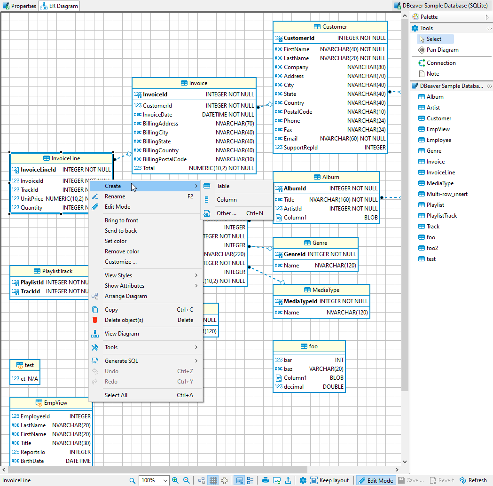

**Note: This feature is available in [Enterprise](Enterprise-Edition) and [Ultimate](Ultimate-Edition) editions only.**

Edit mode for ER Diagrams is a special feature that lets you create database objects while using the visual presentation of ER Diagrams. It can be accessed on the ERD tab of any database object that supports it. Changes made to a diagram in edit mode will generate an SQL script that can be executed to persist all the changes made.
You can enable Edit mode by either choosing it from the context menu or by clicking a button on the bottom toolbar.

### Working in Edit mode

To create an object you need to right-click on the diagram and select an object that you want to create. Foreign keys are created similarly to virtual foreign keys in custom diagrams. Just drag a column from a table for which the foreign key is being added and drop it in the referenced table. This will open a window that lets you choose a unique key in the referenced column.

Saving changes to a database is performed by clicking a save button. This will show you a preview of a generated script that you then can execute or cancel. The revert button will cancel all the changes that you did to a diagram after the last save.