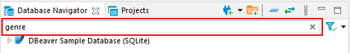
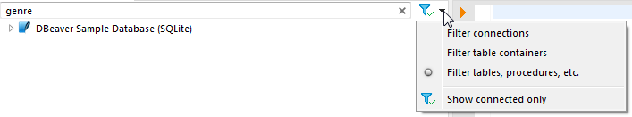
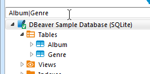

In the [Database Navigator](Database-Navigator) and [Database Object Editor](Database-Object-Editor) you can filter database objects to include or exclude some of them from the view. You can filter connections, schemas, tables, views, and procedures. A dots sign `(...)` next to the node`s name indicates that a filter is applied to its sub-nodes:

There are several ways in which you can filter objects.
One of the ways is to filter objects by the names of tables and views using the filter field above the tree of objects:

To filter objects by name, type the name in the field. The tree dynamically updates to show connections/containers/tables/views with that name. To reset the filter, click the Clear icon  () on the right end of the field.

You can select the types of filtering objects in the drop-down list on the right. And also use the filter only for active connections.

For multiple filtering use special symbols in the filter field - pipe ("|"), comma (","), or space between object names. You can also use an asterisk symbol to replace the part of the name.

Another way to filter objects is to use the **Filter** item on the context menu of a single object. To filter objects using the **Filter** menu, right-click the object, then click **Filter** on the context menu, and then click one of the items on the submenu:

Filter submenu item|Description
-------------------|-----------
**Hide ‘[object name]’**|Hides the current object while displaying the other ones
**Show only ‘[object name]’**|Shows the current object while hiding the other ones
**Toggle filter**|Inverts the filtering – shows hidden objects and vice versa
**Clear filter**|Removes the filtering to display all objects
**Configure [objects] filter**|Appears only to the folder or parent nodes of database objects - like ‘Tables’, ‘Indexes’, etc. Allows the creation of a complex filter with multiple filtering criteria, see [Configure Filters](Configure-Filters).

The third way of filtering is to use the **Filter** item on the context menu on several objects:
1. Select several objects of the same type using Ctrl or Shift keys.
2. Right-click the selection, then click **Filter**, and then choose one of the options on the submenu:

Filter submenu item|Description
-------------------|-----------
**Hide N objects**|Hides the selected objects while displaying the rest
**Show only selected objects**|Shows the selected objects while hiding the rest

To reset such filters, right-click the parent (folder) node displaying the dots sign `(...)`, and then click **Filter -> Clear filter**.
