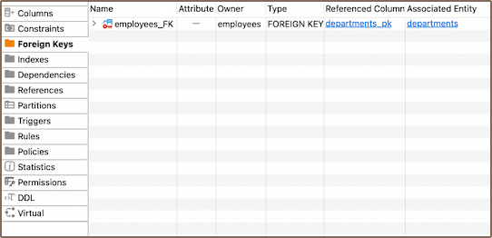
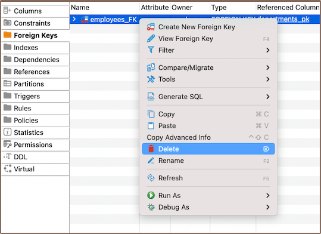

### Create

1) In the corresponding table, click on the **Foreign Keys** tab, right-click, and select **Create New Foreign Key**
   from the menu.

   

2) Choose the Reference table, Unique Key, and hit save.

   

   **Note**: If necessary, set the On Delete and On Update clauses to dictate what happens when you delete or update a row
in the main table.

3) After you hit **OK**, a window will appear displaying the newly created foreign key.

   
4) Persist the changes.

### Modify

You have the ability to rename a foreign key, add a comment, and tweak the **On Delete** and **On Update** rules. To
view parameters, double-click the foreign key name.

### Delete

To delete a foreign key, right-click on the key's name in the **[Properties editor](Properties-Editor)** and select
**Delete**, or you can select the necessary column and press the <kbd>Delete</kbd> key.

**Warning**: Be extra cautious here, as deleting a key can have significant implications for your data.

### Restrictions

* Referential Integrity: Foreign keys enforce referential integrity. That is, the values in the foreign key column must
  match the values in the referenced primary key.
* Impact on Performance: Managing foreign keys can slow down insert and update operations because of the need to check
  referential integrity.
* No Circular References: Circular foreign key references, where two or more tables refer to each other, are not
  permitted
  in most databases.
* Delete and Update Operations: Deleting or updating rows from the referenced table can be complicated because of the
  need to preserve referential integrity.

* Schema Modifications: Changes to the schema of a table (like altering data types or column deletions) can be
  restricted if a foreign key references the table.

**Note**: these limitations can vary based on the specific SQL database system you are using, such as PostgreSQL, MySQL,
Oracle, SQL Server, etc. Always refer to the specific documentation for your database system.