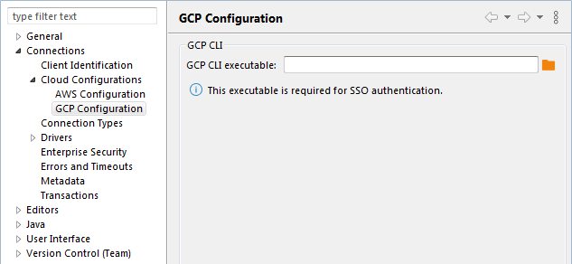
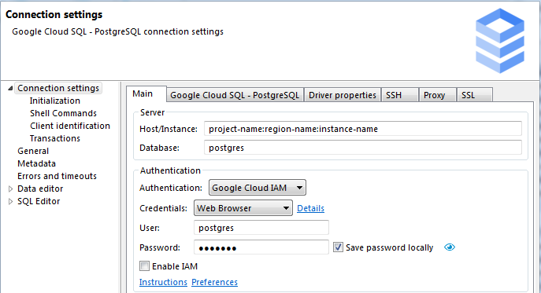

**NB: This feature is available in [Lite](Lite-Edition), [Enterprise](Enterprise-Edition), and [Ultimate](Ultimate-Edition) editions only.**

GCP web browser-based authentication allows you not to use a service or user-based key file, or other default authorization methods. You can provide access to your connection by authorization through the Google account.

## GCP CLI

To enable SSO authorization, you need to install GCP CLI (Command Line Interface) utilities.  
[GCP CLI installation](https://cloud.google.com/sdk/docs/install)

If DBeaver didn't find your executable CLI file (error message: "Authentication error: Error running GCP CLI. Is it installed on the local machine?)", you can add the path for your executable file manually in the Preferences -> Connections -> Cloud Configurations -> GCP Configuration

## GCP web browser-based authentication configuration

## Connection configuration

In the DBeaver database connection dialog, you need to:
- Set Authentication to `Google Cloud IAM`.
- Set Credentials to `Web Browser`.
- Add user and password info if they needed

Now you can connect. DBeaver will open a web browser with SSO authorization. Choose your account with Goggle projects on the web page.

As example:

