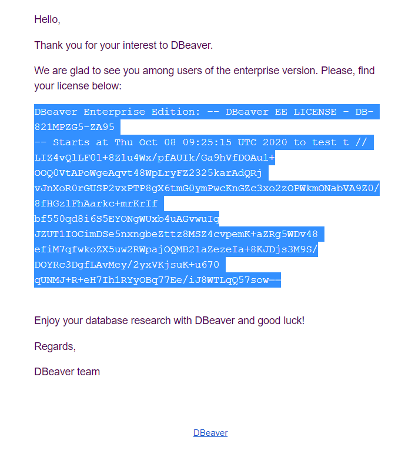
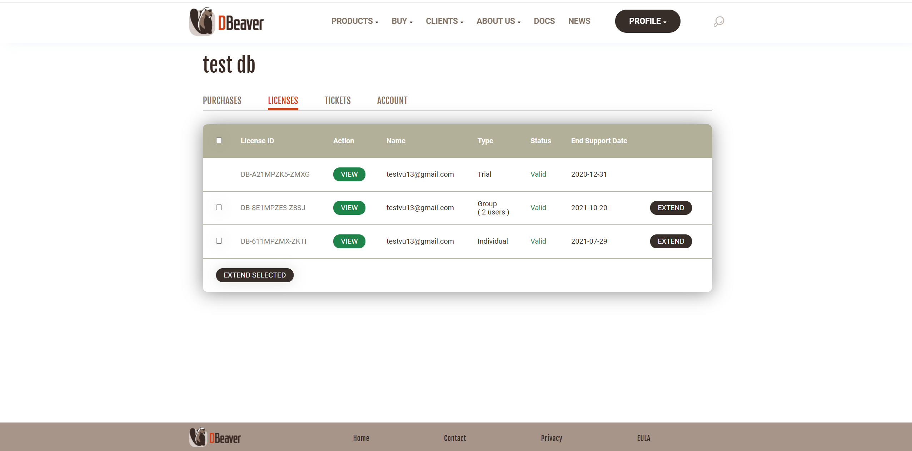
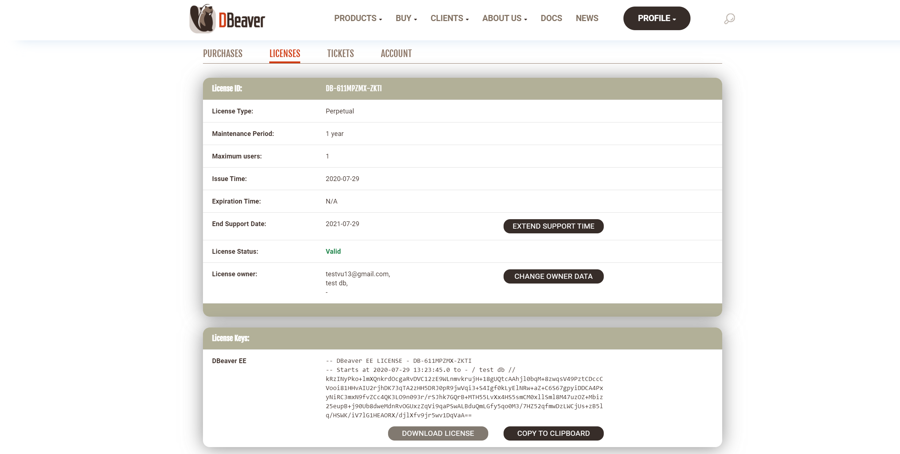
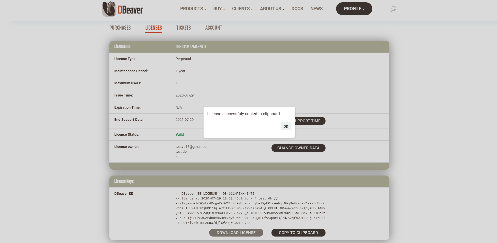
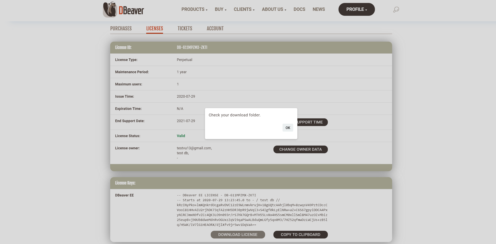
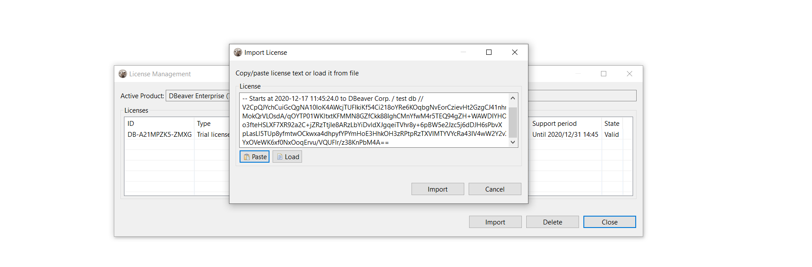
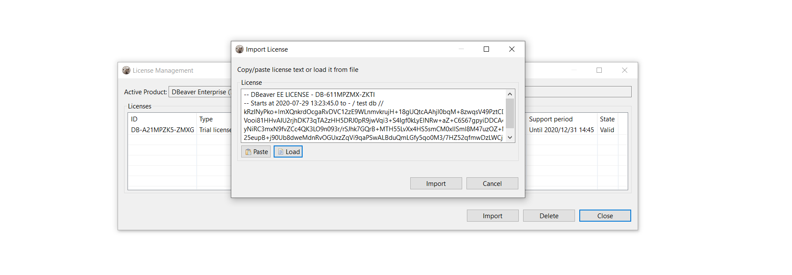

To start using DBeaver EE you can

* request a Trial license for 2 weeks https://dbeaver.com/trial/;
* request an Academic license if you are a student or a teacher https://dbeaver.com/academic-license/;
* buy Subscription license, Standard DBeaver EE license or DBeaver EE license extension https://dbeaver.com/buy/.

After purchase DBeaver EE license or getting Trial/Academic license you receive a License Key by email. 
Also, it is available in your personal account on our site https://dbeaver.com/.
The License Key is a unique identification number that contains License ID e. g. DB-821MPZFO-ZA8W, Start date and license owner’s name and company name. It is very important to import your License Key correctly.

## Import from email

You can just copy-paste License Key to import the license into the License Manager. Please, note that you need to copy-paste full license text (not just license ID). License text starts with “–” and ends with “==” characters.

Sometimes an email client can corrupt the formatting of License Key that can cause an error.

Therefore, you need to import your License Key from your personal account on our site https://dbeaver.com/.

## Import from the personal account

Firstly, you need to Sign in https://dbeaver.com/signin/.

Secondly, you should open the **Licenses** tab, where you can find all your licenses. 

To open License details and copy the License Key you press the **View** button. Here you can find your license status, type, maintenance period, end support date. Also, you can reassign the license to another user.

At the bottom of the page you can find the License Key required to start using DBeaver EE.
There are two options how to copy your License Key from the personal account:

1. Press **COPY TO CLIPBOARD** button, then press OK. The license text will be copied to clipboard.

2. Press **DOWNLOAD LICENSE** button, then press OK. 

.txt file with your License Key will be downloaded to your download folder. The file name is License ID, e. g. DB-821MPZFO-ZA8W.

Then you need to insert copied License Key to License Manager in Dbeaver EE.

## Insert the License key to License Manager

To start using DBeaver EE with your License Key you need to open License Manager in DBeaver EE:
Help -> DBeaver License Info

License information window can look different depending on whether have you already a valid license or not.

Then you click **License Manager**. Here you can find all your imported licenses and information about them.

Next you press the **Import** button to paste your License Key.

If you copied the License Key to clipboard, press the **Paste** button and then **Import**. 

If you downloaded .txt file with the License Key, press **Load** button and then select the file from Downloads. The License Key will be pasted automatically.

Then press the **Import** button and your license will be added in License Manager.

You have successfully imported your license. Now you can close License Manager and start using Dbeaver EE.  

## Import of Subscription license

Subscription license requires an internet access on the workstation for the first activation and each prolongation.

If you try to import Subscription license the following error can appear:

*Invalid subscription*

*Can`t find subscription information for license ‘DB-821MPZFO-ZA8W’.*

*Check your internet connection and/or firewall settings and restart application.*

In this case you need to check that DBeaver EE has an internet access or to configure firewall.

## License extension

Standard DBeaver EE license is a perpetual license with a limited period of support (1 year or 2 years). 

After the end of the selected support period you can continue to use DBeaver Enterprise Edition without support and updates or buy a license extension or a new license.

If you buy DBeaver EE license extension and Dbeaver has an internet access, the license in DBeaver EE will be updated automatically. Otherwise, you have to import the license key from the personal account once again.

## License Manager

License Manager provides you with information about your licenses.
Here you can find:

* License ID e. g. DB-821MPZFO-ZA8W;
* License type: Trial/Academic/Subscription/Standard;
* Version;
* License owner`s name and company name;
* License owner`s email;
* Start time is the date the license was received;
* End time is the date of license expiration (standard perpetual licenses don`t have it)
* Number of users: single user or multiuser for group licenses;
* Support period is a period while you have access to the internal support system on the site and a possibility to download new product versions;
* State: valid or expired.

