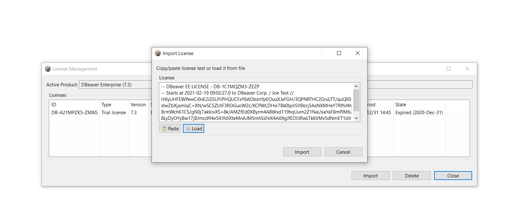

* [Import from email](#import-from-email)
* [Import from the personal account](#import-from-the-personal-account)
* [Insert the License key to License Manager](#insert-the-license-key-to-license-manager)
* [Import of Subscription license](#import-of-subscription-license)
* [Import of License extension](#license-extension)
* [License Manager](#license-manager)

To start using DBeaver EE you can

* request a [Trial license](https://dbeaver.com/trial/) for 2 weeks;
* request an [Academic license](https://dbeaver.com/academic-license/) if you are a student or a teacher;
* [buy](https://dbeaver.com/buy/) a Subscription license, Standard DBeaver EE license or DBeaver EE license extension.

After purchasing the DBeaver EE license or getting the Trial/Academic license, you will receive a License text by email. 
It will also be available in your personal account on our [site](https://dbeaver.com/).
This License text will contain your License ID e. g. DB-821MPZFO-ZA8W, the start date and license owner’s name and company name. It is very important to import your License correctly.

### Import from email

You can just copy-paste the License Key to import the license into the License Manager. Please note that you need to copy-paste the full license text (not just license ID). The license text starts with “–” and ends with “==” characters.

Sometimes an email client can corrupt the formatting of the License Key that can cause an error.

Therefore, you need to import your License Key from your personal account on our site https://dbeaver.com/.

### Import from the personal account

Firstly, you need to [Sign in](https://dbeaver.com/signin/).

Secondly, you should open the **Licenses** tab, where you can find all your licenses. 

To open the License details and copy the License Key press the **View** button. You can see the License details where you can find your license status, type, maintenance period, and end support date. You can also reassign the license to another user.

At the bottom of the page you can find the License Key required to start using DBeaver EE.
There are two options how to copy your License Key from the personal account:

1)Press the **COPY TO CLIPBOARD** button, then press OK. The license text will be copied to the clipboard.

2)Press the **DOWNLOAD LICENSE** button, then press OK. 

.txt file with your License Key will be downloaded to your download folder. The file name is License ID, e. g. DB-821MPZFO-ZA8W.

Then you need to insert the copied License Key to License Manager in Dbeaver EE.

### Insert the License key to License Manager

To start using DBeaver EE with your License Key you need to open License Manager in DBeaver EE:
Help -> DBeaver License Info

The License information window can look different depending on whether you already have a valid license or not.

Then click **License Manager** where you can find all your imported licenses and information about them.

Next press the **Import** button to paste your License Key.

If you copied the License Key to the clipboard, press the **Paste** button and then **Import**. 

If you downloaded the .txt file with the License Key, press the **Load** button and select the file from the Downloads. The License Key will be pasted automatically.

Then press the **Import** button and your license will be added to the License Manager.

You have successfully imported your license. Now you can close the License Manager and start using Dbeaver EE.  

### Import of Subscription license

Subscription license requires internet access on the workstation for the first activation and each prolongation.

If you do not have an active internet connection or work behind a corporate firewall while importing the Subscription license, the following error can appear:

*Invalid subscription*

*Can`t find the subscription information for license ‘DB-821MPZFO-ZA8W’.*

*Check your internet connection and/or firewall settings and restart application.*

In this case you need to check that DBeaver EE has internet access or you will need to configure your firewall.

### License extension

The standard DBeaver EE license is a perpetual license with a limited period of support (1 year or 2 years). 

After the end of the selected support period you can continue to use DBeaver Enterprise Edition without support and updates or buy a license extension or a new license.

If you buy the DBeaver EE license extension and Dbeaver has internet access, the license in DBeaver EE will be updated automatically. Otherwise, you have to import the license key from your personal account once again.

### License Manager

License Manager provides you with the following information about your licenses:

* License ID e. g. DB-821MPZFO-ZA8W;
* License type: Trial/Academic/Subscription/Standard;
* Version;
* License owner`s name and company name;
* License owner`s email;
* Start time is the date the license was received;
* End time is the date the license expires (standard perpetual licenses do not have this)
* Number of users: single user or multiuser for group licenses;
* Support period is the period you have access to the internal support system on the site and the possibility to download new product versions;
* State: valid or expired.

