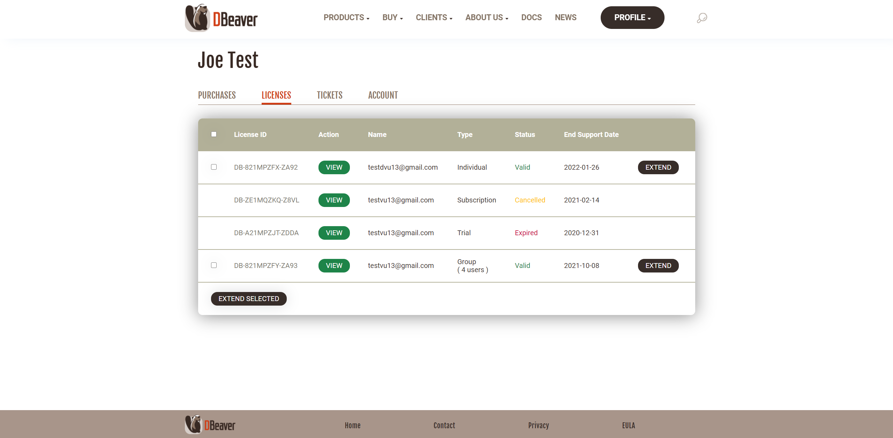
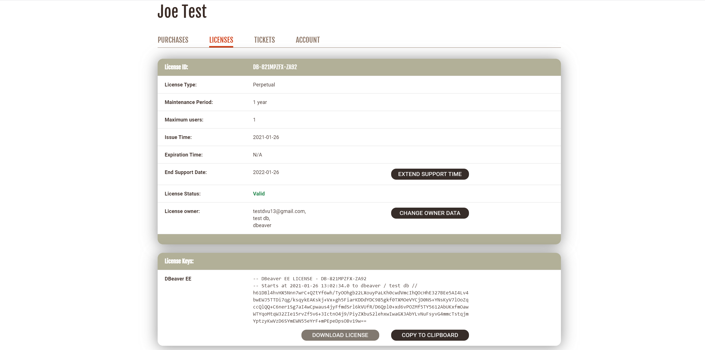
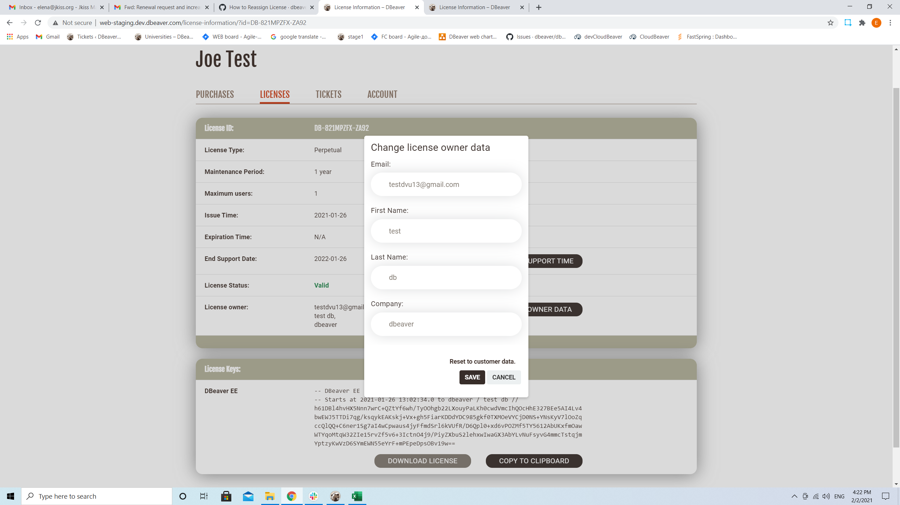
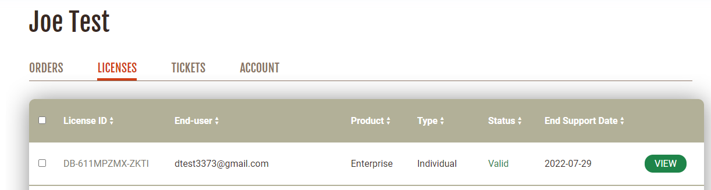

After purchasing a bunch of DBeaver EE licenses, you have to assign each license to an end user.

If an employee subsequently is leaving the company or the team that is using DBeaver, the license admin may need to reassign the license to another employee.

You can reassign the license to another user in your personal account.

Firstly, you need to [Sign in](https://dbeaver.com/signin/).

Secondly, you should open the **Licenses tab**, where you can find all your licenses. 

Select which license you need to reassign and press the **VIEW** button near its license ID. You can see the License details where you can find your license status, type, maintenance period, and end support date.

Also, there is the license end user field that contains the license end user's details. To reassign the license, you need to press the **CHANGE END USER** button near this field.

A pop-up opens, and you can enter the new license end user's data: email; first and last name; and company. After filling in the form, you need to press the **SAVE** button and the license owner will be changed. The license key that contains the license end user’s name and company name will be changed too.

The license will remain in your personal account. The end user's email will be in the end user column on the Licenses tab.

Also, the new license end user will be able to find the license in the personal account and [import it](https://dbeaver.com/docs/wiki/How-to-Import-License/). There will be no CHANGE END USER button because it is only the license customer who can assign a license to the end user. If the new license end user has not been signed up on our website, the account will be created automatically. The new user will receive a welcome email with a link to set up a password.
