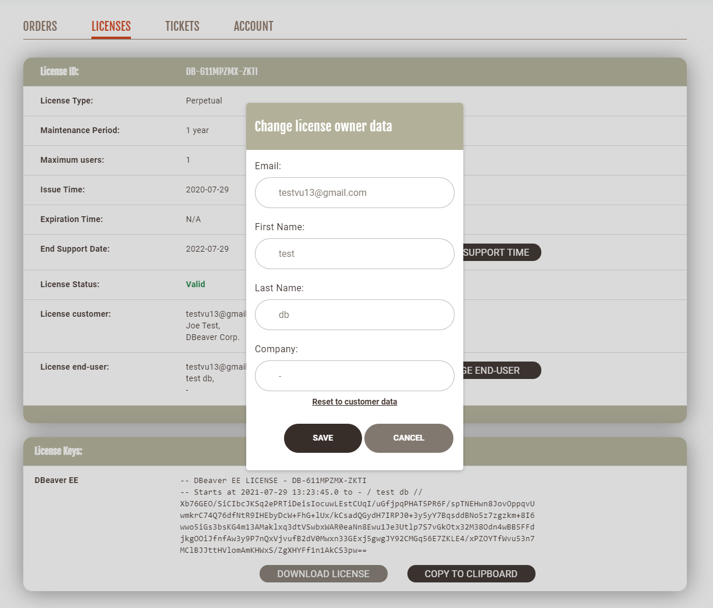

If you buy a bunch of DBeaver EE licenses, you need to assign each license to the end user.

If an employee subsequently is leaving the company or the team that is using DBeaver, the license admin may need to reassign the license to another employee.

You can reassign the license to another user in your personal account.

Firstly, you need to [Sign in](https://dbeaver.com/signin/).

Secondly, you should open the **Licenses tab**, where you can find all your licenses. 

You select which license you need to reassign and press the **VIEW** button near its license ID. You can see the License details where you can find your license status, type, maintenance period, end support date.

Also, there is the license owner field that contains license owner's details. To reassign the license, you need to press the **CHANGE OWNER DATA** button near this field.

A pop-up opens, and you can enter new license owner data: email, first and last name, company. After filling the form, you need to press the **SAVE** button and the license owner will be changed. The license key will be changed too.

The license will remain in your personal account. Also, new license owner will be able to find the license in the personal account but there will be no the CHANGE OWNER DATA button since only the license admin can assign a license. If new license owner hasn't been signed up on our website, the account will be created automatically. New user will receive a welcome email with a link to set up a password.

