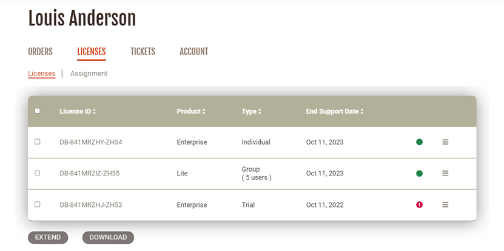

**Note: This feature is available in [Lite](Lite-Edition), [Enterprise](Enterprise-Edition), [Ultimate](Ultimate-Edition) and <a href="https://dbeaver.com/dbeaver-team-edition">Team</a> editions only.**

After purchasing a set of DBeaver licenses, you have to assign each license to an end user.

If an employee subsequently is leaving the company or the team that is using DBeaver, the license admin may need to reassign the license to another employee.

You can reassign the license to another user in your personal account.

Firstly, you need to [Sign in](https://dbeaver.com/signin/).

Secondly, you should open the **Licenses tab**, where you can find all your licenses. 

Secondly, you click the Assignment subtab. Here you can manage the license end-users and track the license usage.

You select which license you need to reassign and press the icon in the right column. 

A pop-up opens, and you can enter the new license end user's data: email; first and last name; and company. After filling in the form, you need to press the **SAVE** button and the license owner will be changed. The license key that contains the license end user’s name and company name will be changed too.

If you have a group or unlimited license, it is also possible to assign users. In addition, if you click the checkbox 'Allow User 1 to manage license users', this user will become a license manager and will be able to assign users.

The license will remain in your personal account. The end user's email will be in the end-user column on the Assignment tab.

Also, the new license end user will be able to find the license in the personal account and [import it](https://dbeaver.com/docs/wiki/How-to-Import-License/) but the end user cannot change the license data. If the new license end-user has not been signed up on our website, the account will be created automatically. The new user will receive a welcome email with a link to set up a password while the previous user will receive an email that the license has been withdrawn.

