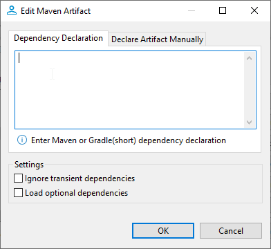
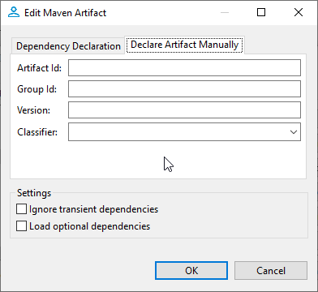

# How to add additional artifacts to the library

## Introduction

 DBeaver has the functionality to add new artifacts into existing drivers.

## How to open

> Database -> Driver Manager -> `Select driver`-> Libraries

### How to edit

    Double click on the library

### How to add

    Click `Add Artifact`

## How to use

For add mode, a **DBeaver** supports two modes **Dependency Declaration** and **Declare Artifacts Manually** editing mode supports only second **Declare Artifacts Manually**.

### Dependency Declaration

Mode parses the inputted text and creates artifacts out of the results of parsing. It Supports multiple input formats written below.



#### Supported formats

* Short Gradle

    ```
    group:artifact_name:version
    ```

* Maven
  * For single artifact

    ``` XML
    <dependency>
        <groupId>group</groupid>
        <artifactId>artifact</artifactId>
        <version>version</version>
    </dependency>
    ```

  * For multiple artifacts
  
    ```XML
    <dependencies>
        <dependency>
            <groupId>group</groupid>
            <artifactId>artifact</artifactId>
            <version>version</version>
        </dependency>
        <dependency>
            <groupId>group</groupid>
            <artifactId>artifact</artifactId>
            <version>version</version>
        </dependency>
        <dependency>
            <groupId>group</groupid>
            <artifactId>artifact</artifactId>
            <version>version</version>
        </dependency>
    <dependencies>
    ```

### Declare Artifacts Manually

It allows to manually set up parameters. Allows adding only one item per dialog.  

