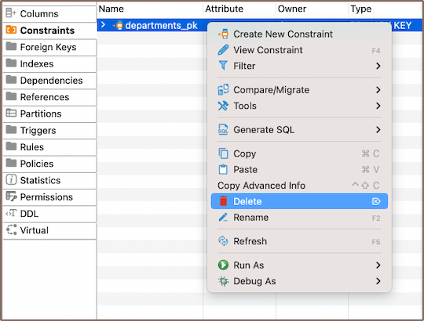

As you continue to explore the intricacies of [table](New-Table-Creation) structures, understanding the role and
functionality of constraints becomes essential. Constraints are rules that we apply to data [columns](Creating-columns)
in a table when we want to limit the type of data that can go into a table. This can help ensure the accuracy and
reliability of our data.

While creating constraints is not always necessary, it can be a powerful tool in the table creation process. Just like
you create columns, you can also define constraints that uphold the integrity of your data. Constraints can be as simple
as ensuring uniqueness in a column or as complex as a check expression that defines acceptable values for a column.

In this guide, you'll learn how to create, modify, and delete constraints, as well as how to customize their settings to
suit your needs. You'll discover how to create [primary keys](#primary-key), [unique keys](#unique-key),
and [check expressions](#check-expression). You'll also learn about the restrictions and considerations you need to 
keep in mind when working with constraints.

## Primary key

Primary keys are a crucial part of your database structure, uniquely identifying each record in a table. When you define
a primary key, the database ensures no duplicate values exist in the specified column(s), maintaining data integrity and
improving performance. DBeaver simplifies this process, providing an intuitive interface for creating, modifying, and
deleting primary keys.

### Create

Creating a new primary key in DBeaver involves a series of steps that guide you through the process. Here's how you can do it:

1) You can start the process of creating a new constraint in three ways:
- Using the **[Properties editor](Properties-Editor)**: Open the Properties Editor and navigate to the **Constraints** tab of the corresponding table.
This is where you'll find all the existing constraints for the table and where you'll create new ones.

   

- Using the **[Database Navigator](Database-Navigator)**: Navigate to the database where the table you want to add a constraint to is located. Find
and select the table for which you want to create a new constraint. Within the selected table, you'll find a folder
named **Constraints**.

- You can also utilize the **Create New Constraint** button  
  located at the bottom of the **Properties editor**.

2) Depending on the method you chose in step 1, either right-click on the window (in the **Properties Editor**) or within
   the **Constraints** folder (in the **Database Navigator**), and select **Create New Constraint**. If you're using 
   the third method, simply click the **Create New Constraint** button. This will open a new window where you'll be able
   to define the details of your new constraint.  
   
   

 Field   | Description                                                                                                                                                                                   
---------|-----------------------------------------------------------------------------------------------------------------------------------------------------------------------------------------------
 **Name**    | Here, you can specify the name of the constraint. It's a good practice to choose a name that clearly indicates the purpose of the constraint.                                                 
 **Type**    | This is where you select the type of constraint. Options include Primary Key, Unique Key, Check. The type of constraint you choose will depend on the rule you want to enforce on the column. 
 **Columns** | In this section, you can select the column or columns that the constraint will apply to. If you're creating a composite constraint, you can select multiple columns.                          

3) After selecting the column, click **OK** to save your new constraint. A window will appear displaying the newly created
   primary key. This is a good time to double-check that everything is correct.

#### Saving changes

Once you have configured the constraint properties, it is essential to save these changes to the database. Until you
commit your modifications, the new constraint will only exist within DBeaver and will not be added to the actual database
table.
Here are three options for committing the changes:

* Click on **File** -> **Save** -> **Persist**.
* Select the desired table in the **Database Navigator** and press <kbd>Ctrl+S</kbd> (or <kbd>CMD+S</kbd> for Mac OS),
  choose **Persist** to save the changes.
* Utilize the **Save** button  located at the bottom of the
  **Properties editor** and press **Persist** to save the changes.

### Modify

To modify an existing primary key, you need to first delete it and then add a new primary key with the updated
parameters.

**Note**: Remember, modifying primary keys should be done with care. Primary keys are integral to maintaining the
integrity of your data, and changing them can have significant effects on your database. Always double-check your
changes and make sure they align with your data requirements.

### Delete

1) You can delete a primary key either through the **Properties Editor** or the **Database Navigator**:

- Using the **Properties Editor**: Open the Properties Editor, navigate to the **Constraints** tab of the corresponding table,
  and find the constraint you want to delete.

   

- Using the **Database Navigator**: Navigate to the database where the table with the constraint is located. Find and select
  the constraint, open the **Constraints** folder, and find the constraint you want to delete.

2) To delete a primary key, right-click on the key's name and select **Delete**, or you can select the necessary primary
   key and press the <kbd>Delete</kbd> key, or **Delete button**  (in the **Bottom Menu** of the **Properties Editor**).

3) A confirmation dialog will appear, asking you to confirm the deletion. Before proceeding, ensure that you've selected
   the correct constraint for deletion. 

4) After confirming the deletion, you'll need to persist the changes to apply them to the database.

**Important**: Be particularly cautious if you're considering using the **Cascade delete** option. This option will not
only delete the primary key but also any dependent records in your database. This can lead to significant data loss if
not handled carefully.

## Unique key

A unique key is a tool that ensures distinct values within a column or a group of columns in a table. While it can
identify unique records, it doesn't have to be the primary key. You can create a unique key on a single column or
multiple columns, ensuring that each value is unique. This is crucial for maintaining data integrity within your table.
If you attempt to insert a duplicate value into a column with a unique key constraint, you'll encounter an error. 

The processes of creating, deleting and modifying a unique key are similar to those for a [primary key](#primary-key).


## Check expression

A check expression in a database is also a constraint, it defines acceptable values for a column. It enforces specific
conditions, ensuring that the data in the column complies with the defined rules. The processes of creating, deleting and
modifying a check expression are similar to those for a [primary key](#primary-key).

For instance, suppose you have a column named "name" and you want to ensure that its value is never an empty string. You
could create a check expression as follows:

```sql
name <> ''
```
This would prevent any records from being inserted or updated with an empty string for the "name" column.


**Note**: Check expressions are a powerful tool for maintaining data integrity. They enforce specific
conditions on your data, preventing invalid entries. Always consider the implications of your actions when working with
check expressions.

### Restrictions

Working with constraints comes with certain restrictions that you need to be aware of. These restrictions are in place
to maintain the integrity of your data and prevent unwanted changes. Here's what you need to know:

- **Unique Values**: When creating a primary key or unique constraint, the column(s) you choose must contain unique
  values. If there are duplicate values in the column(s), the constraint creation will fail.

- **Null Values**: Primary keys cannot contain null values. If the column(s) you choose for a primary key contains null
  values, you will need to either remove or replace these before creating the constraint. Unique constraints, on the
  other hand, typically allow for multiple null values.

- **Data Type Compatibility**: The type of constraint you want to create may have specific data type requirements. For
  example, check constraints require a Boolean expression, so the column(s) involved must be able to participate in such
  an expression.

- **Existing Data Compliance**: When creating a check constraint, all existing data in the table must comply with the
  check condition. If any rows violate the condition, the constraint creation will fail.

- **Performance Impact**: Creating constraints, especially on large tables, can have a performance impact. This is
  because the database needs to check the constraint condition for all existing rows. This might take considerable time
  and resources for large tables.

- **Modifying Constraints**: Constraints cannot be directly modified. This is because constraints are defined
  with specific parameters that can't be changed directly.

- **Deleting Constraints with Dependencies**: You can't delete a primary key in a table with records unless you first
  remove all dependent foreign keys. This is because the primary key is likely being referenced by these foreign keys,
  and deleting it would break these references and potentially cause data integrity issues.


<br><br><br><br>
**Further Reading:**<br>
[New Table Creation](New-Table-Creation) | [Creating columns](Creating-columns) | Implementing Constraints | [Utilizing foreign keys](Utilizing-Foreign-Keys) | [Creating indexes](Creating-Indexes) | [Incorporating triggers](Incorporating-Triggers)

