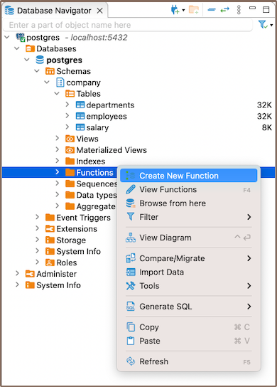
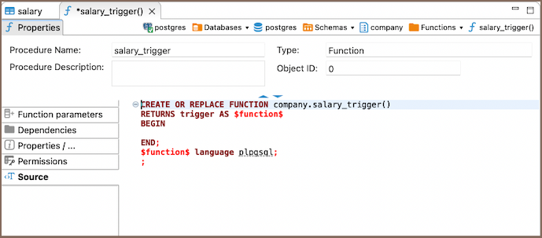
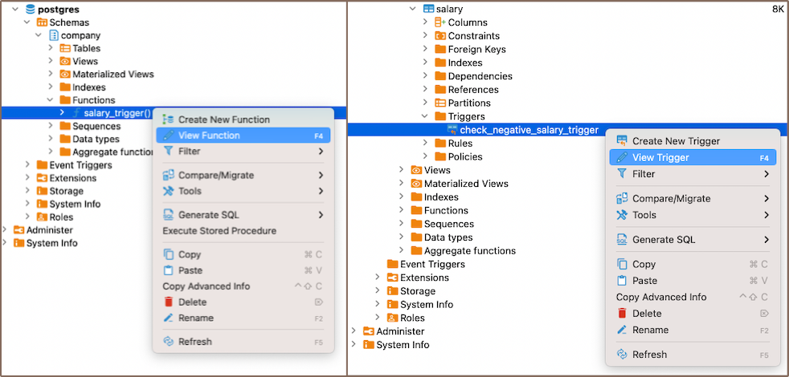

This article focuses on triggers, essential components in database management. Triggers are procedures that are
automatically executed in response to certain events in a database. They are integral to the creation and manipulation 
of [tables](New-Table-Creation), enforcing [constraints](Implementing-Constraints), and automating [tasks](Task-Management).

The process involves creating a function, which is then used in a trigger. For example, a function can check if a new
salary value is negative and raise an exception. This function can be used in a trigger that runs before any `INSERT` or
`UPDATE` operations on a salary table.

However, triggers come with restrictions and can impact performance, so their use should be optimized. The behavior of
triggers can vary based on the database system in use, so always refer to the specific documentation for your system.

### Create

#### Function

1) To create a trigger, start by creating a function. Here are three ways you can do it:

- Open the **[Properties editor](Properties-Editor)** of the database and navigate to the **Functions**
   tab of the corresponding database.
- Navigate to the database where you want to add a function in the **[Database Navigator](Database-Navigator)**. Within the selected database,
  you'll find a folder named **Functions**. 

   
- Additionally, to create a new function, you can utilize the **Create New Function** button
    located at the bottom of the **Properties editor**.

2) Depending on the method you chose in step 1, either right-click on the window (in the **Properties Editor**) or within
   the **Functions** folder (in the **Database Navigator**), and select **Create New Function**. If you're using 
   the third method, simply click the **Create New Function** button. This will open a new window where you'll be able
   to customize the function's settings to suit your needs. 

   

 Field             | Description                                                                                                                                                                                
-------------------|--------------------------------------------------------------------------------------------------------------------------------------------------------------------------------------------
 **Function Name** | This is the name you choose for the function. It should be unique within the schema where the function is being created.                                                                   
 **Type**          | In this case, you would select **Function**.                                                                                                                                               
 **Language**      | This is the programming language in which the function is written. For most database systems, this would be SQL or a variant of SQL, such as PL/pgSQL for PostgreSQL or PL/SQL for Oracle. 
 **Return Type**   | This specifies the type of value the function will return. For a trigger function, this is usually specified as **trigger**.                                                                 

**Note**:These settings can vary depending on the specific database system you're using. Always refer to the
documentation for your database system for the most accurate information.

3) After you've chosen the needed settings for your function, you'll need to write the actual code for the function.
   This is done in the **Source** section.  

   

This function will be called when the trigger is activated. The function you write will depend on what you want the
trigger to do. For example, if you want the trigger to check if a new salary value is negative and raise an exception if
it is, you might write a function like this:  

```sql
CREATE OR REPLACE FUNCTION company.salary_trigger()
RETURNS trigger AS $function$
BEGIN
    IF NEW.salary_amount < 0 THEN
        RAISE EXCEPTION 'Error: Salary cannot be negative';
    END IF;
    RETURN NEW;
END;
$function$ language plpqsql   
```


#### Trigger

1) Creating a trigger is a process that mirrors the creation of a function. Once your function is defined, you can move on
to create the trigger. This can be done through the **Properties Editor** or the **Database Navigator**.

- In the **Properties Editor**, you can navigate to the **Triggers** section associated with the table for which you want to
create the trigger, right-click on the window and select **Create New Trigger**. Here, you can also select **Create New Trigger** button 
from the **Bottom menu**. 

   

- Similarly, in the **Database Navigator**, you can right-click on the relevant table, select **Triggers**, and then
choose **Create New Trigger**.

2) Next, you need to provide a name for the trigger and specify the function that it should call when it's activated. The
trigger's function is typically written to perform a specific task when certain conditions are met. For example, if
you've written a function to check if a new salary value is negative, you can create a trigger that calls this function
before any `INSERT` operations on the salary table.

3) Finally, describe the code for the trigger.

   

For instance:

```sql
CREATE TRIGGER check_negative_salary_trigger
BEFORE INSERT
ON company.salary
FOR EACH ROW
EXECUTE function company.salary_trigger();
```


In this example, a `salary_trigger()` function is created that evaluates the new salary value (NEW.salary). If the
salary is negative, it throws an exception with an error message. Then, a `check_negative_salary_trigger` is established
to run this function before any `INSERT` operations on the "salary" table. Should the salary value be negative,
an exception is triggered and the operation is stopped.

#### Saving changes

Once you have configured the trigger and function properties, it is essential to save these changes to the database. Until you
commit your modifications, the new trigger and function will only exist within DBeaver and will not be added to the actual database.
Here are three options for committing the changes:

* Click on **File** -> **Save** -> **Persist**.
* Select the desired table in the **Database Navigator** and press <kbd>Ctrl+S</kbd> (or <kbd>CMD+S</kbd> for Mac OS),
  choose **Persist** to save the changes.
* Utilize the **Save** button  located at the bottom of the
  **Properties editor** and press **Persist** to save the changes.


### Modify

In the realm of database management, the need to modify existing functions or triggers is a common occurrence. Whether
it's to correct an error, optimize performance, or adapt to new requirements, the ability to modify these elements is
crucial. DBeaver offers intuitive and efficient ways to make these modifications.

The DBeaver interface provides multiple pathways to access and modify functions or trigger:

- **Properties Editor**: Open the **Properties Editor** by double-clicking on the database name (for functions) and table
  name (for triggers). Within the selected database or table, you'll find a folder named **Triggers** or **Functions**.
  Right-click on the trigger or function you want to modify and select **View Trigger** or **View Function**.
- **Bottom Menu**: In the **Properties Editor** interface, use the **View Indexes** or **View Function**
  button .
- **Database Navigator**: In the **Database Navigator**, select the appropriate database or table. Within the selected
  database or table, you'll find a folder named **Triggers** or **Functions**. Right-click the trigger or function and select
  **View Index** or **View Function**.

    

### Delete

You can delete an index either through the **Properties Editor** or the **Database Navigator**:

- Using the **Properties Editor**: Open the Properties Editor, navigate to the **Triggers** or **Functions** tab of the
  corresponding database (for functions) and table (for triggers), and find the trigger you want to delete.

- Using the **Database Navigator**: Navigate to the database where the table with the trigger or function is located. Open the 
  **Triggers** or **Functions** folder, and find the trigger or function you want to delete.

   

2) To delete the trigger or function, right-click on the trigger's or function's name and select **Delete**, or you can select the necessary trigger or function and
   press the <kbd>Delete</kbd> key, or **Delete button**  (in the
   **Bottom Menu** of the **Properties Editor**).
3) A confirmation dialog will appear, asking you to confirm the deletion. Before proceeding, ensure that you've selected
   the correct trigger or function for deletion.
4) After confirming the deletion, you'll need to persist the changes to apply them to the database.

### Restrictions

* **Recursive Triggers**: Some databases allow recursive triggers, where a trigger can call itself. This can lead to
  infinite loops and excessive system load if not handled correctly.
* **Data Modification**: Triggers can't be used to modify a table that is already being used (for reading or modifying) in
  the statement that invoked the function or trigger.
* **Execution Order**: The order in which multiple triggers are fired isn't guaranteed. This can lead to unexpected results
  if triggers have interdependencies.
* **Performance**: Triggers can slow down data modification operations because they add extra processing. They should be
  used sparingly and optimized for performance.
* **Transaction Control Statements**: In many SQL databases, transaction control statements (like COMMIT and ROLLBACK) are
  not allowed within trigger code. However, exceptions apply depending on the database system.

<br><br><br><br>
**Further Reading:**<br>
[New Table Creation](New-Table-Creation) | [Creating columns](Creating-columns) | [Implementing Constraints](Implementing-Constraints) | [Utilizing foreign keys](Utilizing-Foreign-Keys) | [Creating indexes](Creating-Indexes.md) | Incorporating triggers