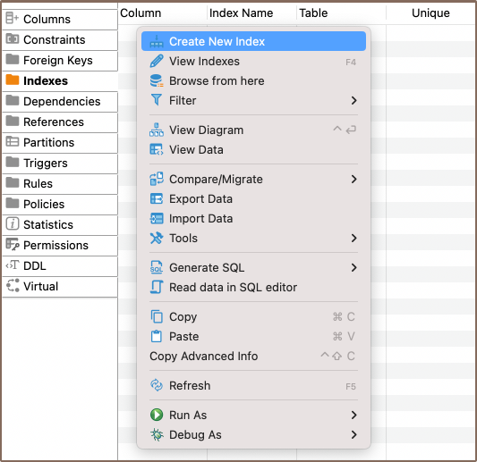
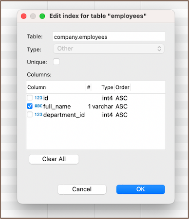
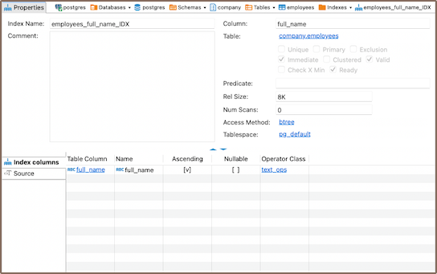
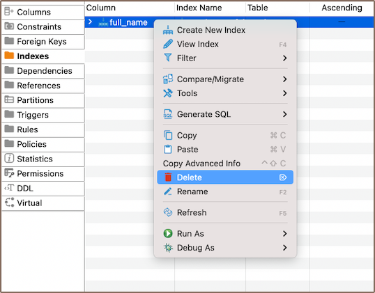

### Create

1) To create an index, navigate to the corresponding table. Click on the **Indexes** tab. Right-click and select
   **Create New Index**.

   

2) Choose the column for the index and click **OK**.

   

**Note** You have the option to create a composite index, which is an index built on several table columns. It boosts
query execution speed when dealing with multiple-column conditions. A composite index can greatly improve database
performance with complex conditions. It's recommended to put unique fields at the end of the composite index.

3) Persist the changes.

### Modify

To modify indexes, double-click the index name to view its parameters.

Remember, the ability to alter index parameters depends on the DBMS type. Changing these parameters may slow down query
performance. Always test performance implications before making changes to a production server.

### Delete

To delete an index, right-click on the index's name in the **[Properties editor](Properties-Editor)** and select
**Delete**, or you can select the necessary column and press the <kbd>Delete</kbd> key.

### Restrictions

* Unique indexes created due to a primary key or unique constraint can't be deleted. Instead, remove the constraint.
  This
  action removes the uniqueness requirement for column values involved in the constraint expression and deletes the
  corresponding unique index.
* Unique Indexes: These enforce uniqueness on the indexed column(s), which can limit data entry if values must be
  distinct.
* Performance Impact: Indexes can improve query speed, but they slow down data modification operations (INSERT, UPDATE,
  DELETE) as the index must also be updated.
* Storage: Indexes consume disk space. This might become significant if there are many indexes or the table is large.
* Null Values: Depending on the database system, there may be restrictions related to indexing null values.
* Data Types: Certain data types might not be indexable or may require specific index types.

Always consider these factors when creating indexes to ensure optimal database performance and efficiency.
