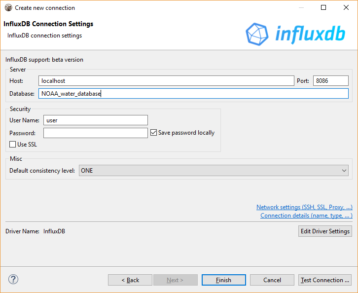
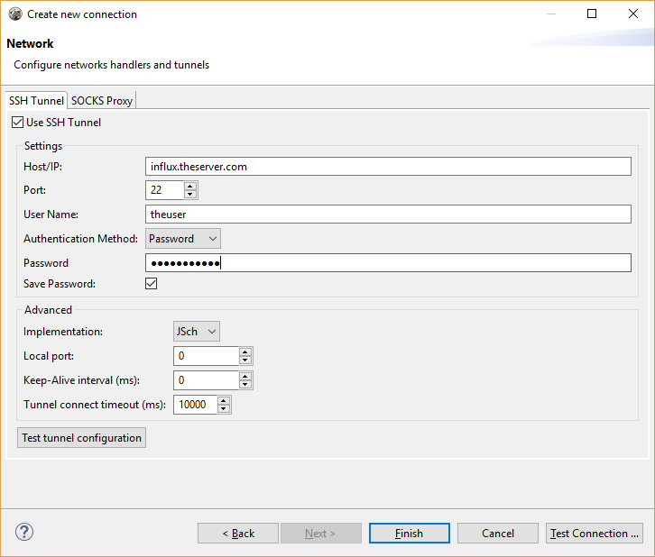
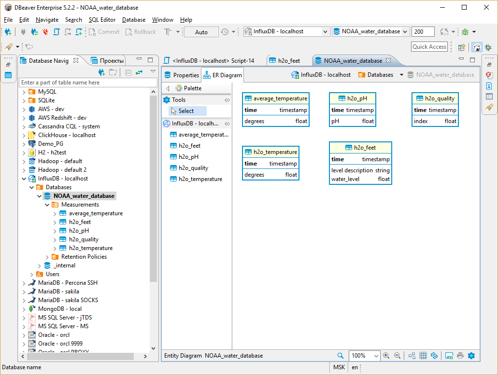
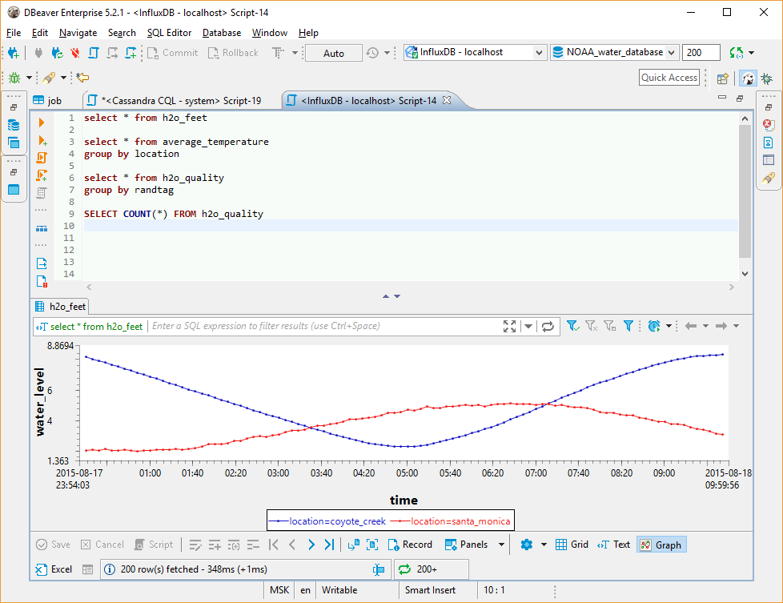
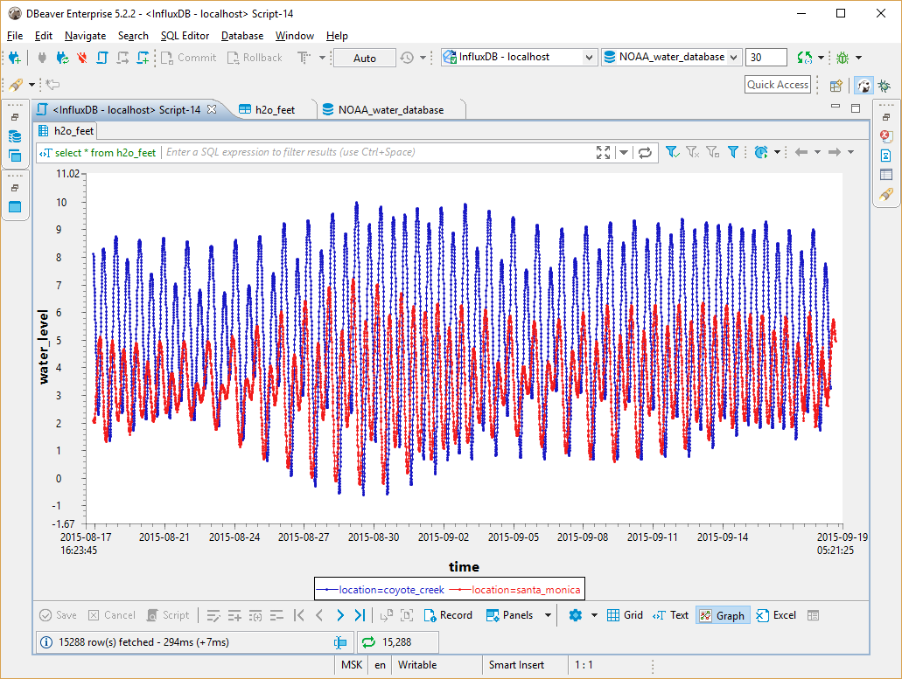

### Overview

DBeaver EE supports InfluxDB schema browser, data viewer and InfluxQL queries execution.  
DBeaver uses InfluxDB Java driver 2.12 to operate with the server over HTTP/HTTPS (standard InfluxDB protocol).  
It supports InfluxDB servers of any version (in the moment of writing).  

### Connecting to Influx Server

You can connect directly to a server or use SSH tunneling or SOCKS proxy.  





### Browsing InfluxDB schema

InfluxDB is <a href="https://docs.influxdata.com/influxdb/v1.6/concepts/crosswalk/">TimeSeries database</a>, it does not support tables, foreign keys and other relational entities.</p>
DBeaver does not support data insert/update in InfluxDB. Database is basically a in read-only state for DBeaver. You can browse schema and view/analyse data.  
While data itself is loaded by various sensors/data collectors in real time.  
Instead of tables InfluxDB has <a href="https://docs.influxdata.com/influxdb/v1.6/concepts/key_concepts/#measurement">measurements</a>. Instead of columns it has <a href="https://docs.influxdata.com/influxdb/v1.6/concepts/key_concepts/#field-key">fields</a> and <a href="https://docs.influxdata.com/influxdb/v1.6/concepts/key_concepts/#tag-key">tags</a>.  



### Executing InfluxQL (versions < 2)
<a href="https://docs.influxdata.com/influxdb/v1.6/query_language/">InfluxQL</a> is a query language similar to SQL.  
DBeaver fully supports all InfluxQL statements. Query results are presented as grid or as graphs:  
### Executing Flux (versions > 2)
<a href="https://docs.influxdata.com/flux/v0.x/get-started/">Flux</a> is a query language that is used in the new versions of Influx. It is not similar to InfluxQL and doesn't use SQL syntax.
#### Query example 
```
from(bucket: "example-bucket")
    |> range(start: -1d)
    |> filter(fn: (r) => r._measurement == "example-measurement")
    |> mean()
    |> yield(name: "_results")
```


