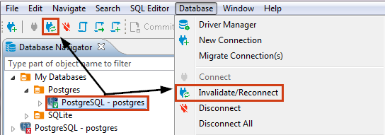

You might need to invalidate a database connection and then reconnect to it again in cases such as where the connection to the server is temporarily lost, etc. To invalidate a database connection and then reconnect to the database, click the database connection in the Database Navigator or Projects view, and then click the **Invalidate/Reconnect** button in the toolbar or **Database -> Invalidate/Reconnect** on the main menu:

You can also right-click the connection and click **Invalidate/Reconnect** on the context menu.