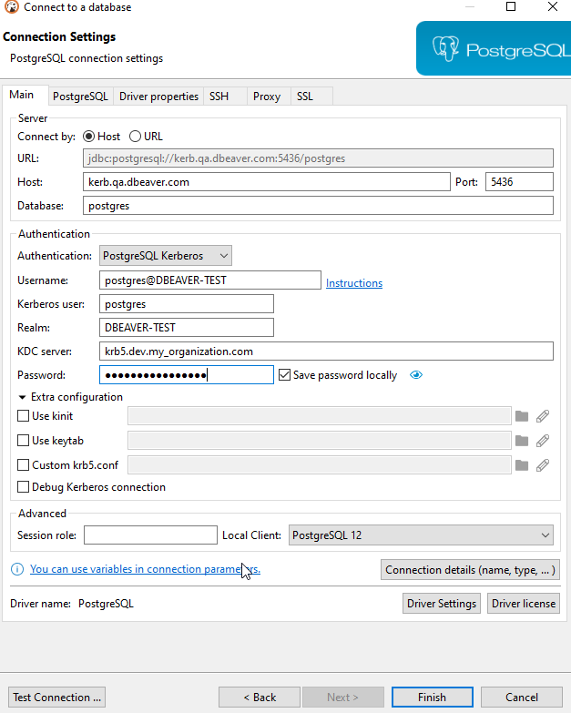

**Note: This feature is available in [Lite](Lite-Edition), [Enterprise](Enterprise-Edition), and [Ultimate](Ultimate-Edition) editions only.**

Databases that support this feature:
- Cockroach
- EnterpiseDB (EDB)
- Fujitsu
- Greenplum
- HANA
- MySQL
- MariaDB
- [Oracle](#oracle)
- PostgreSQL
- PrestoDB
- PrestoSQL (Kerberos can be used with SSL from JKS)
- Redshift
- Teradata (in progress)
- TimescaleDB
- Yellowbrick
- YugabyteDB

There are a lot of ways to use Kerberos in your database authentication. On this page, you will learn a few of them. This page describes only the part that you need to do on the client machine (the one on which DBeaver is installed), and it is implied that Kerberos KDC and the necessary configuration are already done on the server.

### Possible settings

Setting|Description
---------------|-----------
Username|Name of the user/role in the database
Kerberos User|A Kerberos user represents a unique identity in a Kerberos system to which Kerberos can assign tickets to access the Kerberos-aware services.
Realm|A Kerberos realm is the domain over which a Kerberos authentication server has the authority to authenticate a user, host, or service. A realm name is often, but not always the upper case version of the name of the DNS domain over which it presides.
KDC Server|The hostname of your KDC server. The Kerberos Key Distribution Center (KDC) is a network service that supplies session tickets and temporary session keys to users and computers within an Active Directory domain. The KDC runs on each domain controller as part of the Active Directory Domain Services (AD DS). So the KDC hostname is the hostname of your DC.
Password|The password of your Kerberos user.
Use keytab|Check this box if you want to use a keytab file on your machine instead of entering a password.
Use kinit|Check this box if you use kinit tool on your machine. kinit is a tool that obtains and caches an initial ticket-granting ticket for the user. If this box is checked, you will only need to fill in your Kerberos username in most cases.

### Using the keytab file

A keytab is a file containing pairs of Kerberos principals and encrypted keys (which are derived from the Kerberos password). You can use a keytab file to authenticate various remote systems using Kerberos without entering a password. However, when you change your Kerberos password, you will need to recreate all your keytabs.
Keytab files are commonly used to allow scripts to authenticate automatically using Kerberos without requiring human interaction or access to a password stored in a plain-text file. The script is then able to use the acquired credentials to access files stored on a remote system.
For DBeaver, it means that when you use a keytab file, you still need to provide all of the credentials other than a password.

### Using kinit

kinit is a command-line/terminal tool that obtains and caches an initial ticket-granting ticket for the Kerberos user. All of the credentials are provided either in a configuration file or in a command-line interface. This means that to authenticate with kinit in DBeaver all you need to do is provide a kerberos username and check the box to use kinit.

### Using a password

This method is almost the same as using a keytab file, but instead of providing an encrypted file, you need to enter a password manually.

### Oracle

Oracle JDBC driver 21 has broken KErberos authentication, at least for the most of old configurations.  
Use older driver (12.x or 19.x) in order to use Kerberos authentication in Oracle.  