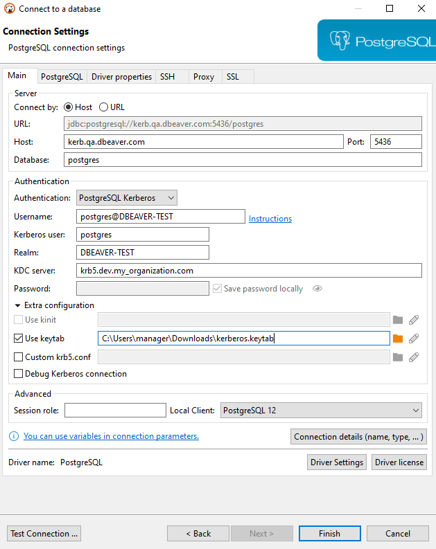

There are a lot of ways to use Kerberos in your database authentication. On this page you will learn a few of them. Those are the easiest ones and are only possible in Enterprise or Ultimate editions of DBeaver.
This page describes only the part that you need to do in the client machine (the one on which DBeaver is installed) and it is implied that Kerberos KDC and the necessary configuration are already done on the server.

###Using the keytab file

One of the easiest methods. To use it you will need a `.keytab` file on your client machine, it contains the data needed for authentication. Aside form this file you will need to provide Kerberos username with realm and KDC server. Depending on database settings, realm can be provided either in its own field or along with username after a `@` symbol.

###Using kinit

Connection with kinit can be even easier if you are using the same kerberos user for different connections and/or different programs and services. The disadvantage is that it can be tricky to use kinit on Windows.
The process of creating the connection with kinit is almost the same but depending on your krb5.conf file you may not need to input anything other than kerberos username and check to use kinit

###Using password

This is the least secure but also the most hassle-free method. Just input Kerberos username with realm, KDC server and password, and you are good to go.

