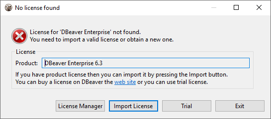

**Note: This feature is available in [Lite](Lite-Edition), [Enterprise](Enterprise-Edition), [Ultimate](Ultimate-Edition) and <a href="https://dbeaver.com/dbeaver-team-edition">Team</a> editions only.**

### Manual license import

Commercial versions of DBeaver ask the user to import the license file if they cannot find it locally.
It is the most simple and convenient way to import the product license for individual users.

### License management automation

There are several ways to automate the license management process. It makes sense for a multi-user environment.

#### Put the license file to the predefined locations

1. Install DBeaver
2. Save license text to a file. It should be named as `.dbeaver-%PRODUCT_PREFIX%-license.dat` or `.dbeaver-%PRODUCT_PREFIX%-license.txt`.
3. Add the license file to one of the following locations:
   - Windows
     - `%HOMEPATH%\`
     - `%APPDATA%\DBeaverData\workspace6\.metadata\`
   - MacOS X
     - `~/` (user home)
     - `~/Library/DBeaverData/workspace6/.metadata/`
   - Linux
     - `~/` (user home)
     - `$XDG_DATA_HOME/DBeaverData/workspace6/.metadata/`
4. Launch DBeaver from Start Menu

Product prefixes:

Product name | Prefix
---|---
DBeaver Enterprise | ee
DBeaver Lite | le
DBeaver Ultimate | ue

#### Passing license file through command line

You can add the command line parameter `license <license-path>` to the DBeaver EE shortcut.
Also, you can add this parameter to the `dbeaver.ini` config file.

[Command line](Command-Line) reference.
