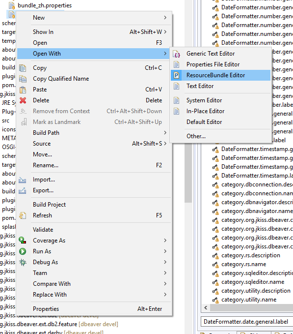
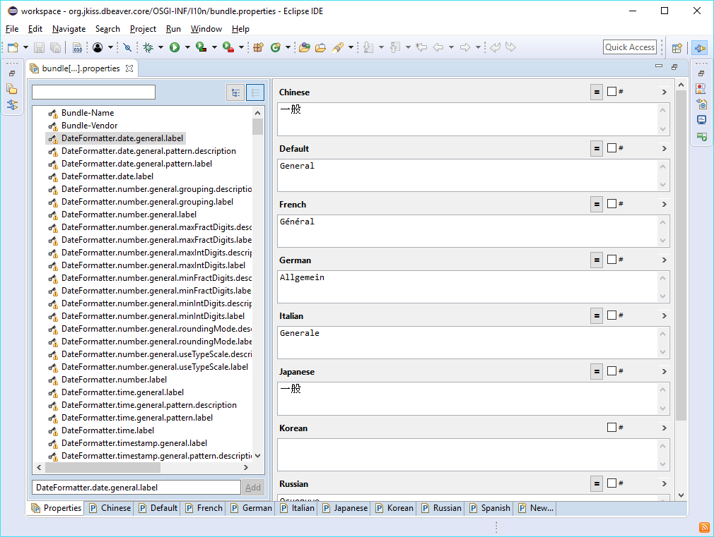
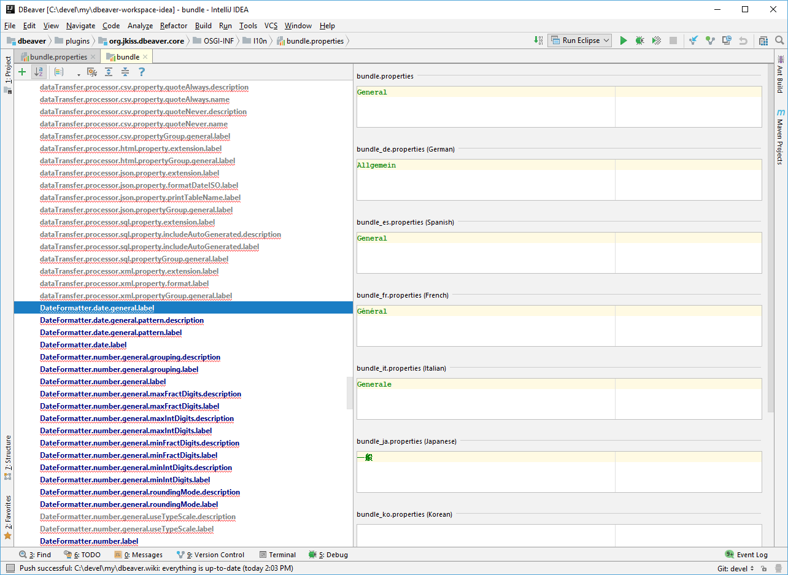

## Localization (i18n + l10n)

DBeaver uses the standard properties-based i18n model.
All translatable resources reside in *.properties file. Each plugin (bundle) has its own set of resources.
Almost all plugins have at least a `bundles.properties` resource. Bigger plugins have additional resources in the src folder.
See the full list of property files below.

bundle.properties contains an original string in the English language.
All translated resources are placed in bundle_XX.properties files where XX is a two-letter language code.

### Environment setup
- Clone DBeaver repository
  - Install [GitHub Desktop](https://desktop.github.com/)
  - In the top menu select File -> Clone Repository
  - In the appeared popup window select the URL tab and paste DBeaver URL: `https://github.com/dbeaver/dbeaver.git`
  - Press Clone

### Localizing tools
#### Eclipse IDE
- Install Eclipse (any version, any package)
- Install [ResourceBundle Editor](http://essiembre.github.io/eclipse-rbe/) plugin.
  - Main menu Help -> `Install New Software` -> `https://raw.githubusercontent.com/essiembre/eclipse-rbe/master/eclipse-rbe-update-site/site.xml`
- Main menu -> File -> Import... -> General -> Existing Projects into Workspace -> Browse
- Choose your DBeaver clone directory and import all projects
- Open some properties file (e.g. bundle.properties - <a href="#properties">see below</a> ) in ResourceBundle editor:

- Edit properties:

#### Intellij IDEA Community

Non-ASCII symbols are encoded to both uppercase and lowercase hex sequences (for example, \u00E3 and \u00e3). By default, only uppercase sequences are enabled in IntelliJ IDEA. Please be sure that you set the `idea.native2ascii.lowercase` property in the `idea.properties` file to `true` to avoid unintended changes, before starting your work.

### Push your changes

- Open GitHub Desktop 
- At the top, select Current branch and press the New Branch button
- Create a new branch with a name related to l10n
- Commit to the new branch
- Publish brunch/push (right button at the top)
- Fetch origin (right button at the top)
- In the main menu select Branch -> Create Pull Request
- On the opened GitHub page add some meaningful text for your pull request name and press the Create pull request button
- Return to GitHub Desktop and switch to devel branch

or 

Create a Pull Request with your changes (in branch `devel`)
[https://help.github.com/articles/creating-a-pull-request-from-a-fork/](https://help.github.com/articles/creating-a-pull-request-from-a-fork/)

### Properties

Module|Purpose|File
---|---|---
Core| Commands, properties | plugins/org.jkiss.dbeaver.core/OSGI-INF/l10n/bundle.properties
Core|Messages,UI strings | plugins/org.jkiss.dbeaver.core/src/org/jkiss/dbeaver/core/CoreResources.properties
API | Properties | plugins/org.jkiss.dbeaver.model/OSGI-INF/l10n/bundle.properties
API | Messages | plugins/org.jkiss.dbeaver.model/src/org/jkiss/dbeaver/model/messages/ModelResources.properties
UI | Properties | plugins/org.jkiss.dbeaver.ui/OSGI-INF/l10n/bundle.properties
UI | Messages | plugins/org.jkiss.dbeaver.ui/src/org/jkiss/dbeaver/bundle/UIMessages.properties
Application (Standalone)| Commands, properties | plugins/org.jkiss.dbeaver.ui.app.standalone/OSGI-INF/l10n/bundle.properties
Application (Eclipse)| Commands, properties | plugins/org.jkiss.dbeaver.ui.app.eclipse/OSGI-INF/l10n/bundle.properties
Data Transfer| Commands, properties | plugins/org.jkiss.dbeaver.ext.data.transfer/OSGI-INF/l10n/bundle.properties
Data Transfer| Messages | plugins/org.jkiss.dbeaver.ext.data.transfer/src/org/jkiss/dbeaver/tools/transfer/internal/DTMessages.properties
ERD| Commands, properties | plugins/org.jkiss.dbeaver.ext.erd/OSGI-INF/l10n/bundle.properties
ERD| Messages | plugins/org.jkiss.dbeaver.ext.erd/src/org/jkiss/dbeaver/ext/erd/ERDResources.properties
SSH| Commands, properties | plugins/org.jkiss.dbeaver.net.ssh/OSGI-INF/l10n/bundle.properties
SSH| Messages | plugins/org.jkiss.dbeaver.net.ssh.ui/src/org/jkiss/dbeaver/ui/net/ssh/SSHUIMessages.properties
Generic driver| Properties | plugins/org.jkiss.dbeaver.ext.generic/OSGI-INF/l10n/bundle.properties
Generic driver| Messages | plugins/org.jkiss.dbeaver.ext.generic/src/org/jkiss/dbeaver/ext/generic/GenericResources.properties
MySQL| Properties | plugins/org.jkiss.dbeaver.ext.mysql/OSGI-INF/l10n/bundle.properties
MySQL| Messages | plugins/org.jkiss.dbeaver.ext.mysql/src/org/jkiss/dbeaver/ext/mysql/MySQLResources.properties
..|..|The same for Oracle (ext.oracle), DB2 (ext.db2), Exasol (ext.exasol), PostgreSQL (ext.postgresql) and SQL Server (ext.mssql)

### Testing you changes

Once you have changed one of these resources you might want to test your changes.
You can:

- Run DBeaver directly from [Eclipse workspace](Develop-in-Eclipse)
- [Build DBeaver from source](Build-from-sources) and run executable

### Changing user interface language

See [Changing interface language](UI_Language)
