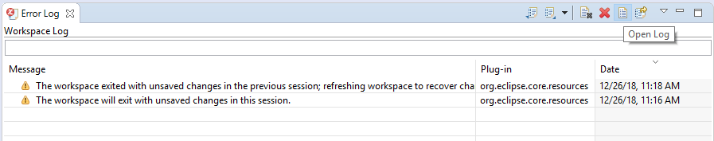

### Error Log view

There is Error Log view (main menu Window->Show View->Error Log) which contains all errors occurred during DBeaver runtime.  
You can double click on warning/error in the log viewer and see error stacktrace. Please attache it to the bug report.  
Also you can open full log (all error messages) if you need:  

### Log files

DBeaver writes different log files. Most of them are Eclipse logs.  
Usually log files reside in the workspace.  

Default workspace location is in the user home subfolder `DBeaverData`. 
- On Windows you usually can find it in `%APPDATA%\DBeaverData\workspace6\.metadata`.  
- On Linux just type `cd $XDG_DATA_HOME/DBeaverData/workspace6/.metadata`
- On MacOS: 
  - Type `open ~/Library/DBeaverData/workspace6/.metadata` in terminal or `~/Library/DBeaverData/workspace6/.metadata` in Spotlight Search.
  - To view hidden folders press <kbd>Cmd+Shift+.</kbd> in the folder view.

Two standard log files:
- `<workspace-path>/.metadata/.log` - all warnings and errors which happens during normal work
- `<workspace-path>/.metadata/dbeaver-debug.log` - the same as `.log` plus debug information

In special cases log files can be written in other directories. Special case is an emergency situation when DBeaver can't start and there is no workspace.
Two typical places to find emergency logs:

- `<install-path>/configuration`
- `${HOME}/.eclipse/org.jkiss.dbeaver.product_<dbeaver-version>`

If you are reporting about some error please attach logs (not complete file but valuable part of it).  
Logs are very useful, big number of errors can't be reproduced/fixed without full error stacktrace.

#### Old (before DBeaver 6.1.3) workspace location

- Windows: `C:\Users\YourName\.dbeaver4`.  
- Linux: `~/.dbeaver/`
- MacOS: `cd ~/.dbeaver4/`
