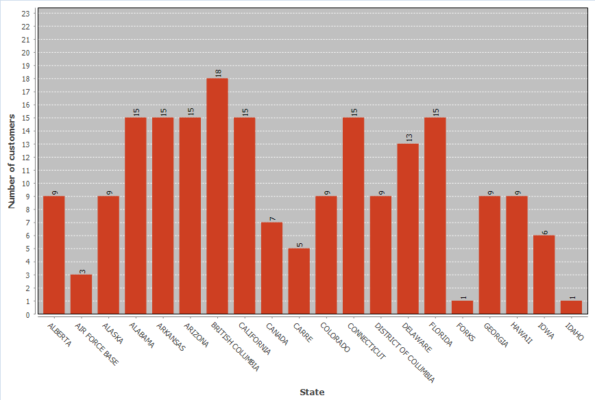

The default grid view of query resulting data is not very much impressive, especially to business analysts and other end users. The **Charts** feature lets you quickly and easily  turn your SELECT queries' output into a colorized bar chart.

You can easily visualize your data by creating a chart bar both in **SQL Editor** and **Data Editor**. 

## Creating Charts In SQL Editor

To build a bar chart in **SQL Editor**, press the **Charts** button in the vertical toolbar of query results area. 

IMG_SQLEditor_Screen_With_ResultsTableToolbar

A chart will be created.

IMG_SQLEditor_Screen_With_BarChartGenerated

## Creating Charts In Data Editor

To build a bar chart in **Data Editor**, press the **Charts** button and a chart will be created.

There are three places where the **Chart** button is located in the **Data Editor**:

* Verical toolbar of the **Data Editor**
* Vertical toolbar of the **Grouping Panel**
* View menu of the **Grouping Panel**

IMG_ DataEditorScreen_With_GroupingPanel_All_Three_Buttons_Highlighted

## Editing Chart Settings

To edit chart settings select the **Charts...** option in the chart's context menu. 

IMG_ChartContextMenu_ChartsOptionHighlighted + IMG_ChartEditor

The following chart settings can be adjusted:

### Setting Axis X
1. In the **Column** drop down list of available columns select a column whose data will be used on axis X of the bar chart. Make sure you choose unique columns for X axis.
2. Define a user-friendly axis name in the **Label** text field.

### Setting Axis Y
1. In the **Column** drop down list of available columns select a column whose data will be used on axis Y of the bar chart. **Note**, that only columns containing numeric data can be used for axis Y. 
2. Define a user-friendly axis name in the **Label** text field.

### Setting Other Options

You can also set the following chart options: 

* Sample count
* Row count
* Sample function

## Exporting Charts 

You can export а chart into PNG format by selecting the **Save as...** option in the chart's context menu.

## Printing Charts 

You can print а chart by selecting the **Print...** option in the chart's context menu.

