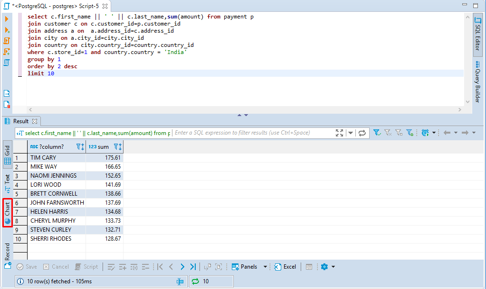
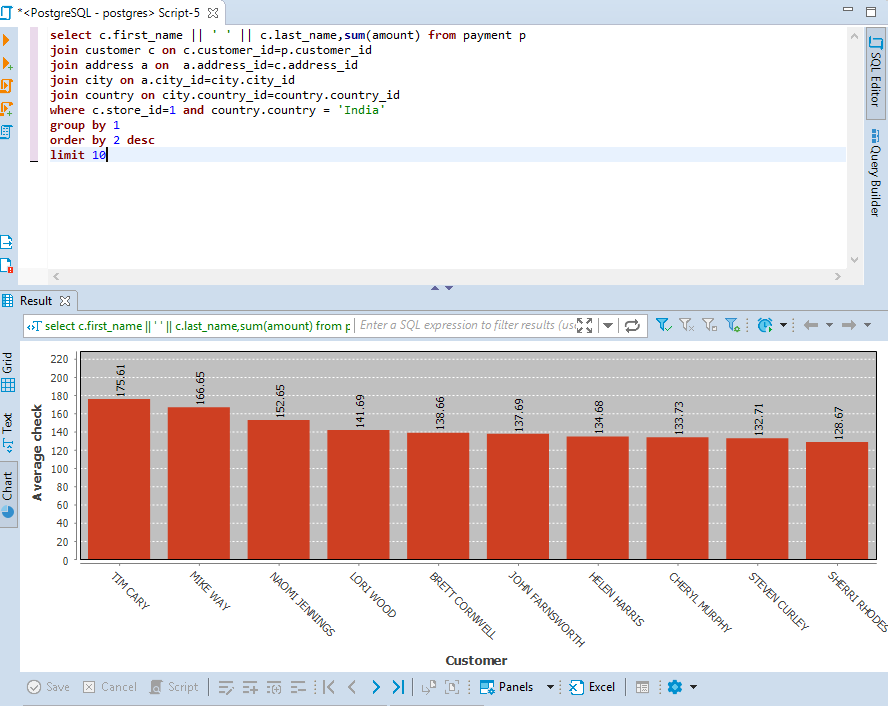
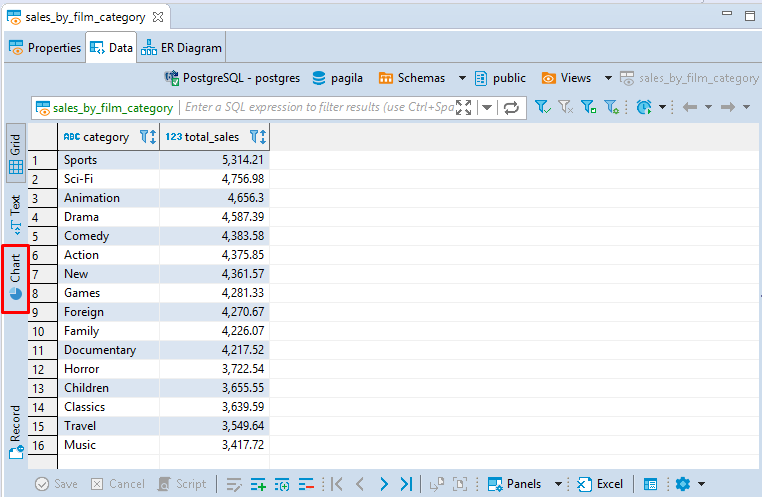
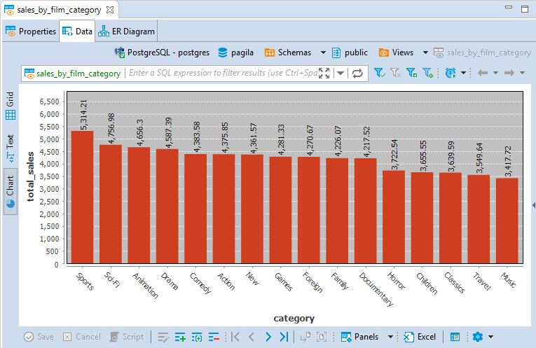
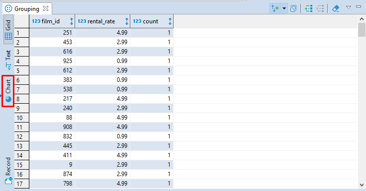
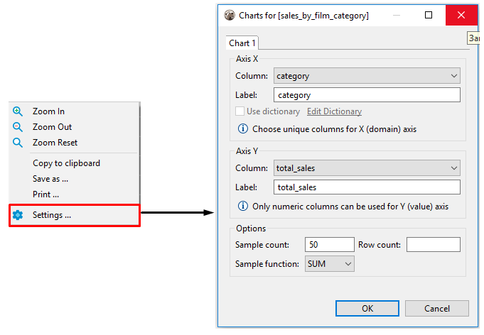

The default grid view of query resulting data is not very much impressive, especially to business analysts and other end users. The **Charts** feature lets you quickly and easily  turn your SELECT queries' output into a colorized bar chart.

You can easily visualize your data by creating a chart bar both in **SQL Editor** and **Data Editor**. 

## Creating Charts In SQL Editor

Visual representation of vast data permits the analytical reasoning process to become faster and more focused. Charts make it easy for analysts to perceive salient aspects of their data quickly.

To build a bar chart in the **SQL Editor**, press the **Charts** button  in the left vertical toolbar of the query results area. 

A bar chart will be created.

## Creating Charts In Data Editor

Charts can be very helpful for visualizing structured analytical data stored as **Views**, for example. 

You can also create a chart for any table but you have to structure its data by sorting and applying various filters to its columns first. All the structural changes you make will then affect the chart you build, this way you can adjust the chart representation to the desired one. 

To build a chart in the **Data Editor**, press the **Charts** button  in the left vertical toolbar.

А bar chart will be created.

Note, that by default, the data for axis Y is taken from the first column of the table containing numeric values. 

## Creating Charts In Grouping Panel 

Such analytical tool as the [Grouping Panel](https://github.com/dbeaver/dbeaver/wiki/Panels#grouping-panel) also supports the **Charts** feature. In a chart built for a table containing the grouping results for one or more columns of a data table, you can easily change axes X and axes Y source data by switching the columns in the **Charts Editor**.

To build a chart in **Grouping Panel**, use the **Charts** button  from the left vertical toolbar or from the **View** menu.

## Editing Chart Settings

To edit chart settings select the **Charts...** option in the chart's context menu and the **Chart Editor** will appear. 

The following chart settings can be adjusted:

### Setting Axis X
1. In the **Column** drop down list of available columns select a column whose data will be used on axis X of the bar chart. Make sure you choose unique columns for X axis.
2. Define a user-friendly axis name in the **Label** text field.

### Setting Axis Y
1. In the **Column** drop down list of available columns select a column whose data will be used on axis Y of the bar chart. **Note**, that only columns containing numeric data can be used for axis Y. 
2. Define a user-friendly axis name in the **Label** text field.

### Setting Other Options

You can also set the following chart options: 

* Sample count - maximum number of columns used for building a chart;
* Row count - maximum number of rows used for building a chart;
* Sample function - an aggregate function where the values of multiple rows are grouped together to form a single summary value displayed on axis Y.

## Exporting Charts 

You can export а chart into PNG format by selecting the **Save as...** option in the chart's context menu.

## Printing Charts 

You can print а chart by selecting the **Print...** option in the chart's context menu.

