The DBeaver formatting functions allow you to set up database locale and change datasource format settings. This feature can be very useful, for example, for database migration. 

To change the data format settings use the option Window -> Preferences in main menu.

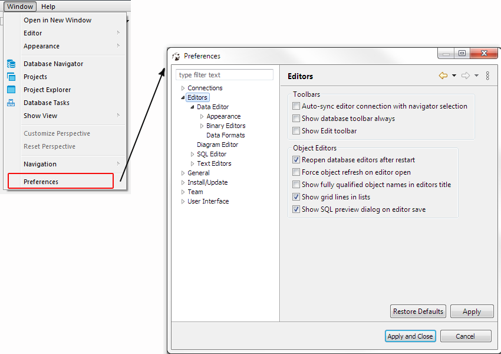

In the Preferences dialog box go to Editors -> Data Editor -> Data Formats.

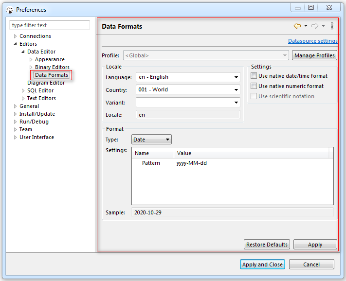

Or, in the [Database Navigator](Database-Navigator) right-click a connection and select **Edit Connection** menu option.

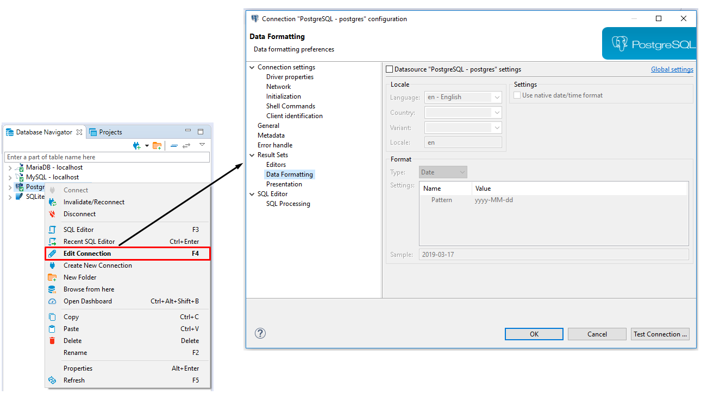

In the right area of the opened **Data formatting preferences** dialog window go to Data editor -> Data Formats and select the **Datasource settings** check box in the left area to customize the data format settings.

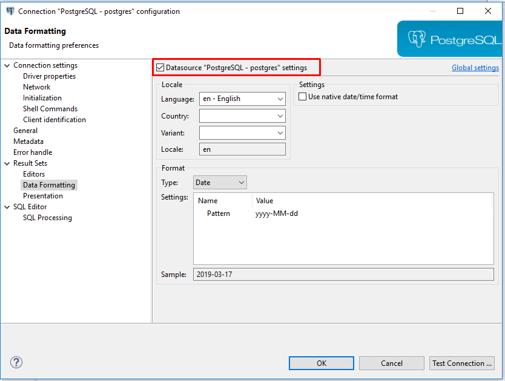

## Data Format Profiles

Data format profiles allow you to apply a set of data format preferences to the whole current project by one click. 

To create a data format profile press the **Manage Profiles** button. In the opened dialog window press button **New Profile**, define the name and press **Create**.

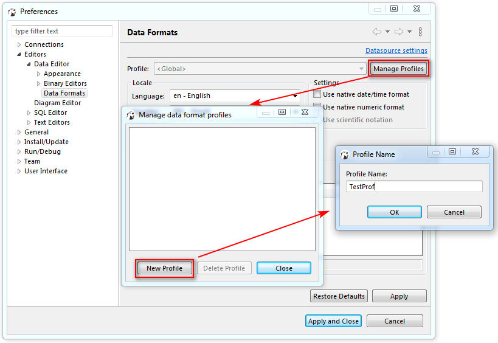

To delete a data format profile press the **Manage Profiles** button, then in the opened dialog window select the profile you want to delete and press the button **Delete Profile**.

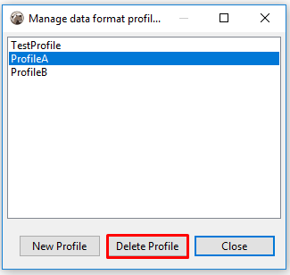

## Changing Data Formats

The following groups of data format settings can be adjusted:

### **Locale**

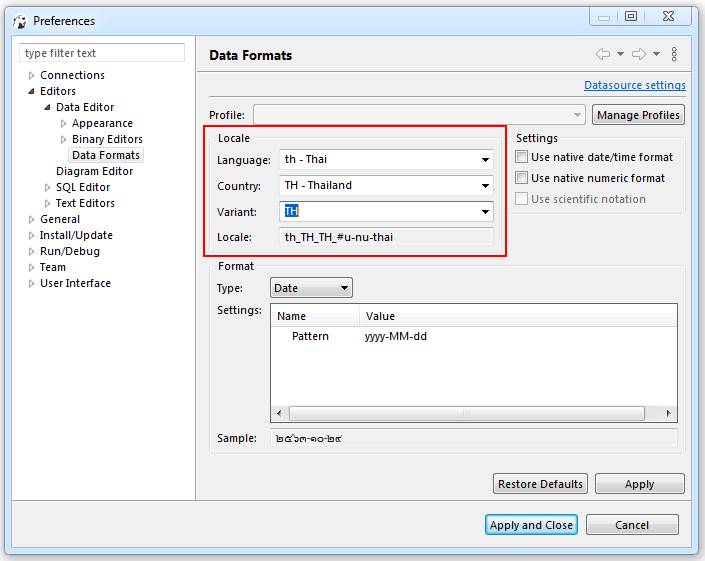

To define this setting select a language, country and variant if available.

### Native Date/Time Mode

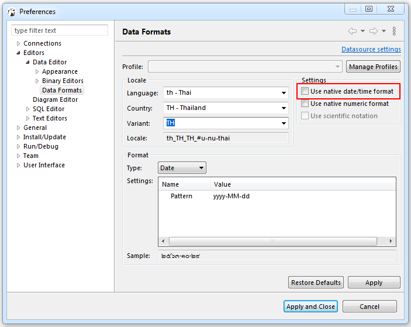

Select **Use native date/time format** check-box and the data format originally built-in to the datasource will be used.

You can change the format of the following data types:

### Data Type Format

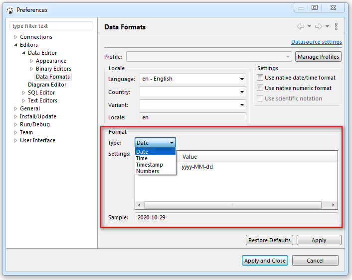

The format of the following data types can be customized:

* Date
* Time
* Timestamp
* Numbers

#### Date 

The default value for this data type is *yyyy-MM-dd*.

Pattern|Description
-------|-----------
yyyy or y|Year of era (4 digits)
yy|Year of era (2 last digits)
YYYY|Week year
M|Month in year without leading zeros
MM|Month in year
MMM|Short month name in year
MMMM|Month name in year
D|Day in year
d|Day in month without leading zeros
dd|Day in month
E|Day name in week
G|Era designator
z|General time zone
Z|RFC 822 time zone

#### Time 
The default value for this data type is *HH:mm:ss*

Pattern|Description
-------|-----------
H|Hour in day (0-23) without leading zeros
h|Hour in day in am/pm (1-12) without leading zeros
HH|Hour in day (0-23)
hh|Hour in day in am/pm (1-12)
a|Am/pm marker
m|Minute in hour without leading zeros
mm|Minute in hour
s|Second in minute without leading zeros
ss|Second in minute
S|Millisecond
ffffff|Microseconds

#### Timestamp 
The default value for this data type is *yyyy-MM-dd HH:mm:ss*

[Link on Java date pattern documentation](https://docs.oracle.com/en/java/javase/11/docs/api/java.base/java/text/SimpleDateFormat.html)

#### Numbers

The following parameters can be configured from this type of data:

* **Use Grouping** - Long numbers can be hard to read if they have too many digits. For example, the factorial of 30 is 33 digits long! Select this check-box to enable Grouping mode, in which digits are displayed in clumps of 3 or 4 (depending on the current radix) separated by commas.

* **Maximum integer digits** - Defines the maximum number of digits to the left of the decimal point.

* **Minimum integer digits** - Defines the minimum number of digits to the left of the decimal point.

* **Maximum fraction digits** - Defines the maximum number of digits to the right of the decimal point.

* **Minimum fraction digits** - Defines the minimum number of digits to the right of the decimal point.

* **Use data type scale for fraction digits** - Some numeric columns or parameters may have a predefined scale, that is the maximum number of digits to the right of the decimal point. Select this check-box if you want the predefined precision to be used.

* **Rounding mode** - Specifies a rounding behavior for numerical operations capable of discarding precision. Each rounding mode indicates how the least significant returned digit of a rounded result is to be calculated. To learn more, please refer to [Oracle documentation](https://docs.oracle.com/javase/7/docs/api/java/math/RoundingMode.html).

To change the data type format, change the value displayed in the **Pattern** area,save the changes made by pressing the **Apply** button and observe the expected result in the **Sample** field.

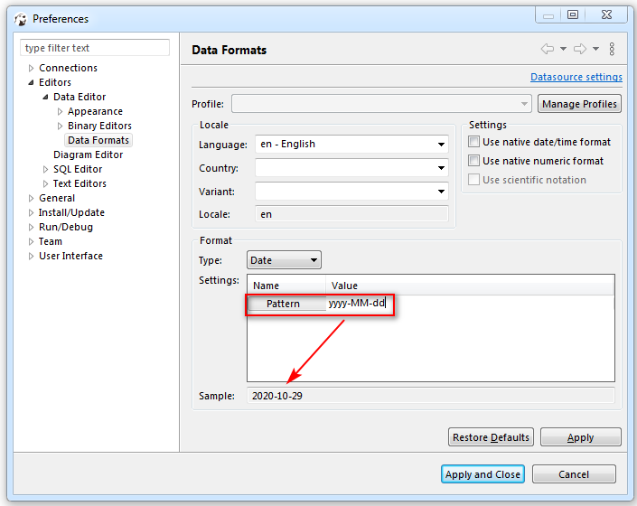

## Restoring Default Data Formats

To restore the default data format settings, press the **Restore Defaults** button.

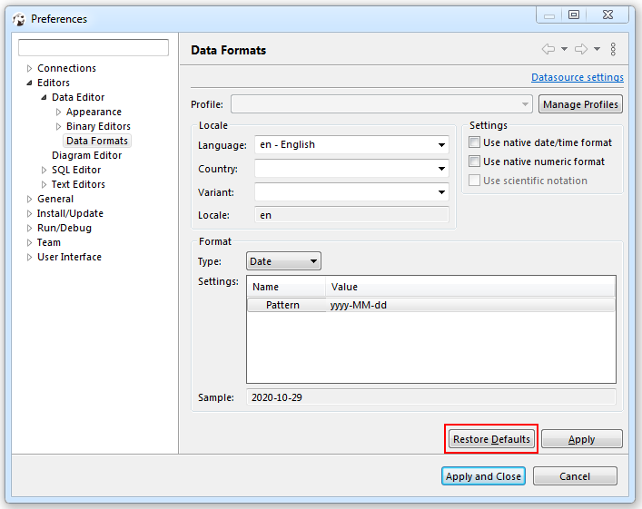

## Datasource Settings

Press **Datasource settings** link to change data format settings for a particular datasource, then adjust the settings in the opened dialog box. 

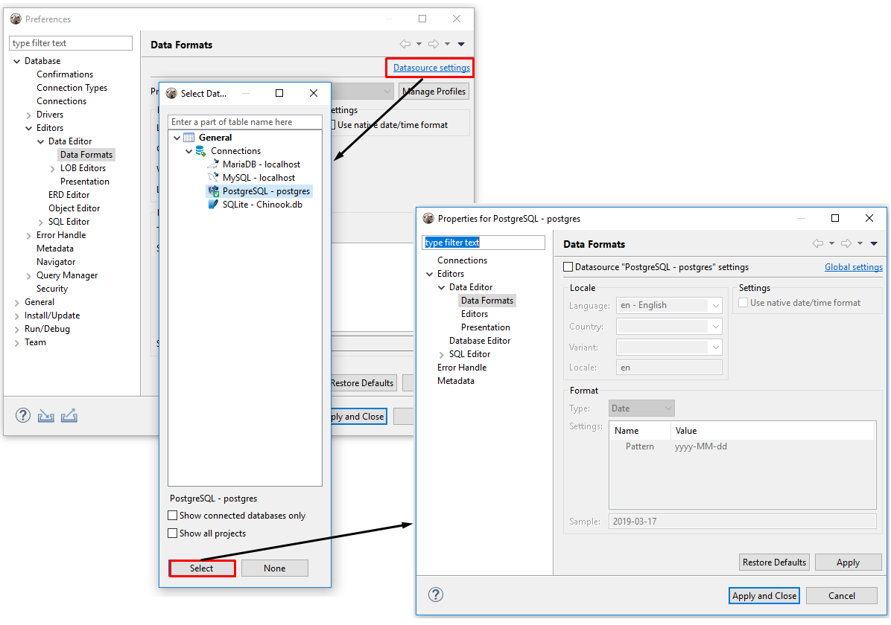

To save changes made press **Apply**.
