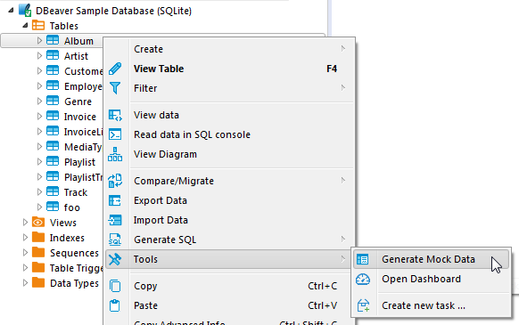
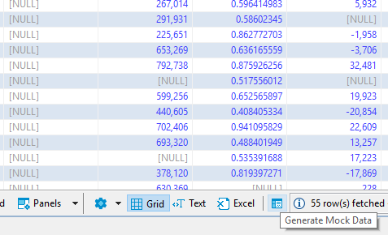
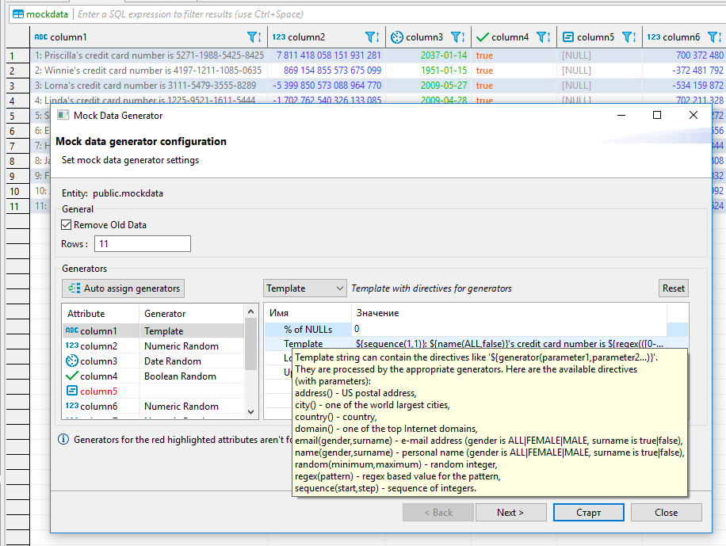

__Note: since version 6.2 Mock data generators were moved to EE version, see https://github.com/dbeaver/dbeaver/issues/6592__

Sometimes in software development we need to generate mock, but valid, data for testing. Populating a database manually is a time-consuming and exhausting process. It can be very complicated when you need to generate not just 5–10 users, but thousands of entities of different types. DBeaver Mock Data generator helps you generate test data much easier.

 

> _Disclaimer:_ The idea behind Mock Data is to generate mock data in a table but it should **NOT TO BE USED IN PRODUCTION ENVIRONMENTS**. Please make sure you have a backup of your database before running the Mock Data generation process.

Th following are features of DBeaver Mock Data generator:

* Works for all the RDBMS that are supported by DBeaver (DB2, MS SQL Server, MySQL, Oracle, PostgreSQL, SQLite, etc.)
* Generates data that matches your database schema:
    * Generated data matches the database column types.
    * All base data types are supported.
    * Constraints (PK, FK, multi-column FK, unique) are supported.
* Supports over 20 configurable data generators (constants, randoms, sequences, names, domains, addresses, prices, regex based, etc.)
* Automatically associates a column with a generator based on the column characteristics
* Saves or overwrites old database data

The following are mock data generators for data types with their configurable parameters:

* Boolean
    * Random
    * Sequence (initial, order)
* Date
    * Random (start, end)
    * Sequence (start, step, reverse)
* Numeric
    * Random
    * Sequence (start, step, reverse)
    * Advanced (min, max, precision, scale) *
        * Price preset *
        * Coordinate preset *
* String
    * Text (template, min length, max length)
    * UUID
    * Address *
    * City *
    * Country *
    * Domain *
    * Email (gender, with surname, numeric suffix) *
    * Name (gender, with surname) *
    * Price (country, min, max) *
    * Regex based random (regex template) *
        * Credit Card preset *
        * Email preset *
        * Gender preset *
        * HEX Color preset *
        * IP4 address preset *
        * IP6 address preset *
        * Phone Number preset *
        * Postal Code preset *
        * Price preset *
    * Template with parametrized directives for other generators *:
        * address() - US postal address
        * city() - one of the world largest cities
        * country() - country
        * domain() - one of the top Internet domains
        * email(gender,surname) - e-mail address (gender is ALL|FEMALE|MALE, surname is true|false)
        * name(gender,surname) - personal name (gender is ALL|FEMALE|MALE, surname is true|false)
        * random(minimum,maximum) - random integer
        * regex(pattern) - regex based value for the pattern
        * sequence(start,step) - sequence of integers
* NULL values
* FK - data from the referenced table according to the constraint

***
* These features are available in the [DBeaver Enterprise Edition](https://dbeaver.com/) only.
