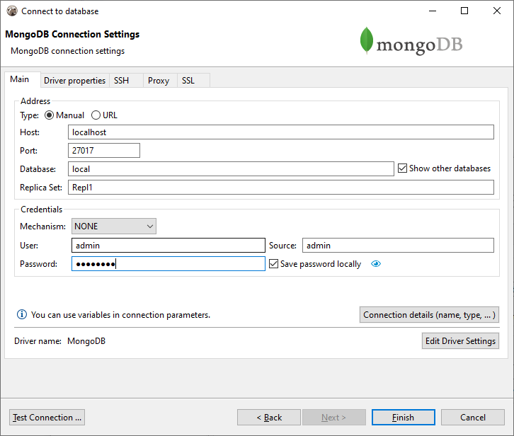
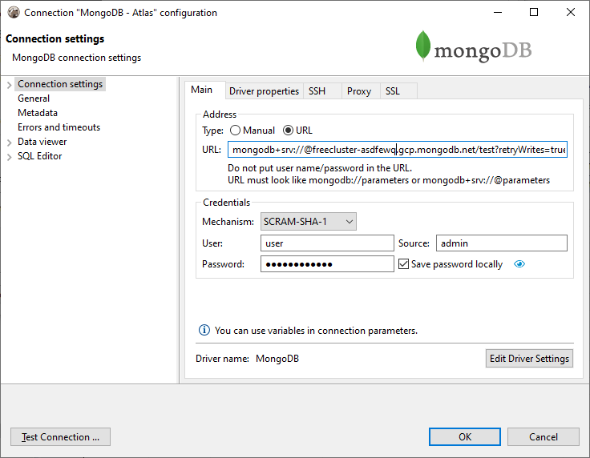
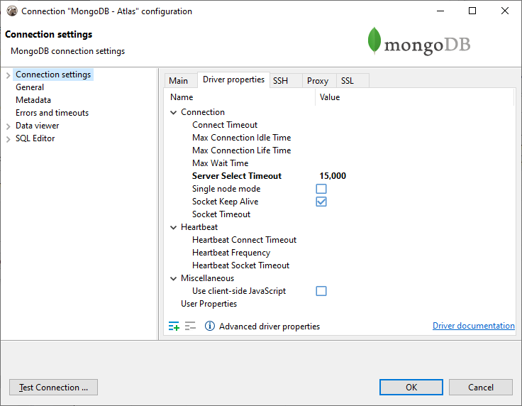
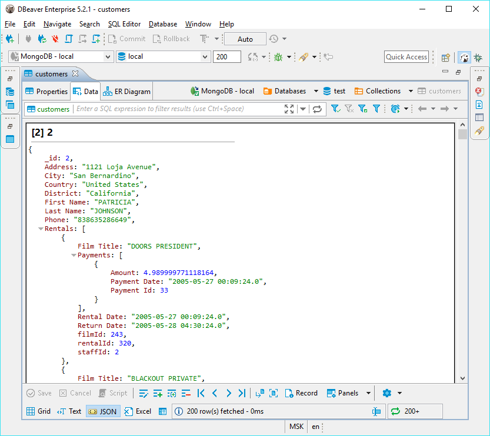
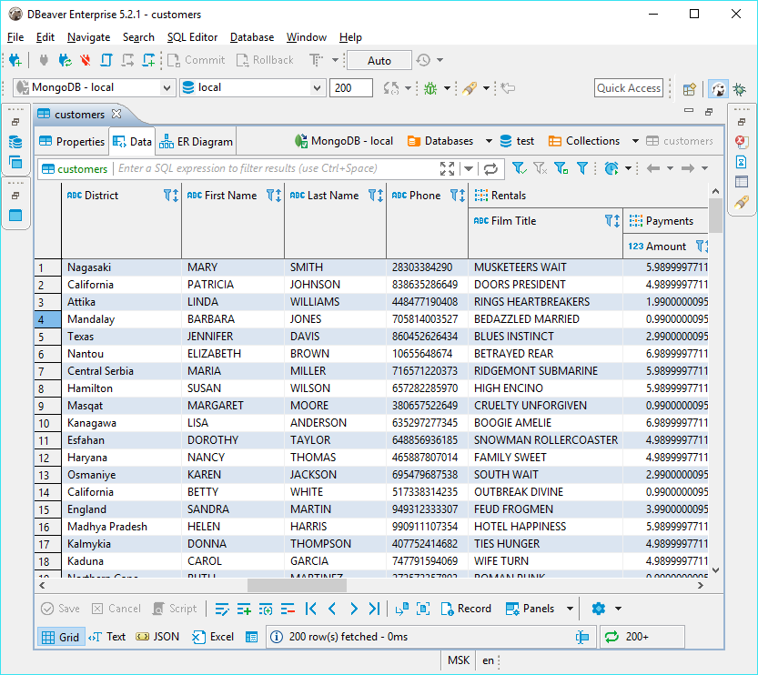
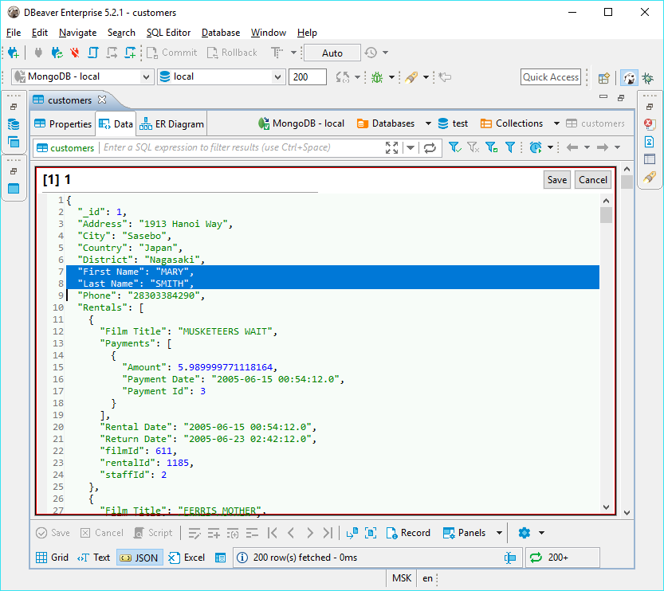

## Overview
DBeaver EE supports MongoDB schema browser, data viewer, SQL and JavaScript queries execution. 
It also supports various administrative tools (like server sessions manager).  
DBeaver uses MongoDB Java driver 3.8.0 to operate with a server. It supports MongoDB servers from 2.x to 4.x.  

## Connecting to MongoDB Server
You can connect directly to a server or use SSH tunneling or SOCKS proxy.  
You can specify server address as a host/port/database configuration or you can enter the target database URL with all necessary parameters:






## Browsing Mongo collections

You can view/edit MongoDB collections content as standard relational tables (grid/plain text presentations) or as JSON documents.  
The presentation can be switched in the Results Viewer toolbar.  
In a grid, DBeaver will try to unify all documents in some particular collection (as they have the same structure/the same set of properties).  







## Executing JavaScript
JS statements can be executed in the SQL editor as usual. DBeaver supports all JS queries for MongoDB 2 and 3 as well as a subset of the `mongo` shell queries.

The following example creates a user in the current database.
```js
db.createUser({
    user: 'testuser',
    pwd: 'test',
    roles: []
})
```

This example returns all documents in the collection 'test_col':
```js
db.test_col.find().toArray()
```

Note: the script will be executed in the current database.  
You can not set an explicit database name in your query.  
The current database can be changed on the SQL Editor toolbar or on the Database Navigator.  

## Executing SQL
You can use standard SQL statements (`SELECT`, `INSERT`, `UPDATE`, `DELETE`) to manipulate Mongo data.

### SELECT queries

SELECT queries support `WHERE`, `ORDER BY`, `GROUP BY`, `JOIN` and `HAVING` clauses.  
MongoDB dialect doesn't support SQL sub-queries.  

```sql
SELECT * FROM test_col 
WHERE propName.subProp='value'

UPDATE FROM test_col 
SET propsName.val1=123
WHERE propName.subProp='value'
```

#### Conditions
SELECT queries with `WHERE` support `AND`, `OR`, `<`, `<=`, `>`, `>=`, `=` and `!=` operators:

```sql
SELECT * FROM Employees
WHERE (Country = 'CA' OR Country = 'RU') AND Age > 20;
```
Please note that `AND` has higher precedence than `OR` and will evaluate first, so you need to surround it with parentheses.

#### Nested fields
Nested JSON fields can be divided by dot.
If your field contains any special characters (e.g. spaces, dashes, etc.), you must enclose it with double quotes. For example:
```sql
SELECT title FROM movies WHERE info."imdb-details".rating > 6
```

#### Working with object IDs

When you need to find a document by ID, you must use the function `ObjectId`:

```sql
SELECT * FROM documents
WHERE _id = ObjectId('5f9c458018e3c69d0adc0fbd')
ORDER BY value DESC
```

#### Working with JOINs

Currently, SQL dialect for MongoDB supports `LEFT JOIN` and `INNER JOIN`:

```sql
SELECT
    ar.Name as Artist,
    al.Title as Album,
    SUM(tr.Milliseconds) as Duration
FROM Track tr
INNER JOIN Album al ON tr.AlbumId = al.AlbumId
INNER JOIN Artist ar ON al.ArtistId = ar.ArtistId
GROUP BY Artist, Album
ORDER BY Duration DESC
```

The only limitation is that you have to specify aliases for both source and target tables in a particular order:
```sql
SELECT *
FROM <source> <source-alias>
INNER JOIN <target> <target-alias> ON <source-alias>.column = <target-alias>.column
```

Note that executing the following script will not result in a merged document, but it will result in separate documents for `Track` and `Album`:
```sql
SELECT *
FROM Track tr
INNER JOIN Album al ON tr.AlbumId = al.AlbumId
```

#### Aggregate functions

In version 22.x only COUNT function is supported.  

### INSERT statements

### UPDATE statements

### DELETE statements

### Working with dates

If you need to operate with dates then you must specify them in an ISO format. It is possible in both the JavaScript and SQL dialect:
```js
db.dates.insert([
    { value: new Date('2016-05-18T16:00:00Z') },
    { value: new Date('2017-05-18T16:00:00Z') },
    { value: new Date('2018-05-18T16:00:00Z') },
    { value: new Date('2019-05-18T16:00:00Z') },
    { value: new Date('2020-05-18T16:00:00Z') }	
])
```

Querying data in JavaScript:
```js
db.dates.find({
    value: { $gte: new Date('2018-05-18T16:00:00Z') }
}).toArray()
```

Querying data in the SQL dialect (ISO and UNIX timestamp, in milliseconds):
```sql
SELECT value FROM dates
WHERE value > ISODate('2018-05-18T16:00:00.000Z')
ORDER BY value DESC

SELECT value FROM dates
WHERE value > ISODate(1526659200000)
ORDER BY value DESC
```

