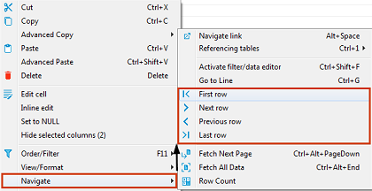

## Scrolling Results Page

If the result set has many rows, you can scroll the results page. To learn how many rows the data table contains, click the **Calculate total row count** button in the bottom toolbar. The number of rows appears in a status field next to the button: . Alternatively, you can right-click a cell in the table and then click **Navigate -> Row Count** on the context menu.

By default, DBeaver limits the number of rows fetched to **200** (you can change this value in the main toolbar or in preferences). The maximum number of rows that DBeaver fetches to display in the Data tab is specified in the Maximum result-set size field in the main toolbar: `

Once you scroll to the last row of the current result portion, DBeaver fetches the next portion (next N rows). You can disable this behavior in preferences. 
You can also manually fetch the next portion of data equal to the maximum result set size. To do so, click the **Fetch next page of results** button () in the bottom toolbar or right-click the table and click **Navigate -> Fetch next page** on the context menu.

The number of rows fetched is visible in the status field under the data table: 

To see the details, click the details button in the status field.

To fetch the whole result set, click the **Fetch all rows** button () in the bottom toolbar or right-click the table and click **Navigate -> Fetch All Data** on the context menu.

NOTE: Be careful when fetching the whole result set. If it is huge, it might cause program hangup or out-of-memory errors.

You can navigate through the result set using standard shortcuts <kbd>Home</kbd>, <kbd>End</kbd>, <kbd>PgUp</kbd>, <kbd>PgDown</kbd>, <kbd>Ctrl+Home</kbd>, <kbd>Ctrl+End</kbd>.

## Data Rows
To jump to the first or last row or move one row forward or backward, use the navigation buttons in the bottom toolbar or on the context menu:  

To jump to a specific line, right-click anywhere in the table and click **Navigate** -> **Go to Line** on the context menu. Then in the Go to Row dialog box, enter the row number and click **OK**.

## History
DBeaver remembers the history of such actions as applying filters to data, opening reference tables or other tables via links. You can navigate among such tables and filtered views:
* Use the forward and backward buttons in the top toolbar: 
* Click <kbd>Ctrl+Left</kbd> or <kbd>Ctrl+Right</kbd>  

Hovering over these buttons displays the names of the tables or filtered views saved in the history. 

## Navigate Foreign Keys / Referencing Tables

You can navigate by foreign keys or to referencing tables – those that reference the current table.
To open a referencing table, press <kbd>Ctrl+1</kbd> or right-click the cell and click **Navigate->Referencing tables->[table name]**:

The referencing table opens in the same editor. To navigate back and forth between the initial and referencing tables, use the history navigation buttons () in the top toolbar of the editor.
In order to open referencing table in a new window use <kbd>Ctrl+Shift+1</kbd> shortcut to show menu.

## Navigation Links 
In the data editor, you can navigate to linked tables – the ones that the current table references.
To open a linked table, click the Navigate link icon in a cell that contains it:

 
Another way is to right-click such a cell and click **Navigate -> Navigate link** on the context menu.
The linked table opens in the same editor, filtered by the cell value:
 
  
NOTE: The table name in green above the table indicates which table is currently open in the editor.

To navigate back and forth between the initial and linked tables, use the history navigation buttons () in the top toolbar of the editor.  
You can open a linked table in a separate editor. To do so, simultaneously hold the <kbd>Ctrl</kbd> key (or <kbd>⌘ command</kbd> key on macOS) and click the Navigate link icon () in the cell.
