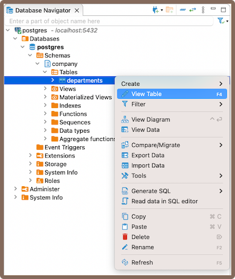
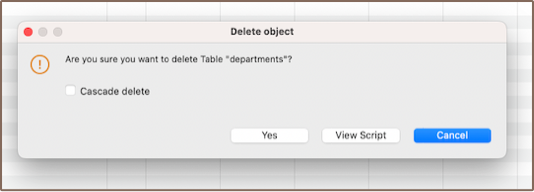

### Overview

This guide provides detailed instructions on creating a new table in DBeaver. This is a beginner-friendly guide,
meaning it is written for individuals who may not have previous experience with databases or DBeaver.

A database table, the focal point of our guide, is a systematic arrangement of data. It consists of rows and columns,
forming cells where the data resides. While the number of columns is fixed for a table, it can encompass an unlimited
number of rows. The maximum number of columns a table can have in a database depends on the database management system. 
DBeaver facilitates various operations, including data manipulation and data definition, with these tables.

Initially, the guide will cover the essential step of creating a table. After successfully creating a table, there are
several enhancements you can add, such as columns, constraints, indexes, and triggers. The creation
of a table is a fundamental operation in database management, and while there are many aspects to consider, not all of
them are mandatory. The only mandatory step is the creation of the table itself and the definition of columns.
The rest are optional and can be used to enhance the functionality and integrity of your database.

#### Table of contents:

* [Table](#Create-table) creation
* Creating [columns](Columns)
* Implementing [constraints](Constraints)
* Utilizing [foreign keys](Foreign-Keys)
* Creating [indexes](Indexes) 
* Incorporating [triggers](Triggers)

While this guide is designed around PostgreSQL within DBeaver, the processes can vary slightly with other database systems. 

### Create table

In DBeaver, creating a table is a straightforward process. Once you've [connected to your database](Connect-to-Database), you can
initiate the table creation process by right-clicking on the Tables folder in the **[Database Navigator](Database-Navigator)** 
and selecting **Create New Table**.  

  

Upon creating a new table in DBeaver, a window will open presenting the **[Properties editor](Properties-Editor)**.
This is the dedicated interface where you can manage and manipulate your tables. The specific options available to you
will depend on the capabilities of your chosen database system.

There are also various ways to create a table: from the **Properties editor** and from the **ER diagram**.

From **Properties editor**: In the **Database Navigator**, double-click on the database name or table name, or select *
*View schema** from the context menu. In the window that opens, navigate to the **Properties** tab, select the **Tables
** section, right-click on the window, and choose **Create New Table**.

From ER Diagram: In the **Database Navigator**, double-click on the database name or table name. In the window that
opens, navigate to the **ER Diagram** tab, right-click on the window, and choose **Create New Table**. Alternatively, in
the **Database Navigator**, right-click on the database/table name and click **View Diagram**. In the window that opens,
you can right-click and choose **Create New Table**.

#### Saving changes

Saving a table in DBeaver is a crucial yet straightforward process. Once you have defined the properties of the table,
it's important to commit these changes to the database. Until you save your changes, your new table exists only within
DBeaver and hasn't been created in the actual database. Here are the three options for saving the changes:

* Click on **File** -> **Save** -> **Persist**.
* Select the desired table in the **Database Navigator** and press <kbd>Ctrl+S</kbd> (or <kbd>CMD+S</kbd> for Mac OS),
  choose **Persist** to save the changes.
* Utilize the **Save** button  located at the bottom of the
  **[Editor panel](Data-Editor)** and press **Persist** to save the changes.

### Modify table

Modifying a table in DBeaver involves adjusting its structure or properties, such as adding, removing, or changing
columns, adjusting constraints, or altering table settings. To make adjustments, navigate to the **Properties** editor.
Access this by right-clicking the table's name in the **Database Navigator** menu and selecting **View Table**.  

  

The specific options and capabilities available to you when modifying a table will depend on the database
system you're working with. Always refer to the documentation of your specific database system for detailed information.

### Delete table

Deleting a table in DBeaver involves a few simple steps. Firstly, navigate to the table you wish to delete in the
**Database Navigator**. Once you've located the table, right-click on it and select the **Delete** option from the context
menu. A confirmation dialog box will appear, allowing you to review the action before it's performed.

  

Upon confirming your decision, DBeaver will execute the necessary SQL command to remove the table from your PostgreSQL
database. Please be aware that this action is permanent, and any data stored in the table will be irretrievably lost.
Therefore, it's crucial to ensure that you've adequately backed up any important data before proceeding with the
deletion.

**Tip**: The confirmation dialog box, which appears when you are deleting a table in DBeaver, offers an important
feature called the **Cascade delete** option. This option, when selected, automatically removes all related records in child
tables, aligning with the deletion of a record in the parent table. While this can be useful for maintaining data
integrity, it should be used with caution. If not handled properly, it can lead to unintended data loss by deleting 
records that you may not have intended to remove. Always ensure you understand the relationships and dependencies in
your data before using the **Cascade delete** option.

### Restrictions on table creation

DBeaver is a database management tool, and as such, it doesn't impose its own restrictions on table creation. Instead,
the restrictions that apply when creating tables are determined by the specific database system you're using.

However, there are some general considerations to keep in mind when creating tables:

* Naming Restrictions: The name of the table must be unique within its schema. Most database systems also have
  restrictions on the length of the table name and the characters it can contain.

* Storage Restrictions: The total amount of data that can be stored in a table is determined by the storage capacity of
  the database system.

* Performance Considerations: While not a restriction per se, it's important to note that the structure of a table can
  have significant impacts on the performance of data retrieval and manipulation operations. For example, having a large
  number of columns, especially ones that are rarely used, can slow down query performance.

Remember that the specific restrictions and limitations can vary depending on the database system you're using. Always
refer to the documentation of the specific database system for detailed information.

 New Table Creation | [Creating columns >>](Columns)

