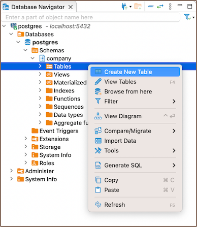
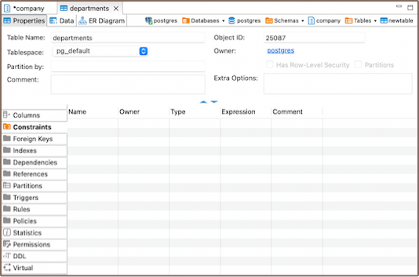
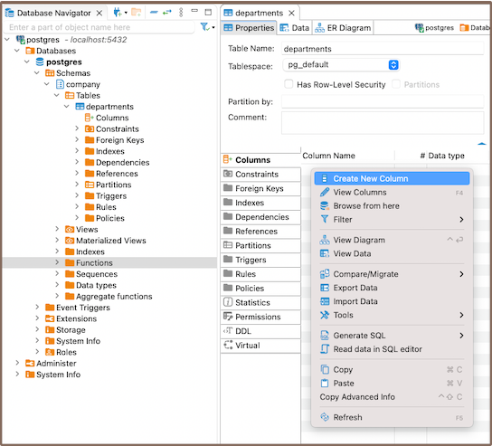
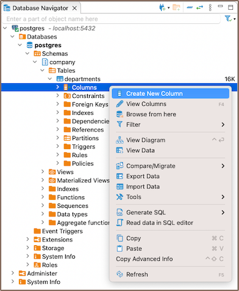
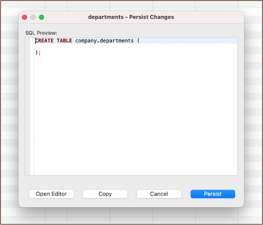

You can create tables, columns, primary keys, and foreign keys using DBeaver. These tools allow you to organize data efficiently and ensure data integrity.  

## Tables
1. In the **Database Navigator**, select the necessary database, right-click on **Tables** and choose **Create New Table**.  

    

2. In the **Properties**, specify the table name (by default, a new table is created with the name "NewTable").  

     

3. As soon as you set the table name, right-click on the **Column screen**, and select **Create New Column**.  

     

   **Note**: Another way to add a new column is to expand the table view in the **Database Navigator** and **Create New Column** from the context menu.  

     

## Columns
1. Click on **Create New Column**.
2. In the **Edit Attribute** window, customize the settings of a column. Adjust the settings as needed, including the **Name**, **Data type**, **Length**, **Not null**, **Auto increment**, and **Default** value of the column.

     

## Primary Keys
1. Move to the **Keys** tab of the corresponding table, right-click on the screen, and **Create New Key**.  

     

2. Select the column and save.  

     

3. Once you save the changes, a window will appear displaying the newly created **Primary Key**.  

     

4. To **Save the table**, select the desired table in the editor panel and press **Ctrl+S** (or **CMD+S** for Mac OS). Then, choose **Persist** to save the changes.  

   

   **Note**: You can also save changes using **Top menu** -> **File** -> **Save**, **Persist** the changes. Additionally, you can save changes using the **Save** button  at the bottom of the editor panel.

## Foreign Keys
1. In the corresponding table, click the **Foreign Keys** tab, right-click on the screen, and **Create New Foreign Key**.  
  
     

2. Select the **Reference table**, **Unique Key**, and save.  

     

   **Note**: If needed, specify the desired behavior for when a row is deleted or updated from the main table, using the 'on delete' and 'on update' clauses.

3. Save the table.