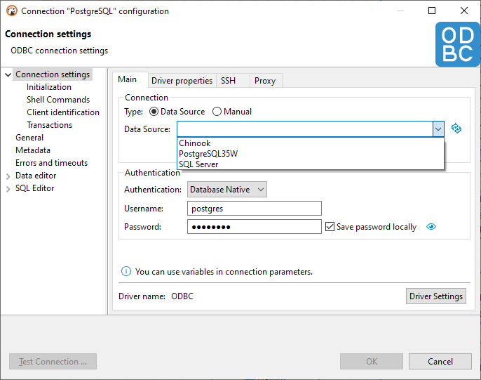
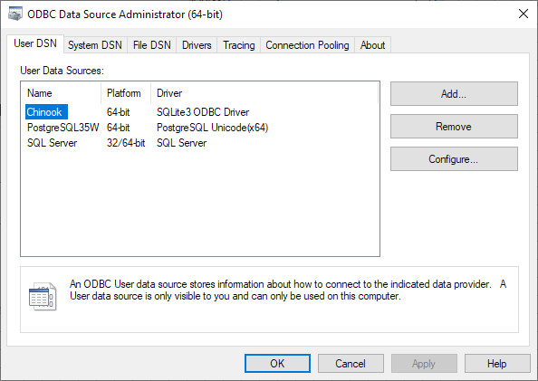
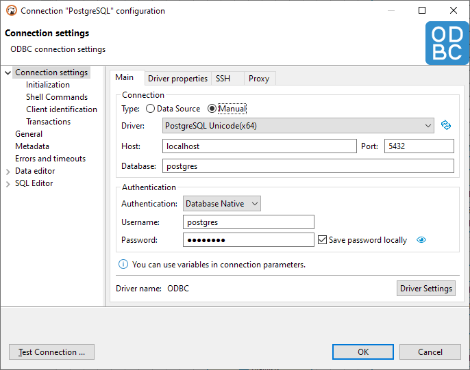

The ODBC driver allows you to create a connection to almost any database in DBeaver by using the native ODBC driver. You can use it as an alternative to the DBeaver driver or if DBeaver does not have a driver for your database.

**Note: This feature is only available for Windows in [Lite](Lite-Edition), [Enterprise](Enterprise-Edition), and [Ultimate](Ultimate-Edition) editions.**

## How to connect to the database via ODBC

First, open the **New Database connection** and select **ODBC** (Not **ODBC - Legacy**). Then, select a desired data source:

You can configure data sources by clicking on the hint below the **Data Source** field:

If you do not have existing data sources or if you want to configure one manually, switch to **Manual** mode and select the desired driver. Then fill the host, port, database name, and other parameters:

That's it. You can now save the connection and use it.
