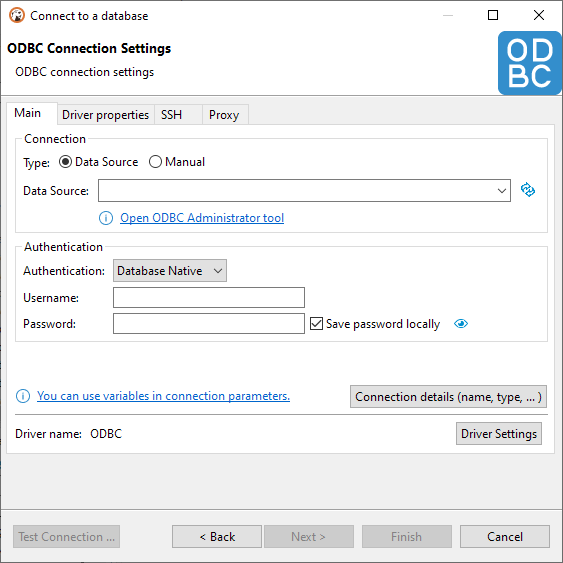
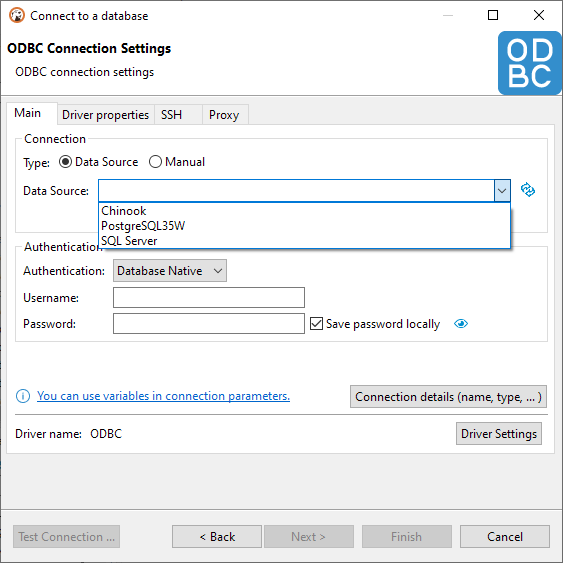
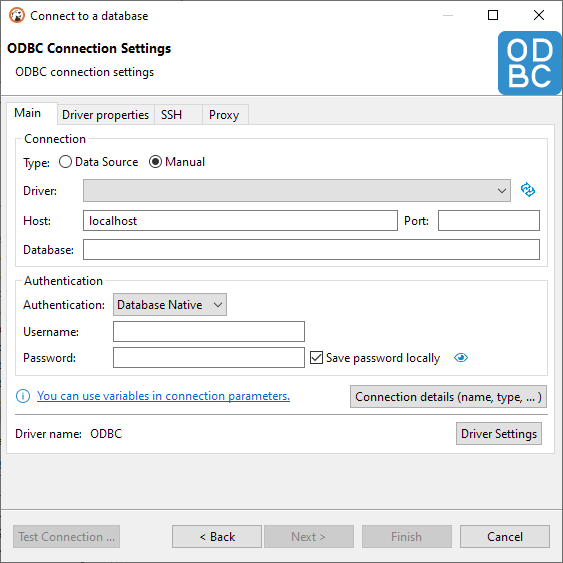
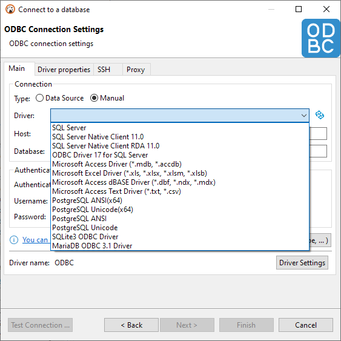
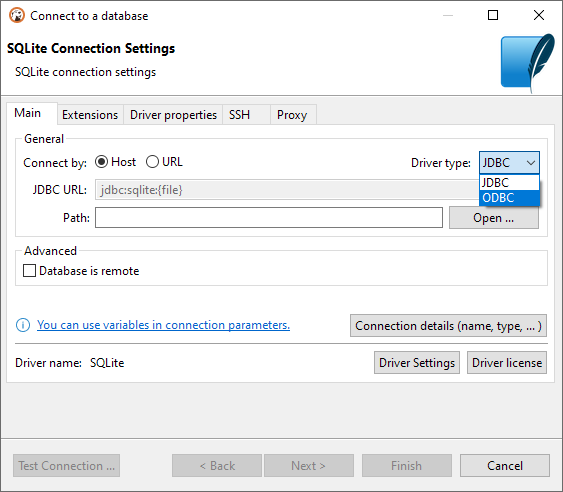

ODBC allows you to create a connection to almost any database in DBeaver by using native ODBC drivers. You can use it as an alternative to DBeaver drivers or if DBeaver does not have a driver for your database.

**Note: This feature is only available in [Lite](Lite-Edition), [Enterprise](Enterprise-Edition), [Ultimate](Ultimate-Edition) and <a href="https://dbeaver.com/dbeaver-team-edition">Team</a> editions.**

## Installing ODBC driver manager

DBeaver works with ODBC drivers using ODBC driver manager. A driver manager is a component is installed in
your operating system that provides access to drivers written in native programming languages.

- On **Windows**, a driver manager is already installed by default.
   You can access it by pressing <kbd>WIN+R</kbd> and typing `odbcad32`.
- On **Linux** and **macOS**, you need to install this component separately.
   We recommend the [iODBC driver manager](https://www.iodbc.org/) as it's confirmed to work flawlessly
  with DBeaver against Linux and macOS. To install, follow the provided instructions.
   You can access it by typing `iodbcadm-gtk` in the terminal.

## Installing ODBC drivers

- On **Windows**, it's done by installing a driver using Windows Installer (`.msi`).
  The installation is the same as for any other software.
- On **Linux** and **macOS**, a driver can be either installed from a package manager or by building it manually.
   Once a driver is installed, you need to add it to the driver manager. Open the driver manager,
  go to **ODBC Drivers** tab, press **Add a driver** and select required files.

## Configuring ODBC data sources

**Note: The process is mostly the same for all operating systems.**

1. Open the driver manager
1. Go to **User DSN** or **System DSN** tab
    1. Choose **User DSN** if you want to create a data source accessible only by the current user
    1. Choose **System DSN** if you want to create a data source accessible by all users
1. Click **Add** and choose the appropriate driver
1. Configure data source settings and click **OK**

## Creating ODBC connections in DBeaver

Open the **New Database Connection** dialog and select **ODBC** (Not **ODBC - Legacy**).

If you want to use a **configured ODBC data source**, switch
to **Data Source** connection type and choose it from a drop-down menu:

|Data Source|Data Source (drop-down)|
|---|---|
|||

If you want to use an **ODBC driver directly** and manually configure connection parameters, switch
to **Manual** connection type and choose an appropriate driver from a drop-down menu and fill rest
of the fields according to your configuration:

|Manual|Manual (drop-down)|
|---|---|
|||

## Making existing DBeaver connections use ODBC driver

DBeaver allows you to replace the underlying database driver of a connection with our ODBC driver.
This is not the same as creating a new ODBC connection as it keeps all database-specific functionality untouched.

**Note: In this mode, you can't use database-specific authentication methods and settings.**

To do so, open existing connection and choose **ODBC** as the driver type from the drop-down menu:

As of now, it's available for the following database drivers:
- DB2
- PostgreSQL
- SQL Server
- SQLite
- MySQL
