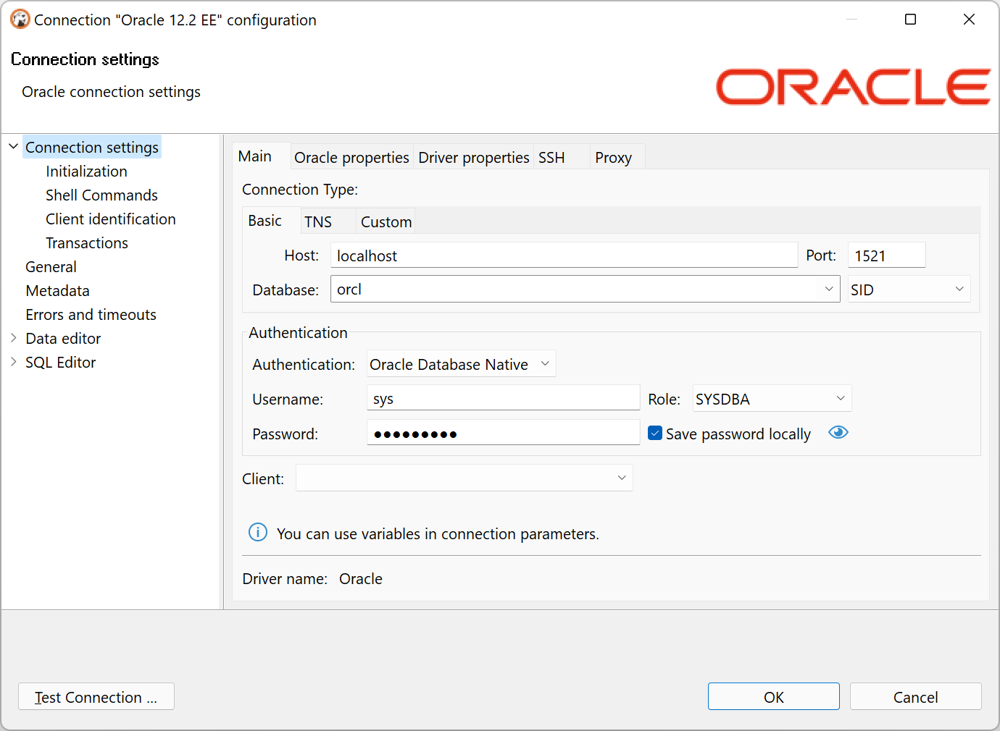

## Connecting to Oracle databases

There are several ways to configure a database connection and several ways to perform an authentication.

## Configuration types 

### Basic connections

Host/port based configuration

Parameter | Description | Example
----|-----|----
Host | Server host name | 192.168.1.25
Post number | Server listener port | 1521 (default)
Database | Service or SID name | ORCL
Service/SID | It depends on the server configuration. SID must be selected for some servers and the Service Name for others | SID

### TNS

TNS configuration is the simplest but it requires you to have the `tnsnames.ora` file somewhere on your disk.
tnsnames.ora contains information about all accessible Oracle server connections.
DBeaver can determine the default location of this file but sometimes you will need to manually specify it.

Parameter | Description | Example
----|-----|----
Network Alias | Name of configuration from tnsnames.ora | ORCL1
TNS names path | Path to `tnsnames.ora` file.  By default, it is got from the TNS_ADMIN environment variable or from Windows' registry | c:\oracle\network\admin

### Custom URL

For more a sophisticated configuration, you can specify the full JDBC URL manually (see [Data Sources and URLs](https://docs.oracle.com/database/121/JJDBC/urls.htm#JJDBC28270)). 

Sample URL (Oracle Cloud):  
`jdbc:oracle:thin:@(description= (retry_count=20)(retry_delay=3)(address=(protocol=tcps)(port=1522)(host=adb.us-ashburn-1.oraclecloud.com))(connect_data=(service_name=xxxxxxxxxxxxxxxxx_high.adb.oraclecloud.com))(security=(ssl_server_cert_dn="CN=adwc.uscom-east-1.oraclecloud.com, OU=Oracle BMCS US, O=Oracle Corporation, L=Redwood City, ST=California, C=US")))`

## Authentication

### Database

Parameter | Description | Example
----|-----|----
User name| Database user name | SYS
Password | Database user password | 
Role | Role for connection. Roles SYSDBA and SYSOPER are needed for some administrative operations | Normal
Save password | Saves the user/password information in the local DBeaver configuration | SID

### OS authentication

The Oracle driver gets user information from the current OS user.  
You do not need to explicitly specify any credentials.

### Oracle Wallet

**Note: This functionality is available in Lite, Enterprise and Ultimate editions only.**

A more secure way to connect is to use the Oracle Wallet. Wallet is a directory with security keys and some other optional connection information.
Wallets are usually distributed as ZIP archives. You need to extract the ZIP archive to a folder on a disk and specify this folder in the `Wallet location` field.

Wallet may contain information about a database user. This, however, is optional. You will sometimes need to specify the user too.

Wallet may also contain a TNS configuration. If it does, you can use the TNS connection configuration easily by setting the `TNS path` to the same value as the `Wallet location`.

Parameter | Description | Example
----|-----|----
User name, Password, Role| See <a href="#database">Database authentication</a> | 
Wallet location | Oracle wallet directory | C:\oracle\network\wallet\example
Wallet password | Optional. Some wallets are password-protected

### Kerberos

**Note: This functionality is available in Lite, Enterprise and Ultimate editions only.**

Kerberos is the most complicated authentication in Oracle.

Parameter | Description | Example
----|-----|----
Username | Database user name | c##testuser
Kerberos user | Kerberos / Active directory user name | testuser@THE-REALM
Realm | Kerberos realm | THE-REALM
KDC server | KDC server address | krb5.your-domain.com
Password | Kerberos user password | 

## Oracle Cloud connections

DBeaver supports Oracle Cloud Autonomous databases connectivity.  
There are two ways to authenticate:

### Plain URL connection

- To use a plain URL connection you must enable the `Access control list` for the Oracle autonomous database. 
- Then add your IP address to the IP list.  
- Use the Custom connection configuration (<a href="#custom">URL</a>). You can copy the URL from the Oracle Cloud database page (link "DB Connection").

### Oracle Wallet connection

It is the default authentication type for the Oracle Cloud.  
. 
- Download Wallet from the Oracle Cloud website
- Expand the wallet archive to a folder
- Set <a href="#tns">TNS</a> configuration type
- Set the `TNS path` to the wallet location directory
- Choose the proper `Network Alias` from the drop-down menu
- Set `Authentication` to the Oracle Wallet
- Set the database user name and password (you can get them from the Oracle Cloud database information page)
- Set the `Wallet location` to the wallet location directory

