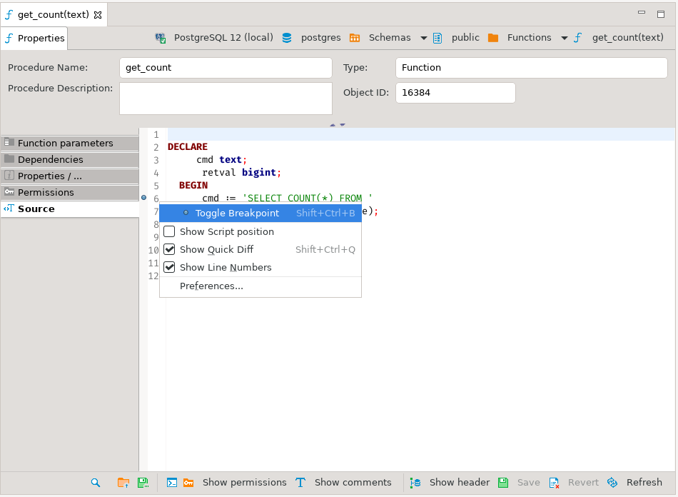
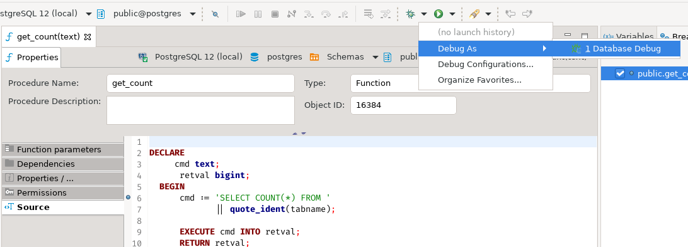
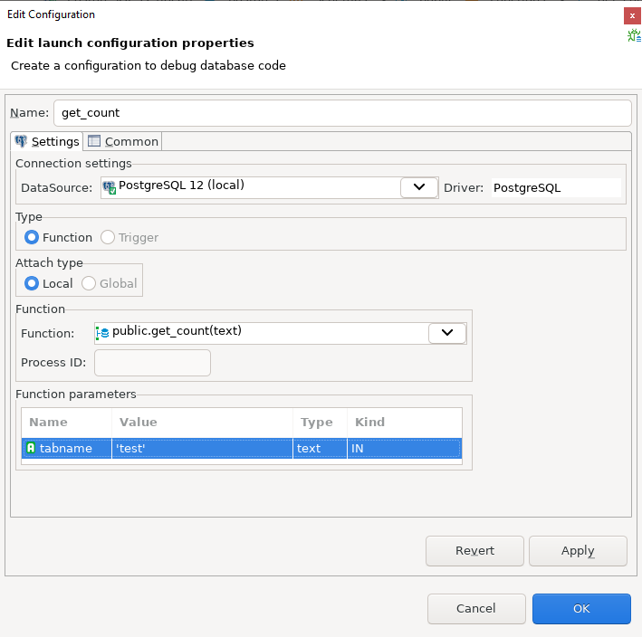
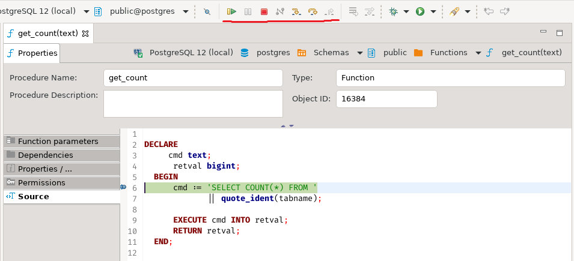

## Prerequisites for Debugging
To enable interactive debugging of PL/pgSQL procedures on a Postgres server, you need to use the _plugin_debugger_. 
The _plugin_debugger_ is a typical interactive debugger delivered as an extension. 
It requires a shared library preload in Postgres to operate the shared_preload_libraries parameter in the settings. 
The debugger is developed and maintained by EDB. Its source code is available for examination and improvement.
 
The debugger provides the required server API for debugging PL/SQL procedures with:

* Breakpoint management;
* Step-by-step tracing;
* Variable acquisition and management.

## Installation

### PostgreSQL 12 on Ubuntu-based distros
If you happen to have a PostgreSQL 12 installed via _apt_, then the procedure is quite straightforward:
```
sudo apt install postgresql-12-pldebugger
sudo service postgresql restart
```
After that, run the following command in the database or databases that you wish to debug functions in:

`CREATE EXTENSION pldbgapi;`

### Installation from source code

You can find the source code in [this repository](https://github.com/EnterpriseDB/pldebugger). 
Installation instructions are located in the README file.

## Running debugger in the DBeaver interface

Open the source code of the function you want to debug. To toggle breakpoints, 
place the caret on the line you want the function to be stopped at and use a shortcut `Shift + Control + B`. 
Alternatively, you can toggle the breakpoint with your mouse by clicking on a 
ruler, as demonstrated in the screenshot below:



**NB.** You must only toggle the breakpoints when _Show header_ option is **not** on.

Then you need to set up a debugging configuration. 
Locate the downward-facing arrow right to the bug icon, click on it, then

_Debug As_ -> _Database Debug_:



The _Edit Configuration_ dialog opens. Set up input values in the table 
_Function parameters_.



Click on _OK_ button, and you are ready to go!

The usual buttons essential for debugging such as _Step Over_ and _Continue_ 
are located here:

