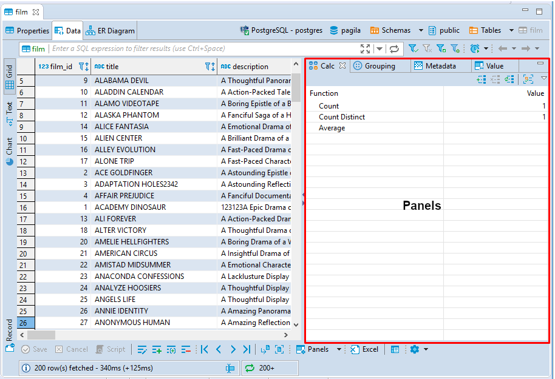
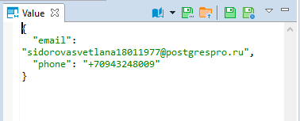
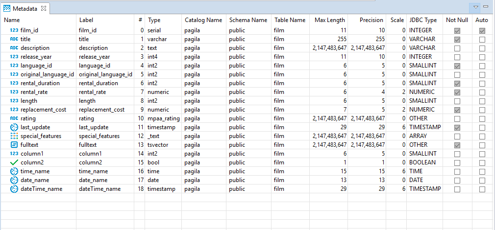
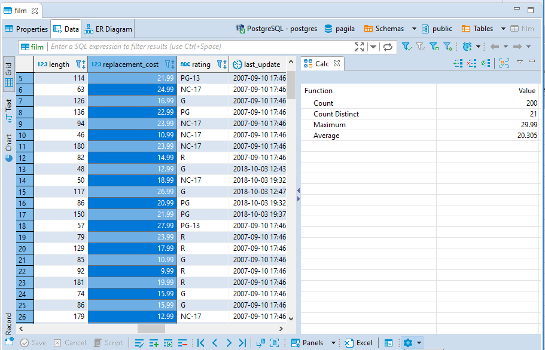
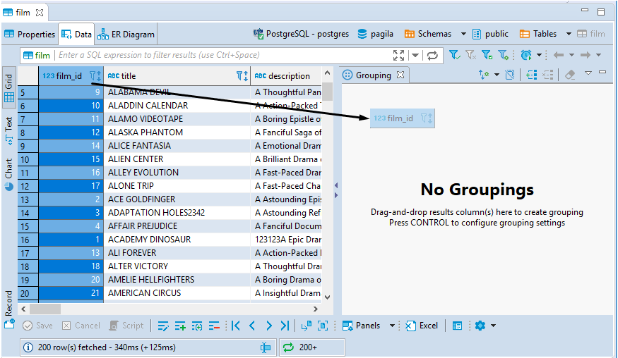
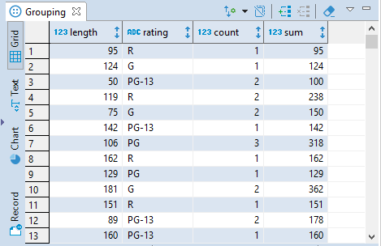
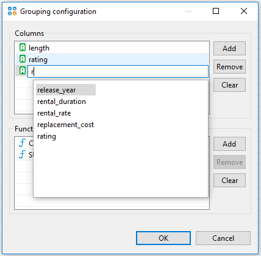

Panels provide additional space in the [Data editor](Data-Editor) in which you can manipulate data. The panels are handy if you work with complex types (structures, arrays), long text data, or BLOBs. Panels appear as tabs in an additional pane in the right part of the Data tab:

This additional pane appears only when you open one of the four panels:

* Calc
* Grouping
* Metadata
* Value viewer (default)

To open panels, click **Panels** in the bottom toolbar. By default, the Value viewer panel opens. Alternatively, you can open the Value panel by pressing <kbd>F7</kbd> on a cell.
To open the other panels, click the down arrow next to the **Panels** button and click the name of the panel on the menu:

Panels also open if you try to inline-edit a cell with a complex data type.

To close panels, click the **Panels** button again or click the standard Close (cross) icon in the upper right corner of each panel.  
You can also show and hide panels by clicking the **Configure** button () in the bottom toolbar and then **Toggle result panels** on the Configure dropdown menu.

## Value Viewer

The Value viewer panel displays just one value that is currently in focus and allows editing it.
 

The toolbar of Value panel contains the following buttons:

Button|Name|Description
------|----|-----------
|**Content viewer settings**|Opens a menu with a set of options for content view change.
|**Save to file...**|Allows saving the content to a local file. **NOTE**: This button is only available for XML, JSON and Binary content.
|**Load from file...**| Allows uploading data from a local file. **NOTE**: This button is only available for XML,JSON and Binary content.
|**Apply cell value**|Displays in the data table the changes made in the Value viewer. **NOTE**: This button does not save changes made to the database. To save the changes in the database, you need to use the **Save** button in the bottom toolbar of the [Data Editor](Data-Editor)..
|**Auto-apply value**|Еnables automatic display of changes made in the Value viewer in the data table. When auto-saving is enabled, the changes appear in the data table at the same time when they are made in the Value viewer.**NOTE**: This button does not save changes made to the database. To save the changes in the database, you need to use the **Save** button in the bottom toolbar of the [Data Editor](Data-Editor).

## Metadata Panel
The Metadata panel displays metadata for each cell in the row containing the cell currently in focus. You can just view the metadata.

## Calc Panel

The Calc panel is useful for getting basic statistics across data in several columns and rows:

You can select several columns and rows in standard ways - by pressing and holding the left mouse button or by clicking cells while holding the <kbd>Ctrl</kbd> or <kbd>Shift</kbd> keys. The panel updates dynamically to shows statistics for the selected data.

To see data grouped by columns, click the Group by columns button (). To remove the grouping by columns and see summary values for all columns, click the same button again.

By default, the panel applies and displays results for two functions – **Count** and **Count Distinct**. To add other functions, click the **Add function** () button in the toolbar of the panel or right-click one of the rows in the Aggregate panel and click **Add function** on the context menu and then click the name of the function. The following functions are available:

* Sum
* Average
* Minimum
* Maximum
* Median
* Mode

To remove an individual function, click the function and then click **Remove function** () in the toolbar of the panel, or right-click the function and click **Remove function** on the context menu. To remove all functions, click **Reset** () in the toolbar or on the context menu.

You can copy the value of a particular function to the clipboard - right-click the row and click **Copy Value** on the context menu.  
You can also copy all functions with their values - right-click in the table and click **Copy All** on the context menu. 

## Grouping Panel

The Grouping panel provides tools to calculate statistics based on a table of a custom SQL query.
It uses GROUP BY queries to extract unique values for COUNT (default), SUM, AVG, MIN, MAX and other analytics functions displaying the results in dedicated columns.  
To obtain the grouping results for one or more columns of a data table, open the Grouping panel, then, in the results table, put the cursor onto the data type icon of the table header so that the cursor turns into a hand pointer (), and drag-n-drop the column(s) onto the panel:

If you add several columns to the panel, DBeaver groups data in the order in which the columns go and calculates statistics based on the grouping.

By default, the COUNT function is used. You can add other functions as well. To add a function:

1. Click the **Edit grouping columns** button in the panel`s toolbar.
2. In the Grouping Configuration window, in the **Functions** area, click **Add**, then type the function into the new row:
   * You can use auto-complete options DBeaver provides.
   * You need to indicate the column name in brackets. COUNT is the only function that supports `*` instead of column name.
3. Click **OK**:
  
   

To remove a function, in the same Grouping Configuration window, click the function and click **Remove** and then **OK**. To remove all functions, click **Clear** and then **OK**.

You can also add or remove columns using the same Grouping Configuration window. To add a column:

1. Click the **Edit grouping columns** button in the panel`s toolbar.
2. In the Grouping Configuration window, in the **Columns** area, click **Add**, then type the column name into the new row (you can use auto-complete options DBeaver provides), and then click **OK**:  

   

For MySQL/MariaDB databases you can also add a column with an expression - the expression will be calculated in the resulting column:

To remove a column, in the Grouping Configuration window, in the **Columns** area, click the column name, then **Remove** and **OK**. To remove all columns, click **Clear** and **OK**.  
Another way to remove a column is to click the column and then the **Remove grouping column** button () in the panel`s toolbar. Clicking the **Clear grouping** button () removes all results from the Grouping panel.
