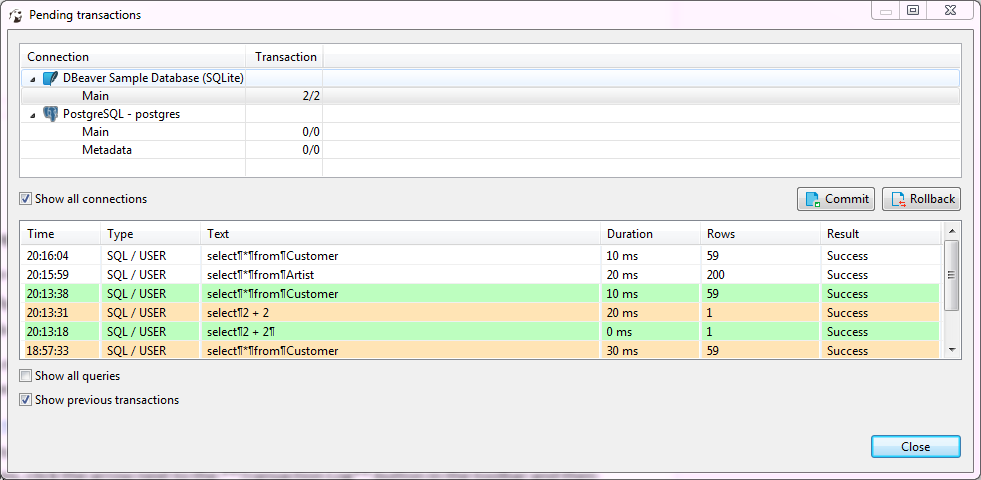

It might be useful to check your pending transactions because they might lock your database. To see your pending transactions, click the arrow next to the **Transaction Log** button in the toolbar and then click **Pending Transactions** on the dropdown menu:

 
The upper table of the Pending transactions window shows currently active connections and the number of their transactions. The bottom table shows query details of the connection that is currently in focus in the upper table:

When the Pending transactions window opens, the upper table shows only those connections that have pending transactions. If no connections have pending transactions, the table is empty. To see all connections that are currently active (connected), select the **Show all connections** checkbox.

You can commit or roll back transactions right from the Pending transactions window: in the upper table, click the row with the required uncommitted transactions and then click the **Commit** or **Rollback** button, depending on your purpose. If a transaction is committed/rolled back successfully, both buttons are disabled. If the operation is unsuccessful, the system displays an error message.

To see all previous transactions made during the current session, select the **Show previous transactions** checkbox. To see all queries including non-transactional ones, select the **Show all queries** checkbox. The green rows are committed transactions, the orange (or red) ones are rolled back, rows without a special color are non-transactional or pending transactions.