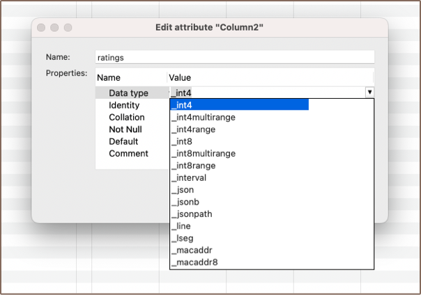

DBeaver offers support for array data types in managing PostgreSQL databases. This feature enables the storage of
multiple values in a single variable, allowing for more efficient and organized data management. A complete list of types is
available in the **Edit Attribute** window in the data type selection dropdown when [creating a column](Creating-columns#create). 

The representation of these array data types in DBeaver requires a specific notation. An underscore `_` is placed before
the data type, distinguishing array data types from scalar ones.

### Creating Array column

You have the flexibility to create an array column either via the [**Properties Editor**](Properties-Editor) or the
[**SQL Editor**](SQL-Editor) in DBeaver.

In the **Properties Editor**, navigate to the **Edit Attribute** window. Choose your desired array data type,
For an array of integers, such as `_int4`, from the data type selection dropdown.



Alternatively, you can execute a script in the **SQL Editor** to add an array column to an existing table.
For example, the following command will add a new integer array column called 'ratings' to your table:

```sql
ALTER TABLE film ADD ratings _int4 NULL;
```

### Creating Array Data

Once the table is created, you can use the SQL script in the **SQL Editor** to insert data into the array column. For example, this
script utilizes the array constructor with nested arrays:

```sql
INSERT INTO film (film_title, ratings)
VALUES ('Inception', array[array[8, 9], array[7, 9], array[8, 10]]);
```

This script, "Inception" has received three sets of ratings. Each set could represent ratings from a different
platform or group of users, for example. Each set contains two ratings, in this case.


### Modifying and Querying Array Data

Once you've established an array column, DBeaver allows you to modify and query the array data just like you would
perform any other operations in PostgreSQL. You can use standard SQL commands like `UPDATE`, `INSERT`, and `SELECT` to
manipulate and retrieve data from your array columns. The array data is treated the same way as any other data type in
PostgreSQL, granting you all the flexibility of SQL operations.