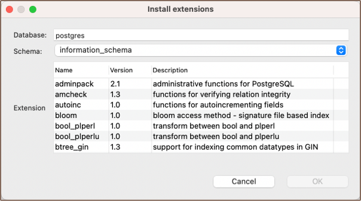

DBeaver offers support for [PostgreSQL](PostgreSQL) extensions. These tools allow you to customize
and extend your database's functionality beyond its default capabilities. From adding new data types and functions to
enhancing performance and database operations, PostgreSQL extensions offer a range of possibilities.

The ability to install, use, and delete PostgreSQL extensions within DBeaver provides a seamless and integrated
experience, making it simpler for you to leverage the full potential of your PostgreSQL database system.

### Install Extensions
With DBeaver, you have two ways to install PostgreSQL Extensions - through the [Database Navigator](Database-Navigator)
and using the [SQL Editor](SQL-Editor).

**Note**: Be sure to have the appropriate permissions to perform the installation. The ability to add extensions
typically requires database administrative privileges. Without these, you may encounter errors during the installation
process.

#### Database Navigator

Navigate to the **Database Navigator** -> **Databases** -> **Extensions**. Right-click on the **Extensions** and select
**Create New Extension**. In the opened dialog box, you can select the **Schema**, required **Extension** from the list and 
confirm the installation.




#### SQL Editor

Alternatively, you can install an extension directly using a SQL command. Open the SQL Editor, and type the appropriate
SQL command to create the extension. For example, to install the "uuid-ossp" extension, you would run:

```sql
CREATE EXTENSION IF NOT EXISTS "uuid-ossp";
```

Then, [execute](SQL-Execution) the command. DBeaver will run this command on your PostgreSQL server to install the extension.


### Using Extensions

After installing the extension, its functionality becomes available. New functions, data types, operators, or other
features may be available in your SQL queries depending on the extension.

For example, if you have the `uuid-ossp` extension installed, you can use the `uuid_generate_v4()` function to generate
universally unique identifiers (UUID). It can be used directly in SQL queries or as a default value when creating a new
table.

### Deleting Extensions

Deleting an extension in DBeaver is as simple as installing one. Navigate to the **Extensions** in the **Database Navigator**,
right-click on the extension you wish to remove, and select **Delete**. Confirm the deletion in the dialog box
that appears.

**Important**: Dropping an extension will remove all functionalities and data types associated with it. Ensure you have a
clear understanding of the impact on your database before performing this operation.