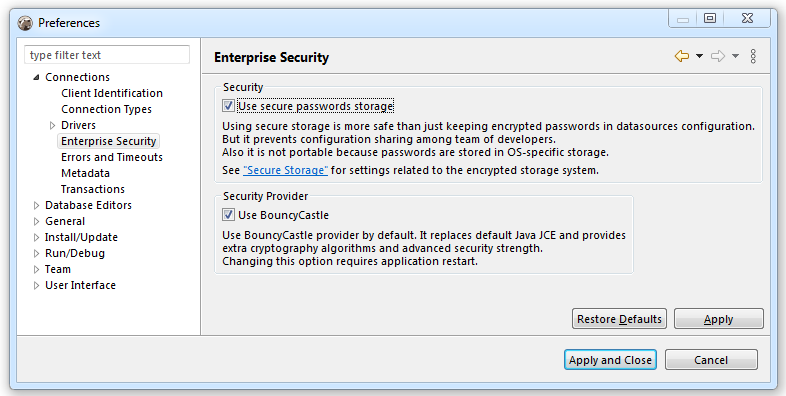

**Note: This functionality is available only in [Enterprise-Edition](Enterprise-Edition).**

DBeaver support local storage for connection secure data. It includes:
- Database server user credentials
- SSH tunnel user credentials
- Proxy user credentials

By default user names and passwords are stored in file `credentials-config.json`. 
This file is encrypted using AES key. However it is really secure as this key is not secure (can be found in DBeaver sources) and thus this file can be un-encrypted by 3rd party people using some 3rd party software.

In DBeaver Enterprise there is much more strong security support.

## Master password for local configuration

It is possible to set master password for all projects in local workspace.
Go to Preferences->Database->Security and enable option `Use secure passwords storage`.
There are several password storage providers (you can see them on page General->Security->Secure Storage), `DBeaver Enterprise Password Provider` is the default one (in standalone DBeaver). It will ask you to specify master password.
DBeaver doesn't store this password anywhere, it only encrypts user credentials in special local storage. It is not possible to decrypt these password without password (at least easily).

Side effect of this configuration - you cannot share your connections (with password) between different users. Because user credentials are stored in a completely separate location and they are protected by local user password.

#### Use Windows Integration password provider

You can disable default password provider and enable "Windows Integration" provider. This provider doesn't need master password but it uses randomly generated password stored in local user secure storage (in Windows).
This is easier (as you don't need to remember master password) but less secure (anybody who have access to your Windows user account will have access to DBeaver stored credentials).

## Project password

You may specify a password for a project. It will encrypt all project's configurations with this password. Also you will be able to share your project settings with other users (you will need to pass the project password as well).

In order to enable project password open project properties. You can do this by:
- Click on main menu File->Project security
- Click on "Configure" icon in project explorer view toolbar and switch to Project Security tab
- Press <kbd>ALT+Enter</kbd> on a project element in `Projects` view and switch to Project Security tab

On project security page click on "Set Password" button to enable project password. Click on Clear to disable it (you will need to enter current project password to clear it).

#### "Encrypt configuration" option
