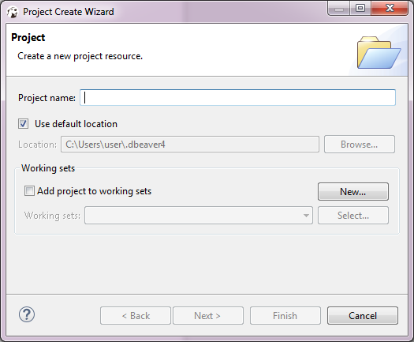

The [Projects view](Projects-View) allows the creation of new projects as well as renaming and deleting projects that are not active.
NOTE: You cannot rename or delete a project that is set as active. 

## Creating Project
To create a project, in the Projects view, in the toolbar, click **Create Project** (). The Project Create Wizard opens.

1. In the Project screen, in the **Project name** field, specify the name of the project.
2. To keep the default location to store the project, leave the **Use default location** checkbox selected. If you want to change the location, clear the checkbox and enter the name of the new directory into the **Location** field or click **Browse** and select the directory in the folder tree. 
3. Click **Finish**. The new project appears in the projects tree.

## Deleting Project
To delete a project, in the Projects view, right-click its name in the tree and click **Delete** on the context menu. Two confirmation dialog boxes will appear one after another:
1. **Delete object** dialog box is to confirm the deletion of the project itself. Click **Yes** if you are sure you want to delete it. Otherwise, click **No**.

   

2. **Delete project** dialog box is to confirm the deletion of the project's contents. These are the project configuration files and scripts stored in the file system. Click **Yes** if you want the contents to be deleted as well. To keep the contents, click **No**.

NOTE: If you have deleted a project and then re-create it with the same name, the new project picks up all the database connections of the deleted project.
