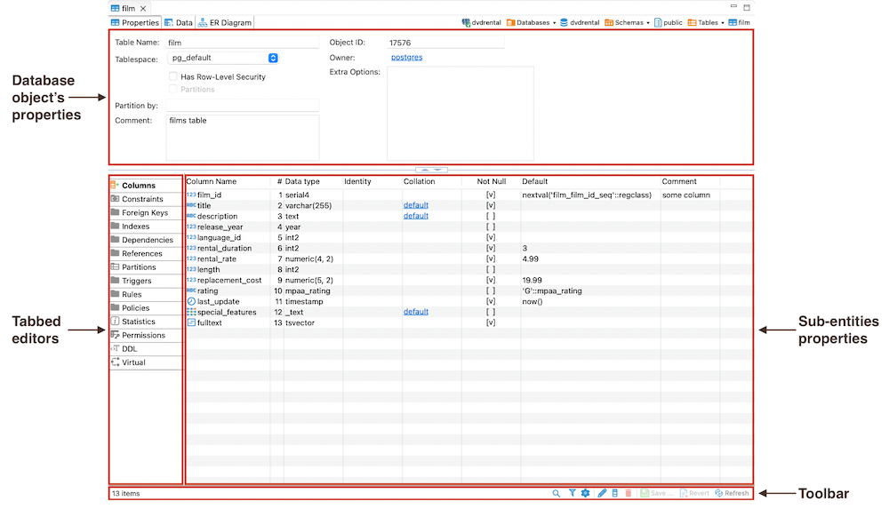
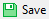

## Overview

When you open the **Properties** tab of the [Database Object Editor](Database-Object-Editor), you'll encounter the following
interface elements:

- **Database object's properties**: displays the properties of the current database object.
- **Tabbed editors**: These vary depending on your database. Depending on the database you're working with, you'll see
  different tabs reflecting that particular database's unique characteristics and requirements.
- **Sub-entities properties**: These contain the properties of the object's sub-entities. To access these properties,
  click the tabs in the **Tabbed Editors**.
- The **Toolbar** provides tools for managing these sub-entities.

## Key Operations

To interact with the **Properties Editor** page, you can use [Toolbar controls](#toolbar-controls), execute commands
from [context menu](#context-menu) associated with sub-entities, and utilize related [keyboard shortcuts](Shortcuts).

### Toolbar controls

The toolbar at the bottom of the editor provides the following tools for the majority of sub-entities, except for some
specific ones like SQL-based views ([**DDL** and **Source**](SQL-Editor#sql-script-editors)):

 Button                                               | Name                           | Description                                                                                                                                                                                                                        
------------------------------------------------------|--------------------------------|------------------------------------------------------------------------------------------------------------------------------------------------------------------------------------------------------------------------------------
                        | Search items                   | Displays a search field next to the button: - Type in the search combination - the content updates dynamically - To remove the filter, click the cross icon next to the search field.                                      
                      | Filter settings                | Opens the Filtering window, which allows setting a custom filter, see [Configure Filters](Configure-Filters).                                                                                                                       
  | Configure columns              | Opens the Configure columns dialog box to select the columns to display or hide in the current view.                                                                                                                 
          | Refresh the selected items     | Depending on the database type, refreshes either the current item or its parent or the whole database object – reloading data from the database.                                                                                   
                 | View                           | Opens an editor/viewer for the item currently in focus.                                                                                                                                                                            
            | Create new [items]             | Creates a new item of the same type as currently displayed in the open view, for example, a [column](Creating-columns) .                                                           
                   | Delete database object         | Deletes the item currently in focus.                                                                                                                                                                                               
                        | Save the current contents      | - Same as the **Save** button on the main application toolbar - Same as <kbd>Ctrl+S</kbd>(or <kbd>⌘S</kbd> for MacOS)  Opens the **Persist Changes** window that allows saving changes in the currently open sub-entity. 
                      | Revert to the last saved state | Reverts all changes made to the database object to the previous saved state.                                                                                                                                                     

### Context menu

The **Properties** of the sub-entities have context menus that offer the same commands as the [Database Navigator](Database-Navigator).
To access these menus, right-click on the item.