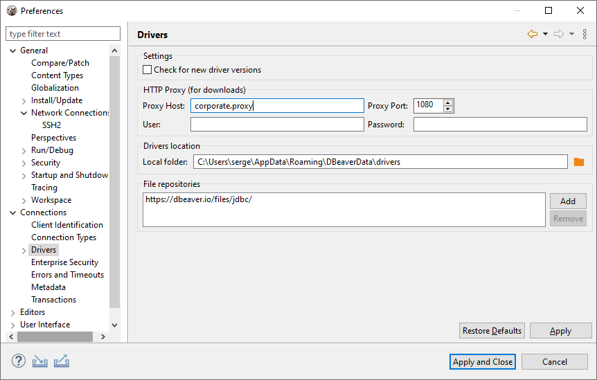
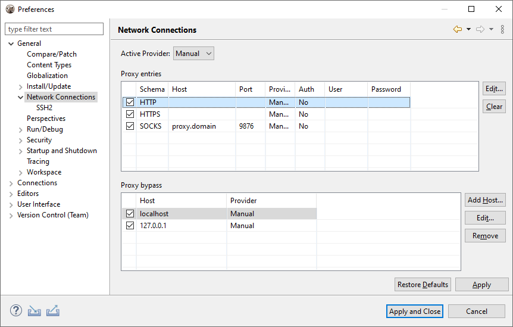
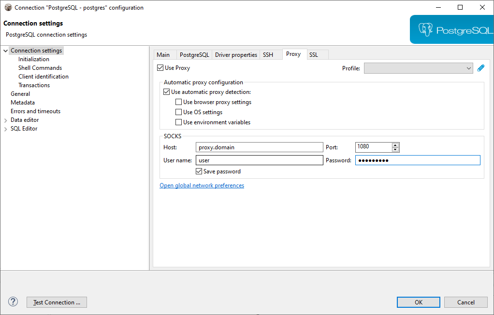

## External resources access

Sometimes DBeaver needs to access external internet resources for such tasks as:

- 3rd party JDBC drivers download
- Information about new DBeaver version
- Connect to remote databases outside of your corporate network
- Subscription license activation (commercial version)
- License information update (commercial version)

If you are behind some corporate firewall which restricts access to external internet resources then it may become a real problem.  
Sometimes corporate firewalls allows to access external resources using web browser but restricts this for all other applications.  

## How to configure proxy for drivers download

You need ask your network administrator about proxy parameters.  
Then go to Preferences->Connections->Drivers.  

You can enter proxy host/port and (optionally) user/password here. It will be used for drivers download only.  
Drivers are usually downloaded from maven.org web site. You also may ask your network admin to add `maven.org` to the list of allowed external domains.

## How to configure network for license activation

You need to configure global proxy server.  
If you can't activate your subscription license then you first need to use trial version to start DBeaver and configure proxy.  

Go to Preferences->General->Network Connections:

Switch to Manual or Native proxy (native proxy settings will use active web browser proxy configuration).  
Note: in order to activate/update license DBeaver needs access to web site `dbeaver.com` only. You may ask your network administrator to add `dbeaver.com` to the white list.  

## How to configure proxy for external databases access

You can configure proxy settings for individual connection.  
You may set proxy settings manually or use active OS/web browser settings:

