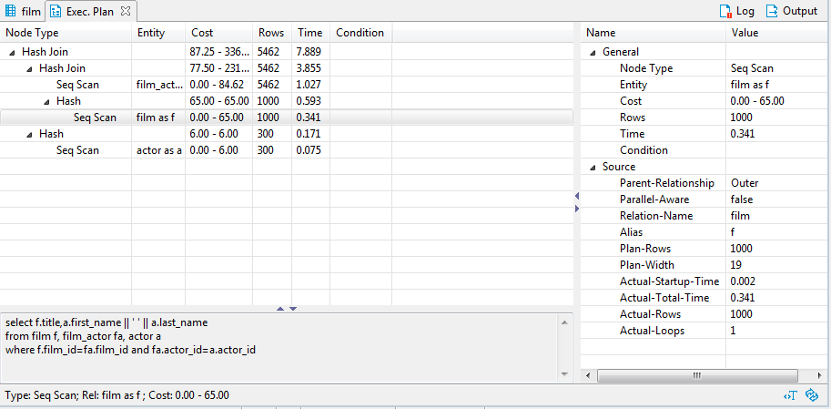
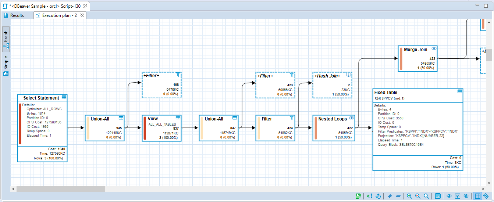

## Execution Plan

This feature is supported for the following data sources:

**The Execution plan for databases marked with a star is supported only in Lite, Enterprise and Ultimate editions**

* ClickHouse 
* Couchbase 
* DB2 LUW
* Exasol
* Firebird
* HSQLDB 
* Microsoft SQL Server 
* MySQL
* Netezza 
* OceanBase
* Ocient
* Oracle
* PostgreSQL
* SAP HANA

### Simple plan view

If a database driver supports the visualization of the execution plan, you can see the execution plan of the current query (under cursor) by pressing <kbd>Ctrl+Shift+E</kbd> or clicking **Explain execution plan** on the context menu or in the main toolbar: 
The execution plan command generates a tree of query execution as one of the result tabs and is convenient in estimating if the query/script is quick/optimal enough: 

You can click the rows of the execution plan to see their details (statistics) in the panels below and to the right of the plan.  
To reevaluate the plan, click the **Reevaluate** button ().
To see the source script on which the plan is based, click the **View Source** button ().

### Advanced plan view 

In DBeaver [Lite](Lite-Edition), [Enterprise](Enterprise-Edition), and [Ultimate](Ultimate-Edition) editions you can use an advanced (graph) visualization of the execution plan.  
This visualization shows the most expensive (cost-based) plan nodes. You can hide all irrelevant nodes (see node details), use horizontal or vertical plan layouts, export it to an image or save it as JSON to send to a colleague.

