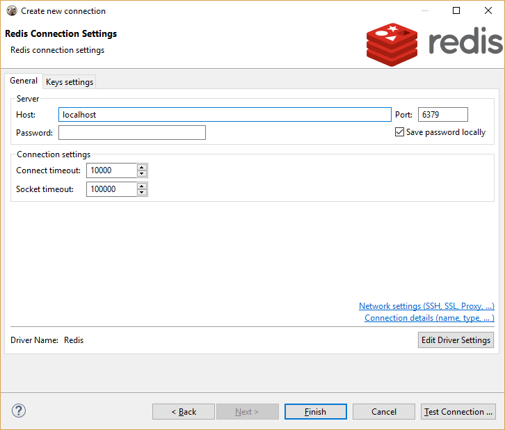
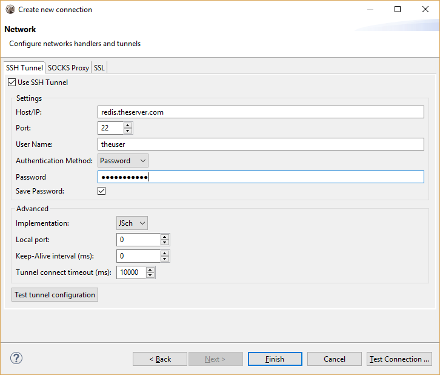
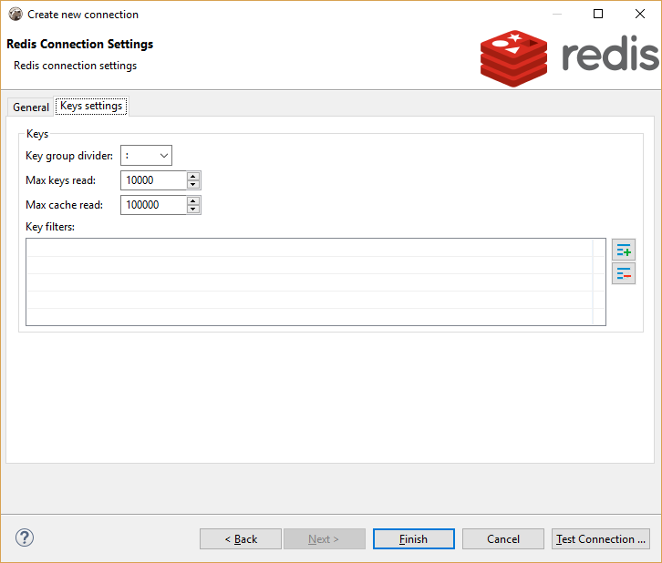
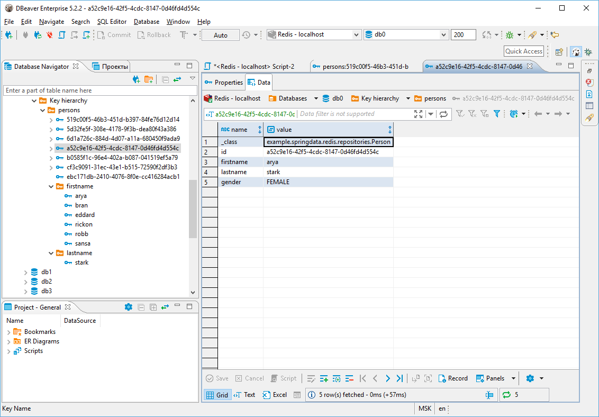
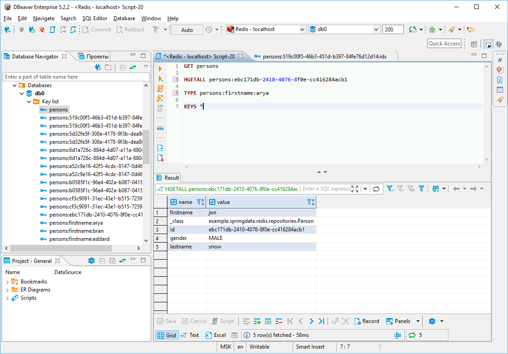

### Overview
DBeaver EE supports Redis key browser, key value viewer and Redis commands shell.  
DBeaver uses <a href="https://github.com/xetorthio/jedis" target="_new">Jedis</a> driver 2.9.0 to operate with <a href="https://redis.io" target="_new">Redis</a> server. It supports Redis servers of any version.  

### Connecting to Redis Server
You can connect directly to a server or use SSH tunneling or SOCKS proxy.  





### Browsing Redis keys

You can view/edit Redis keys as a plain list. However the Redis database usually contains a lot of keys (millions or even billions) and using list presentation is not convenient (or it is not possible).  
DBeaver supports a hierarchy presentation of keys. Internally Redis does not support hierarchies but application level key names may be divided into groups using a character (e.g. coma, dash or colon). DBeaver uses this pattern to show hierarchy. Group separator can be configured in connection properties.  

Key browser may be convenient in some cases but in the case of big databases it is very difficult to find your key in the navigator, so the SQL editor should be used instead. Redis <a href="https://redis.io/commands" target="_new">commands</a> is the most flexible way to operate with keys.  





### Executing Redis commands

Redis does not support SQL or any other query language. Instead, it supports <a href="https://redis.io/commands" target="_new">build-in commands</a> and <a href="https://redis.io/commands/eval">LUA scripts</a>.

Redis commands can be executed in the same way as in a Redis command line shell:
```COMMAND ARG1 ARG2 ... ARGN```

In order to execute a command, run it using CTRL+Enter or ALT+X. All standard DBeaver SQL editor shortcuts work for Redis as well.

In order to execute a LUA script, surround it with {} brackets and run it as a single statement. If the script contains empty lines or special characters, select the script text before the execution.
```lua
{
    return {1,2,{3,'Hello World!'}}
}
```
