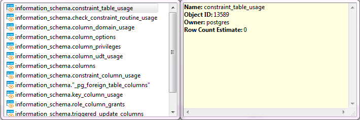

The SQL Assist feature provides auto-completion of database object names and SQL commands, and other keywords in queries.

To perform some object name auto-complete, press <kbd>Ctrl+Space</kbd> or right-click the desired location in the query and click **SQL Assist** on the context menu. DBeaver searches for objects in a database by their names and/or descriptions. 

When you start typing an SQL keyword in a statement, DBeaver offers auto-complete options as well.  
Another auto-complete function is that it searches for the last entered identifier - type the first letter and press <kbd>Ctrl+Shift+Space</kbd>.  

You can also press <kbd>Ctrl+Space</kbd> after the asterisk in the query similar to `SELECT * FROM tableName` or similar to `INSERT INTO tableName (*)` (brackets are important) (you can use ()[]{} brackets) - the asterisk will be replaced with a list of all the table columns.
  
## Hippie Engine
Hippie Engine provides autocompletion based on information from the current script file. It scans files looking for words and adds proposals based on similarity with the given string.

It can be toggled on or off in the **[Code Completion](#customize)** preferences.

## Customize

You can customize your SQL Assist and Auto Complete by navigating to **Window** -> **Preferences** -> **Editor** -> **SQL Editor** -> **Code Completion**, optimizing the performance of the auto-completion feature.