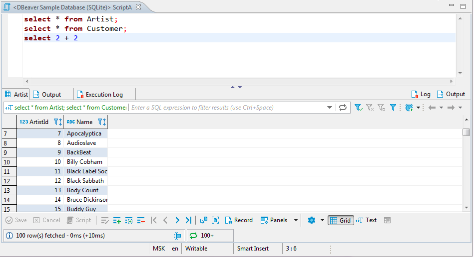

You can create multiple SQL scripts for a single connection. Every script opens in its own SQL editor. 
To open an SQL editor for some connection:
* Click this connection in the [Database Navigator](Database-Navigator) view and press <kbd>F3</kbd> or click **SQL Editor -> SQL Editor** on the main menu. Alternatively, click **SQL Editor** on the context menu of this connection. DBeaver opens the Choose SQL script editor with saved SQL scripts linked to this connection. Click the SQL script to open it in a separate tab.
* Click **Recent SQL Editor** on the context menu for this connection or on the main menu (**SQL Editor -> Recent SQL Editor**). This opens the latest used SQL editor. You can also open the most recent SQL editor using <kbd>Ctrl+Enter</kbd> shortcut in the Database Navigator view.
* If you need to create a new SQL script, on the main menu, click **SQL Editor -> New SQL Editor** or press <kbd>F3</kbd> and then click **New Script** in the Choose SQL Script window.

DBeaver uses SQL syntax highlighting which depends on the database associated with the script. Different databases have different sets of reserved keywords and system functions.

NOTE: SQL Editor for a connection is different from SQL console for a table or view (right-click the table and click **Read data in SQL console**). Unlike the console, it can save scripts and changes made to them.

You can see all your saved SQL scripts in the [Project Explorer](Project-Explorer) view in the **Scripts** folder.

The SQL editor includes the script panel at the top and the results panel at the bottom:

You can open the SQL editor preferences by pressing <kbd>Alt+Enter</kbd>.

Also you can customize your SQL Editor toolbar to bring more commands with `Preferences->User Interface->Toolbar Customization`. See [Toolbar Customization](Toolbar-Customization).

By default, only Execute SQL Statement, Execute SQL Script and Explain Execution plan are visible.

## Results Panel
The results panel displays tabs with results in various formats. The tabs resulting from script execution represent instances of the [Data Editor](Data-Editor). You can create, edit and execute SQL scripts in the script panel and then see the results in the result tabs.

The results panel provides **Output** and **Log** views of results. 

The execution **Log** tab contains all queries executed in the current SQL editor:

The **Output** tab contains all server-side database messages/warnings generated by a database when you execute queries. This feature is supported only by a few database engines (Oracle, SQL Server and some other ones). 

## Layout Adjustment
You can modify the layout of the SQL Editor by showing/hiding the results panel and changing the horizontal/vertical position of the panes.
* To toggle (hide/show) the results panel, press <kbd>CTRL+6</kbd> or right-click anywhere in the script pane and, on the context menu, click **Layout -> Toggle results panel**.
* To maximize the results panel, press <kbd>CTRL+Shift+6</kbd>, or double-click the results tab name, or right-click anywhere in the script panel and, on the context menu, click **Layout -> Maximize results panel**.
* To switch between the script panel and the results pane, press <kbd>Alt+6</kbd> or right-click anywhere in the script panel and, on the context menu, click **Layout -> Switch active panel**.

To position both panels horizontally, right-click anywhere in the script panel and, on the context menu, click **Layout -> Horizontal**.  
To position both panels vertically, right-click anywhere in the script panel and, on the context menu, click **Layout -> Vertical**.

## Hyperlinks
You can press and hold <kbd>Ctrl</kbd> and at the same time move the mouse over the SQL text. If DBeaver recognizes some identifier as a table/view name, it presents it as a hyperlink. You can click the hyperlink to open this object`s editor:

  

## Active Database/Schema Selection
You can change the connection associated with the current SQL editor or change the active database/schema, at the same time retaining the SQL text.  
To change the connection, press <kbd>Ctrl+9</kbd> or click the **Active datasource** box on DBeaver`s main toolbar:

The Select Data Source dialog box opens. In the tree of connections, click the required connection and then click **Select**. To disassociate the SQL Editor with any connection, click **None**:

To change the active schema, press <kbd>Ctrl+0</kbd> or click the **Active Catalog/Schema** box in DBeaver`s main toolbar:

The Choose catalog/schema dialog box opens. In the list of schemas, double-click the required schema:

If there are many schemas and they do not fit in the dialog box use the search field to find the schema you need: 

To configure the set of columns to be visible for each schema in the dialog box, click the **Configure columns** button ().

You can easily associate the SQL Editor with the connection that is currently in focus in the Database Navigator (the focus can be on any object of the connection - a table, a folder, etc.) - click the **Set connection from navigator** button on DBeaver`s main toolbar:

The reverse action is also possible: you can set the focus of the Database Navigator to the active connection of the SQL Editor - press <kbd>Ctrl+Shift+,</kbd> or click the arrow next to the **Set connection from navigator** button in DBeaver`s main toolbar and then click **Link with editor**:

