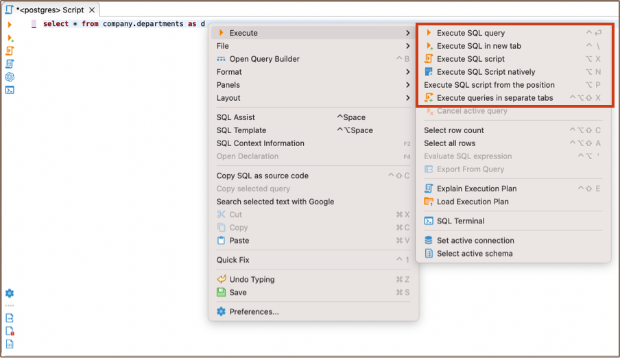
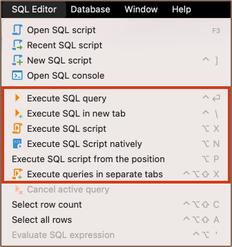
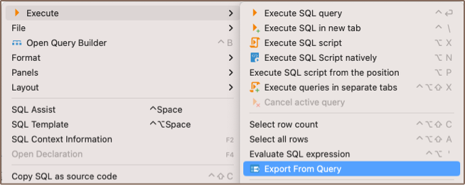
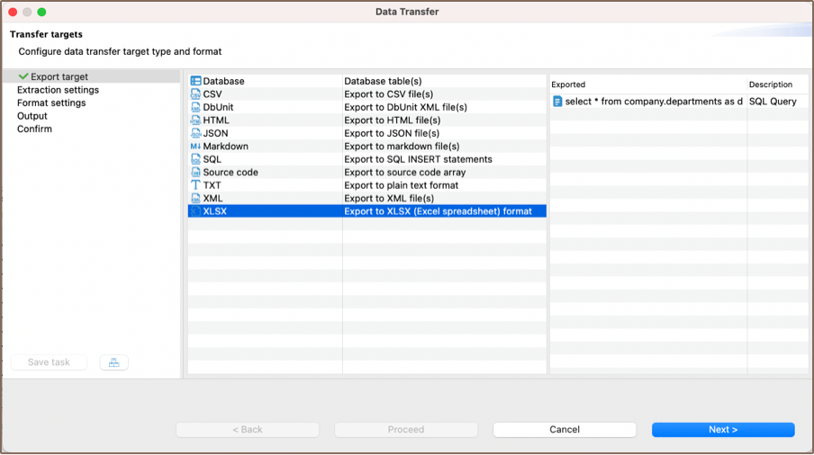
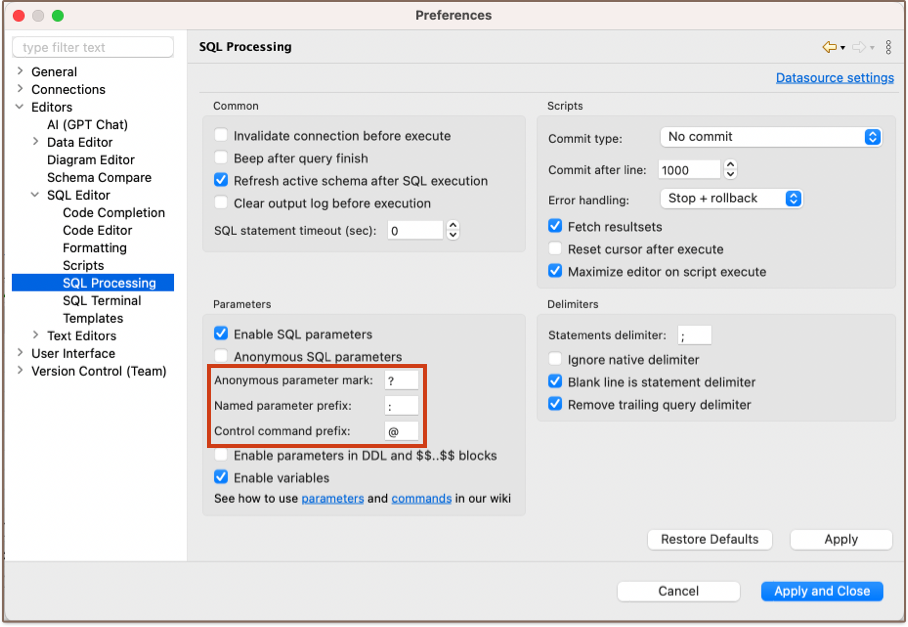

You can execute one query, a highlighted portion of a script, or a whole script. You can execute them using:
* Shortcut key combinations (see details further in this article)
* Tools in the main toolbar:  (Note: toolbar is customizable. See [Toolbar Customization](Toolbar-Customization))
* Context menu (right-click the query):

  

* DBeaver main menu:
 
  

To execute a query under the cursor or selected text, press <kbd>Ctrl+Enter</kbd> or right-click the query and click **Execute -> Execute SQL Statement** on the context menu. You can do the same using the main toolbar or main menu: **SQL Editor -> Execute SQL Statement**. This executes the SQL query under the cursor or selected text and fills the results pane with the query results.

To execute a query under the cursor in a separate tab, press <kbd>CTRL+\ </kbd> or right-click the query and click **Execute -> Execute SQL in new tab** on the context menu. The same can be done using the main toolbar or the main menu: **SQL Editor -> Execute SQL in new tab**. This executes the SQL query under the cursor or selected text and creates a new results tab.

To execute the whole script, press <kbd>Alt+X</kbd> or click **Execute -> Execute SQL Script** on the context menu or **SQL Editor -> Execute SQL Script** on the main menu or in the main toolbar. This executes all queries in the current editor (or selected queries) as a script. DBeaver parses queries one by one using a statement delimiter (“;” by default) and executes them consecutively. You can configure the script execution behavior in the SQL editor preferences (Right-click the script and click **Preferences** on the context menu).

To execute a script opening each query results in a separate tab, press <kbd>Ctrl+Alt+Shift+X</kbd> or click **Execute -> Execute Statements In Separate Tabs** on the context menu or **SQL Editor -> Execute Statements In Separate Tabs** on the main menu or in the main toolbar. The executes all queries in the script, but opens multiple result tabs. Each script query is executed in a separate thread (that is, all queries are executed simultaneously).
NOTE: Be careful with this feature. If you execute a huge script with a large number of queries, it might cause
unexpected problems.

## Result tabs

A single query may generate several result sets represented by tabs. These tabs are linked to the query they are executed from.

* To close an individual tab, press <kbd>CTRL+Shift+&bsol;</kbd> or middle-click on a tab header. 
* To close all tabs expect current, click **Close all result tabs except this** on the context menu of this tab.
* To close all tabs of desired query, click **Close all result tabs of same query** on the context menu of this tab.

### Naming

A tab is often named after the primary table of your query. For example, after executing the following query you will see a single tab called `Album` (assuming that your database has a table called `Album`):

```sql
SELECT * FROM Album;
```

If a query has joins or, in other words, has multiple source tables, a `(+)` is shown right to the table name. The following query will result in a tab called `Album(+)`:

```sql
SELECT * FROM Album al, Artist ar WHERE al.AlbumId = ar.ArtistId;
```

Additionally, you can change the name of a given tab via its context menu or by using a special comment:

```sql
-- title: DBeaver is cool
SELECT * FROM Album;
```

In other cases, tabs are named in a form of <kbd>Results &lt;**A**&gt; (&lt;**B**&gt;)</kbd>, where:
* **A** is _an index of query_
* **B** is _an index of result set of this query_

### Pinning

Tabs can be moved around by dragging them with a mouse and pinned using **Pin tab** on the context menu of desired tab. Pinned tabs are stacked on the left. They can be moved among other pinned tabs, but can't be mixed with unpinned tabs. Pinned tabs cannot be closed without being unpinned first, and cannot be overwritten by executing a query in it (by making this tab active).

### Detaching

Tabs can be detached from the SQL editor into a separate view using the **Detach Tab** action found in the context menu of the desired tab. After the tab is detached, you can rearrange and move it anywhere you want (for example, you can put two tabs side-by-side for comparison).

Additionally, you can detach it from the application window using **Detach** found in the context menu of an already detached tab.

After the tab is detached, it's still synchronized with the SQL editor, meaning you can edit and refresh data as long as the SQL editor that produced that tab is open. Once you close it, tabs become read-only.

## SQL Expression Evaluation
To evaluate an SQL expression, right-click the expression and click **Execute -> Evaluate SQL expression** on the context menu. This command basically performs a query of **SELECT [expression] FROM DUAL** type:


## Row Count
If you want to know how many rows an SQL query will produce, you need to apply the Row Count feature – highlight and right-click the SQL text and then click **Execute -> Select row count** on the context menu:


## Query Export
It might be useful to export a query if you have a long-running query and you do not need to see its results in the results panel. You can directly export the current query results to a file/table by right-clicking the query and then clicking **Execute -> Export From Query** on the context menu:



The Data transfer wizard opens. Go through its steps to complete the export of the query.



## Dynamic Parameter Bindings

You can use dynamic parameters in your SQL queries. The parameter format is :name. When you execute a query which contains dynamic parameters, DBeaver displays a dialog box in which you can fill the parameter values:


You can also use anonymous parameters (?), but you will need to enable them in the SQL editor preferences:



You can open the SQL editor preferences by pressing <kbd>Alt+Enter</kbd>.

## Miscellaneous
* To select the current query row count, press <kbd>Ctrl+Alt+Shift+C</kbd>.
* To open the definition of the database object currently in focus (under cursor) in a viewer/editor, press <kbd>F4</kbd>.  