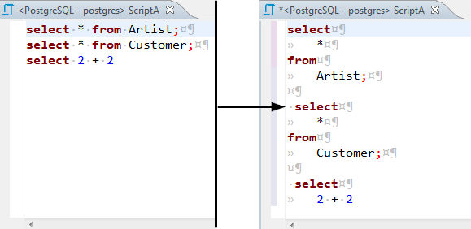
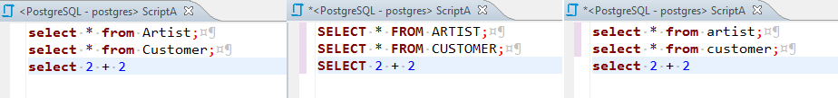
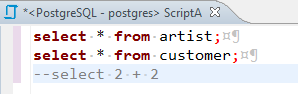
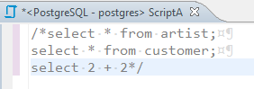
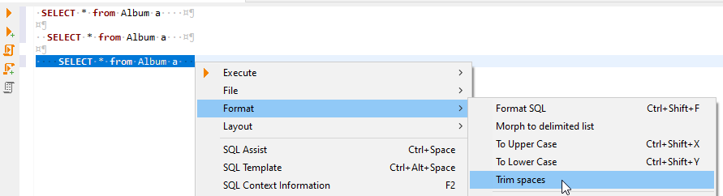
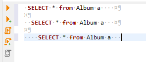
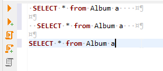
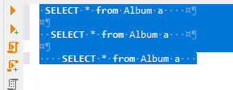
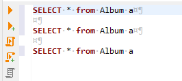

To format an SQL text, select it and press <kbd>Ctrl+Shift+F</kbd> or right-click the selected text and click **Format -> Format SQL** on the context menu.

To format a script to upper or lower case, highlight the SQL text, then right-click it and click **Format -> To Upper Case / To Lower Case**, respectively, on the context menu.

 

To comment out an SQL line, press <kbd>Ctrl+/</kbd> or right-click the line and click **Format -> Toggle Line Comment** on the context menu. To uncomment a commented line, manually remove the commenting syntax, or press the same button combination, or right-click the line and click the same item on the context menu.

To comment out a block of text, select the text, then press <kbd>Ctrl+Shift+/</kbd> or right-click it and click **Format -> Toggle Block Comment** on the context menu. To uncomment a commented block of text, you can either manually remove the commenting syntax or select the same block of text, right-click it and click the same item on the context menu or press the same button combination.

To trim spaces (leading and trailing) SQL text right-click the selected text or end of string and click **Format -> Trim spaces** on the context menu.

You can choose a part of the text

or put the cursor at the end of the row you want to trim

This result you will get:

Or you can choose a part of the text from many lines

Then each of the selected rows will trim, and the final result will be like this:

