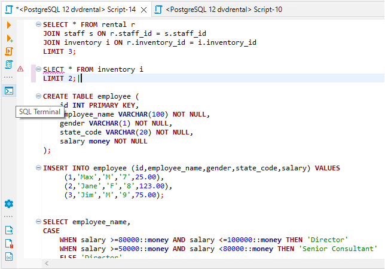
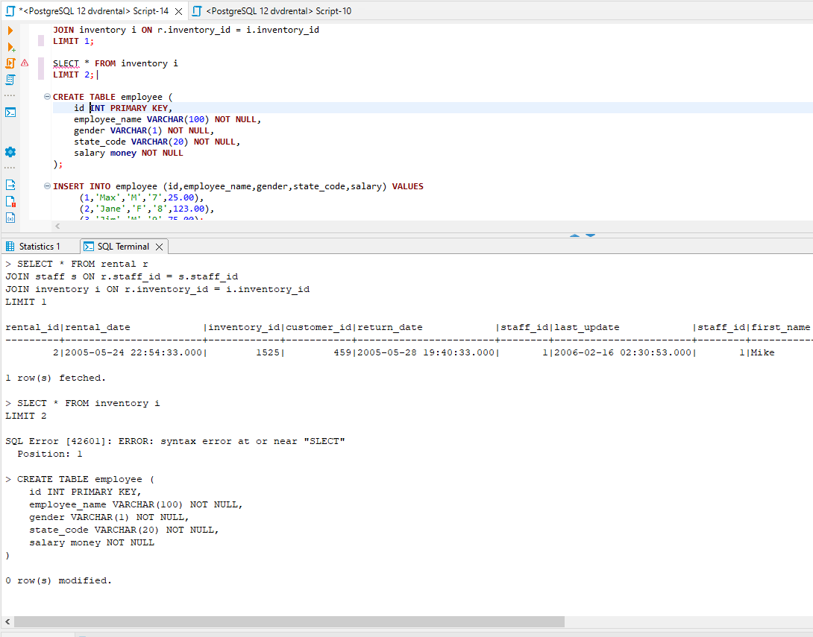
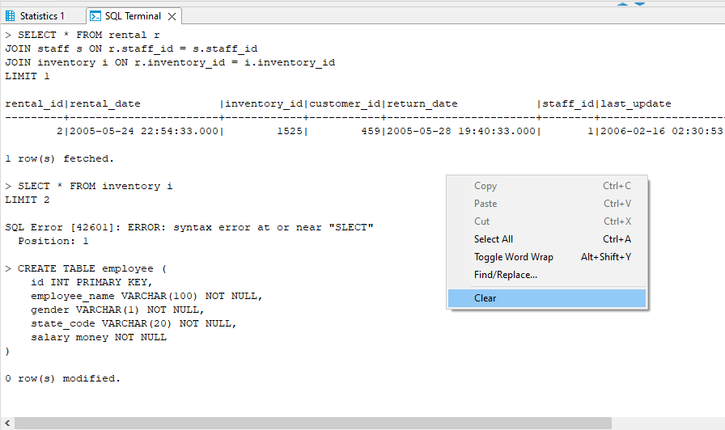
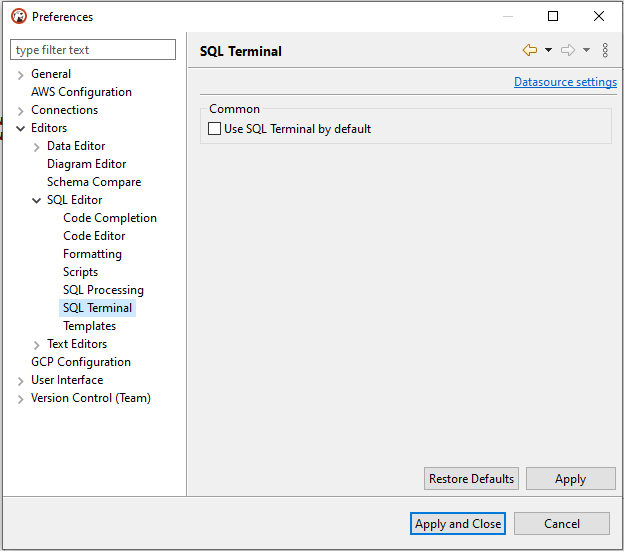

SQL Terminal is an SQL Editor result tab where you can find the results for all executed queries in a text format.

To open SQL Terminal you should press the corresponding button on the left SQL Editor toolbar. (Note: toolbar is customizable. See [Toolbar Customization](Toolbar-Customization))

You can execute a single statement or a sql script and see the result set with data, errors, and statistical information along with the corresponding query text.

The context menu is available by right-clicking on the SQL Terminal area.

For each sql script file, it will be saved whether the SQL Terminal is enabled, and the state of the SQL Terminal button will be restored when the file is opened.

You can set up whether to enable or disable the SQL Terminal for new scripts by default in `Preferences->Editors->SQL Editor->SQL Terminal`.

