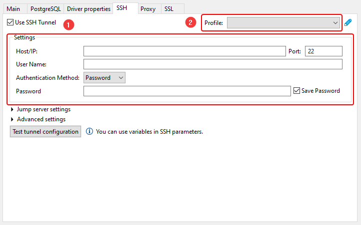
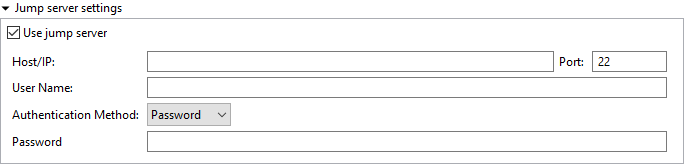
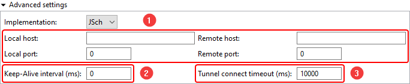

Sometimes the database cannot be accessed directly, in such cases you can use SSH tunnel. SSH or Secure Shell is a network communication protocol that allows two computers to communicate and encrypts the shared data. 

DBeaver supports following SSH authentication methods:
 - Username/password
 - Public key authentication
 - Agent authentication

Available agent authentication implementations:
 - [pageant](https://www.digitalocean.com/community/tutorials/how-to-use-pageant-to-streamline-ssh-key-authentication-with-putty)
 - [ssh-agent](https://help.github.com/en/github/authenticating-to-github/generating-a-new-ssh-key-and-adding-it-to-the-ssh-agent)

## Configuring SSH

SSH is either can be configured individually for each connection in <kbd>Connection settings</kbd> &rArr; <kbd>SSH</kbd>1 or as a [network profile](Network-Profiles) which can be selected from drop-down menu2 on the same page mentioned earlier:

In order to use SSH, you have to enable it first. After that, configure it for your needs, then click on <kbd>Test tunnel configuration</kbd> to test whether all parameters are valid or not.

It's often required to set the hostname to `localhost` in <kbd>Connection settings</kbd> &rArr; <kbd>Main</kbd>. SSH establishes a connection between two machines, authenticating each side to the other, and passing commands and output back and forth. After connecting to remote machine, all commands you execute are executed on that remote machine, so by having host set to `localhost` you're opening a connection to the database on this remote machine, not on your local machine, and just redirect I/O to the latter. 

## Configuring Gateway Host

Gateway host, sometimes known as jump host, is used in situations when you can't access a particular machine directly from your local machine, but it's possible using a gateway server.

Just like SSH configuration, you have to enable it first. Gateway has the same configuration as for regular SSH tunnel:

## Advanced options

1. Optional port forwarding configuration, see more information [below](SSH-Configuration#port-forwarding).
1. Keep-alive interval. Can be used to "ping" remote machine to make sure that SSH connection is still alive.
1. Connection timeout. If the destination SSH machine is quite slow and connect takes ages to complete, you can adjust the value of this parameter.

### Port Forwarding

Port forwarding is used to expose some socket sitting on a remote port to your local port, allowing you to communicate with it. After the SSH connection to remote machine is established, you now need to connect to the database on that machine. Now you need to pass the port on which the database is listening to from that remote machine to your local machine, and this is when port forwarding becomes handy.

By default, it randomly chose local port and forwards it to the destination port set in <kbd>Connection settings</kbd> &rArr; <kbd>Main</kbd>

Usually it's not required to change this configuration, but it can be useful e.g. when you want to use a particular local port.