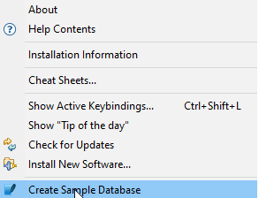

# How to create a sample SQLite Database

## Introduction

If you want to test **DBeaver** features, you can create a demo database. There is a specialized database that can be created. You can create a sample *SQLite* database at the first launch. The database can be added at any time by the following sequence. Chinook is used as a reference database
> Help -> Create Sample Base

