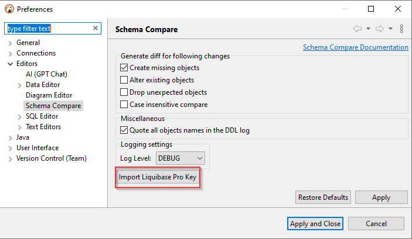

## Schema compare/migration

You can compare two schema/database structures and generate a report in the following formats:
- DDL script (series of create/alter/drop statements)
- Diff diagram (sort of ER diagram)
- Liquibase change log
- Liquibase change report (json, yaml or plaintext)

### Selecting objects to compare

- Select the two objects (schemas, databases, or tables) you want to compare
- Open the context menu
- Open the sub-menu `Compare/Migrate`
- Click on `Compare/Migrate Schema` element

### Compare settings

Re-validate that you have chosen the correct objects to compare.
You can also specify the types of changes to be processed: creates, drops, or alters. By default, all types of changes are enabled.

For comparisons, table containers should be used. 
Schemes - if the database supports the schemas. 
Databases - if the database supports catalogs and does not support the schemes. 
Datasources - if there is no support schemas, nor catalog support (you can find an example below in "Compare schemaless bases").

You can exclude the specific compared types of objects.  
For example, you can do this if you do not want to see the sequences, views, or external keys in the final comparison result.

### Compare results

Click on `Compare Schemas` to generate a diff report.  

By default, DDL diff is generated. It contains a series of creating, alter and/or drop statements that will modify the schema on the right side. Thus it will make it identical to the schema on the left side.  

You can enable/disable particular changes in the tree on the left side of the diff page:

You can also switch to another diff report representation (diagram, json, yaml, plaintext).

### Compare logs

If you want to get acquainted with the comparison logs, you first specify the logging level on the Preferences->Editors->Schema Compare preference page. Specify one of the logging levels and click on `Apply`. By default, the logging level is the OFF level. To get maximum information you can choose the level DEBUG.

After compare operations, you can click on the button `Show log`. A log will be open in the Editor and the content of this log will depend on the logging level you choose in the settings. Log level сhanges from preferences will not be applied to the comparison wizard if it is already open in another window. Close and open schema compare wizard in this case.

### Compare schemaless bases

Some bases (like SQLite and Firebird) do not have catalogs and schemes that can be selected for comparison. In this case (and only for these databases), it is possible to compare the entire datasource entirely.

### Databases supporting schema comparison
* MySQL/MariaDB
* Oracle
* PostgreSQL
* SQLServer
* Snowflake
* SQLite
* Firebird
* Redshift
* DB2
* Informix
* Derby
* Greenplum
* Netezza
* Cockroach
* Vertica
* SAP HANA

### Using schema compare with Liquibase PRO key.

If you have a Liquibase PRO key, then you can use it with DBeaver.
Steps you need:
- Find and open your dbeaver.ini file. It is located in the DBeaver root directory.
- Find -vmargs command
- Add a new line after this command: -Dliquibase.license.key=yourKey (example: -Dliquibase.license.key=ABwwGgQU...)
- Open DBeaver and "Schema compare" window. Key will be checked at this step

You can also add the Liquibase Pro key via UI in Preferences->Editors->Schema Compare preference page.
Use the `Import Liquibase Pro Key` button to open the Import key dialog.

You can add your key in the Liquibase Key text field manually, throw the `Paste` button, or use the `Load` button to download a file.
You can check the license state with the `Check Key State` button. After pressing the button, you can see the result of the checking in the `Messages` field.

We advise you to restart the program after adding a key for more correct program work. Settings сhanges will not be applied to the comparison wizard if it is already open in another window. The key will be saved in the DBeaver settings. If you specified the key in the .ini file, as well as installed another key through the Import Key dialog, then the key from the .ini file will be in priority.

If the license key is valid, then the `Object types` dialog will be extended on PRO objects.
(If PRO objects didn't appear in schema compare changelog - check your logs. Maybe license expired or key is invalid)

